# STM32F103C8T6

## 一、STM32简介


- STM32是ST公司基于ARM Cortex-M内核开发的32位微控制器
- STM32常应用在嵌入式领域，如智能车、无人机、机器人、无线通信、物联网、工业控制、娱乐电子产品等
- STM32功能强大、性能优异、片上资源丰富、功耗低，是一款经典的嵌入式微控制器
- MCU厂商
	- ST(意法半导体，主打消费类电子)-STM32F1xx/STMF4xx
	- TI(德州仪器，主打低功耗的仪器仪表)-MSP430
	- MICROCHIP(微芯，主打工业控制)-pic16fxxx/pic18fxxx
	- NXP(恩智浦，主打汽车电子)-LPC2136
	- STC(宏晶，低端CPU)-STC89S51
	- 松瀚单片机---国产单片机

- MPU：
	- 三星：猎户座
	- 高通：晓龙
	- 华为：麒麟


## 二、ARM

- ARM即指ARM公司，也指ARM处理器内核  acorn RISC(reduce instrution sets computerh) machine
- ARM公司是全球领先的半导体知识产权(IP)提供商，全世界超过95%的智能手机和平板电脑都采用ARM架构
- ARM公司设计ARM内核，半导体厂商完善内核周边电路并生产芯片


- ARM公司根据不同场景生产了各种型号的内核

	- Classic 经典的ARM处理器  也是由ARM1内核逐渐演变而来的

		更改了命名方式，推出了Cortex系列的内核，并根据不同应用场景推出了三款子型号

		分别是：Cortex-A系类、Cortex-R系列、Cortex-M系列  **“ARM”**

	- Embedded  Cortex-R系列和Cortex-M系列适用于嵌入式领域，R系列(RealTime),主要面向实行很高的场景，比如硬盘控制器；M系列(Microcontroller),主要应用于单片机领域，

	- Application  Cortex-A系列适用于高端应用型的领域，主要应用在手机领域，也是性能最高，发展最快的系列

## 三、STM32F103C8T6


- 系列：主流系列STM32
- 内核：ARM Cortex-M3
- 主频：72MHz
- RAM：20K，即运行内存，实际的存储介质是SRAM
- ROM：64K，即程序存储器，实际存储介质是Flash闪存
- 供电：2.0~3.6V(标准3.3V)
- 封装：LQFP48，48个引脚

## 四、片上资源/外设 Peripheral

| **英文缩写** |      **名称**      | **英文缩写** |      **名称**      |
| :----------: | :----------------: | :----------: | :----------------: |
|     NVIC     | 嵌套向量中断控制器 |     CAN      |      CAN通信       |
|   SysTick    |   系统滴答定时器   |     USB      |      USB通信       |
|     RCC      |   复位和时钟控制   |     RTC      |      实时时钟      |
|     GPIO     |      通用IO口      |     CRC      |      CRC校验       |
|     AFIO     |      复用IO口      |     PWR      |      电源控制      |
|     EXTI     |      外部中断      |     BKP      |     备份寄存器     |
|     TIM      |       定时器       |     IWDG     |     独立看门狗     |
|     ADC      |     模数转换器     |     WWDG     |     窗口看门狗     |
|     DMA      |    直接内存访问    |     DAC      |     数模转换器     |
|    USART     | 同步/异步串口通信  |     SDIO     |      SD卡接口      |
|     I2C      |      I2C通信       |     FSMC     | 可变静态存储控制器 |
|     SPI      |      SPI通信       |   USB OTG    |    USB主机接口     |

## 五、命名规则


## 六、系统结构


- Cortex-M3：内核

- ICode：指令总线，用来加载程序指令

- DCode：指令总线，用来加载数据，比如常量和调试数据

	ICode和DCode主要用来连接Flash闪存，Flash里面存储的就是我们编写的程序

- System：系统总线

	- SRAM：用于存储程序运行时的变量数据
	- FSMC：可配置的静态存储器控制器，它具有4个片选输 出，支持PC卡/CF卡、SRAM、PSRAM、NOR和NAND

- AHB：即先进高性能总线，系统总线，用于挂载主要外设。挂载的一般是最基本的或者性能比较高的外设，比如复位和时钟这些最基本的电路，还有SDIO也是挂载在AHB总线上的；桥接一和桥接二分别接到了APB2和APB1两个外设总线上。APB即先进外设总线，用于连接一般的外设。因为AHB和APB的总线协议、总线速度、还有数据传送格式的差异，所以中间需要加两个桥接，来完成数据的转换和缓存。AHB的整体性能比APB高一些，其中APB2的性能又比APB1的性能高一些。**APB2一般是和AHB同频率，都是72MHz,APB1一般是36MHz**，所以APB2连接的都是一般外设中稍微重要的部分，比如GPIO端口，还有一些外设的1号选手等，比如USRAT1,SPI1,TIM1,TIM8.TM1和TM8一样都是高级定时器，所以也是重要的外设，还有ADC、EXTI、AFIO也是接在APB2上面的，其他次要一点的外设都会分配到APB1上去。

- DMA:”CPU的小秘书”，一些大量的数据搬运，让CPU来处理就太浪费资源了。比如有个外设ADC模式转换，这个模数转换可以成连续模式，比如1ms转换一次，转换完的数据必须转运出来，否则会被丢失，如果让CPU去转运的话，没过1ms就得转运一下数据，影响CPU的正常工作。DMA可以代替CPU去处理这些简单但是需要反复去干的事情，DMA通过DMA总线连接到总线矩阵上，它可以用于和CPU一样的总线控制权，来访问这些外设小弟。 当需要DMA搬运数据时，外设小弟就会通过请求线发送DMA请求，然后DMA就会获得总线控制权，访问并转运数据，整个过程不需要CPU参与，省下了CPU的事件用来干其他事情。

## 七、引脚定义


- 红色：电源相关引脚
- 蓝色：最小系统相关引脚
- 绿色：IO口、功能口引脚
- FT：能够容忍5V的电压
- 调试端口：
	- STLINK：PA13、PA14
	- JLINK：PA13、PA14、PA15、PB3、PB4

## 八、启动配置

- 启动配置的作用就是指定程序开始运行的位置，一般情况下，程序都是在Flash程序存储器开始执行，但是在某些情况下，我们也可以让程序在别的地方开始执行，用以完成特殊的功能。


- 主闪存存储器：正常执行Flash内存里面的程序
- 系统存储器：用来做串口下载用的，系统存储器存的就是STM32中的一段BootLoader程序，BootLoader程序的作用就是接收串口的数据，然后刷新到主闪存中，这样就可以使用串口下载程序了。当需要串口下载程序时就要将启动模式，配置成改该模式。PB13、PB14、PA15、PB3、PB4这五个调试调试端口，它们既可以用来下载程序，也可以作为普通IO口使用，如果在程序中把这5个端口全配置成了IO口，那么这个芯片就没有调试端口了，也就下载不了程序。所以在配置这五个端口时，要特别注意，如果全部变成IO口了，就下载不进去程序了，就需要使用串口的方式下载程序。如果没有STLINK或JLINK，就可以使用串口来下载程序。
- 内置SRM：主要用来进行程序调试

**BOOT引脚的值是在上电复位后的一瞬间有效的，之后就随便了**，BOOT1和PB2是在同一个引脚上，也就是上电的瞬间，是BOOT1的功能，当第4个时钟过后，就是PB2的功能

## 九、最小系统电路

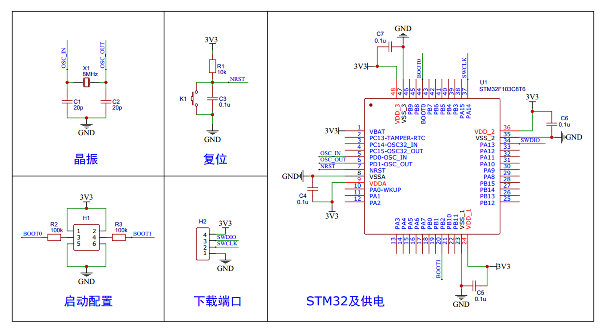

- 晶振电路：如果需要RTC功能，需要再接一个32.768KHz的晶振，电路和8MHz晶振一样，接在3、4号引脚，OSC32就是32.768KHz的意思，**32768是2的15次方**，内部RTC电路通过2的15次方分频就可以生成1s的时间信号。

- 复位电路：用来给单片机提供复位信号，NRST是**低电平**复位的，当这个复位电路在上电的瞬间，电容是没有电的，电源通过电阻开始向电容充电，并且此时电容呈现的是短路状态，NRST引脚就会产生低电平，当电容逐渐充满电时，电容就相当于断路，此时NRST就会被R1上拉为高电平，上电瞬间的波形就是先低电平，然后逐渐高电平，这个低电平就会给单片机提供一个复位信号。按键提供了手动复位的功能，当按下按键时，电容放电，并且NRST引脚也通过按键被直接接地了，即手动产生了低电平复位信号，按键松手后，NRST又回归高电平，此时单片机就从复位状态转为工作状态。

## 十、新建工程

- 关于启动文件——型号分类及缩写

	| **缩写** | **释义**           | **Flash****容量** | **型号**          |
	| -------- | ------------------ | ----------------- | ----------------- |
	| LD_VL    | 小容量产品超值系列 | 16~32K            | STM32F100         |
	| MD_VL    | 中容量产品超值系列 | 64~128K           | STM32F100         |
	| HD_VL    | 大容量产品超值系列 | 256~512K          | STM32F100         |
	| LD       | 小容量产品         | 16~32K            | STM32F101/102/103 |
	| MD       | 中容量产品         | 64~128K           | STM32F101/102/103 |
	| HD       | 大容量产品         | 256~512K          | STM32F101/102/103 |
	| XL       | 加大容量产品       | 大于512K          | STM32F101/102/103 |
	| CL       | 互联型产品         | -                 | STM32F105/107     |

- **新建工程步骤**


- 工程架构

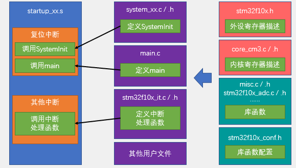

## 十一、GPIO

### (一)GPIO简介

- GPIO(General Purpose Input Output)通用输入输出口

- 可配置为8种输入输出模式

- 引脚电平：0V~3.3V，部分引脚可容忍5V，从引脚定义中可以看出，带FT的引脚就可以容忍5v

- 输出模式下可控制端口输出高低电平，用以驱动LED、控制蜂鸣器、模拟通信协议输出时序等

- 输入模式下可读取端口的高低电平或电压，用于读取按键输入、外接模块电平信号输入、ADC电压采集、模拟通信协议接收数据等

### (二)GPIO基本结构

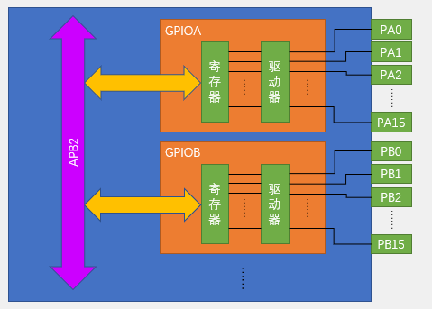


- 寄存器就是特殊寄存器，内核可以通过APB2总线对寄存器进行读写，这样就可以完成输出电平和读取电平的操作了，STM32是32位的单片机，所以寄存器也是32位的，但是端口只有16位，所以这个寄存器只有低16位对应的有端口
- 驱动器是用来增强信号的驱动能力的，寄存器只负责存储数据，驱动器来负责增大驱动能力。

### (三)GPIO位结构

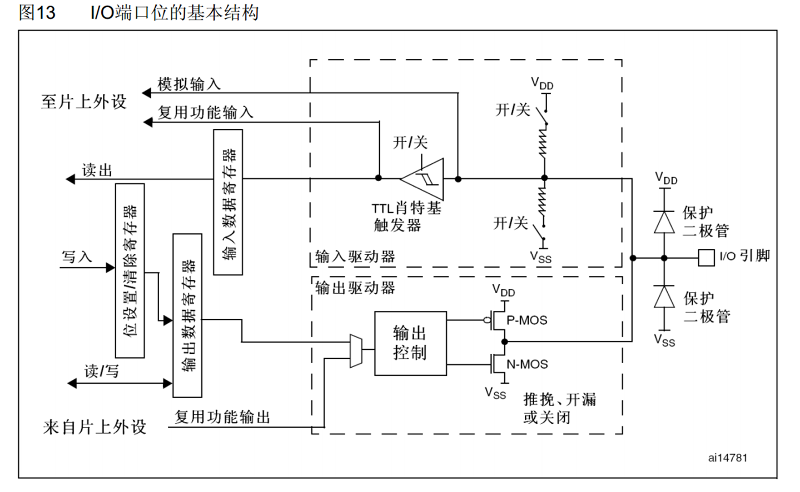

- 输入部分——上半部分电路
  - 保护二极管：对输入电压进行限幅，上面二极管接V~DD~3.3v,下面二极管接V~SS~0V，当输入电压比3.3v还要高，那上方这个二极管就会导通，输入电压产生的电流就会直接流入V~DD~而不会流入内部电路，这样就可以避免过高的电压对内部造成伤害；如果输入电压比0V还低(相对V~SS~电压)，所以是可以有负电压的，这时下方二极管就会导通，电流会从V~SS~直接流出去，而不会从内部电流汲取电流。
  - 上拉电阻V~DD~，下拉电阻V~SS~，上面导通，下面断开就是**上拉输入模式**，上面断开，下面导通就是**下拉输入模式**，两个都断开就是**浮空输入模式**。上拉、下拉是为了给输入提供一个默认的输入电平。对于一个数字的端口，输入不是高电平就是低电平，如果输入引脚什么都不接，就说不清到底是高电平还是低电平，实际上，如果什么都不接，输入就会处于一种浮空的状态，引脚的输入电平极易受到外界干扰而改变，**为了避免引脚悬空导致的输入数据不确定，我们就需要在这里加上上拉或者下拉电阻了**，如果接入上拉输入，当引脚悬空时，还有上拉电阻保证引脚的高电平，上拉输入又可以称作默认为高电平的输入模式，下拉输入又可以默认为低电平的输入模式。这里的上拉和下拉电阻的组织都比较大，目的是尽量不影响正常的输入操作。
  - 施密特触发器(图中肖密特触发器—由肖特基管组成的)，作用是对输入电压进行整形，执行逻辑是，当输入电压大于某一阈值，输出就会瞬间升为高电平，如果输入电压小于某一阈值，输入就会瞬间降为低电平；因为引脚的波形是外界输入的，虽然是数字信号，实际情况下会产生各种失真，通过施密特触发器，可以有效的避免因信号波动造成的输出抖动现象，经整形的波形就可以直接写入输入数据寄存器了。再用程序读取输入寄存器对应某一位的数据，就可以知道端口的输入电平了
  - 模拟输入，连接到ADC上的，ADC需要接受模拟量，所以这根线连接在施密特触发器前
  - 复用功能输入，连接到其他需要读取端口的外设上的，比如串口的输入引脚，这根线接受的是数字量，所以在施密特触发器后面。
- 输出部分——下半部分
  - 输出数据寄存器控制，即普通IO口输出，写输出数据寄存器的某一位就可以操作对应的某个端口了；
  - 位设置/清除寄存器，可以用来单独操作输出数据寄存器的某一位，而不影响其他位。因为数据输出寄存器同时控制16个端口，并且这个寄存器只能整体读写，所以如果想单独控制其中某一个端口而不影响其他端口的话，就需要通过特殊的方式。第一种方式，先读出这个寄存器，然后按位与和按位或的方式更改某一位，最后再将更改后的数据写回去；第二种方式是通过位设置和位清除寄存器，对某一位进行清零或置一的操作；第三种方式通过，读写STM32的位带区。
  - 两个MOS管，P-MOS和N-MOS，输出控制的信号负责MOS管的导通和关闭，负责将IO口接到V~DD~或者V~SS~，可以选择**推挽、开漏或者关闭三种输出方式**。在**推挽输出**模式下，P-MOS和N-MOS均有效；数据寄存器为1时，上管导通，下管断开，输出直接接到V~DD~，就是输出高电平；数据寄存器为0时，上管断开，下管导通，输出直接接到V~SS~，就是输出低电平。这种模式下，高低电平均有较强的驱动能力，推挽输出也可以叫强推输出模式；**在推挽输出模式下，STM32对IO口具有绝对的控制权，高低电平都由STM32决定**。在**开漏输出**模式下，P-MOS是无效的，只有N-MOS工作，数据寄存器为1时下管断开，这时输出相当于断开，也就是高阻模式，数据寄存器为0时，下管导通，这时输出直接接到V~SS~，也就是输出低电平，这种模式下，只有低电平有驱动能力，高电平是没有驱动能力的；**开漏模式可以作为通信协议的驱动方式**，比如I^2^C通信的引脚，就是使用的开漏模式，在多机通信的模式下，这个模式**可以避免各个设备的相互干扰，另外，开漏输出还可以用于输出5V的电平信号**，比如在IO口外接一个上拉电阻到5v的电源，当输出低电平时，由内部的N-MOS直接接V~SS~，当输出高电平时，由外部的上拉电阻拉高至5V，就可以输出5V的电平信号，用于兼容一些5V电平的设备；关闭状态，**当引脚配置为输入模式时，P-MOS和N-MOS都无效，也就是输出关闭，端口的电平由外部信号来控制**。
  - 片上外设控制

### (四)GPIO模式

- 通过配置GPIO的端口配置寄存器，端口可以配置成以下8种模式

| **模式名称** | **性质** |                      **特征**                      |
| ------------ | :------: | :------------------------------------------------: |
| 浮空输入     | 数字输入 |      可读取引脚电平，若引脚悬空，则电平不确定      |
| 上拉输入     | 数字输入 | 可读取引脚电平，内部连接上拉电阻，悬空时默认高电平 |
| 下拉输入     | 数字输入 | 可读取引脚电平，内部连接下拉电阻，悬空时默认低电平 |
| 模拟输入     | 模拟输入 |           GPIO无效，引脚直接接入内部ADC            |
| 开漏输出     | 数字输出 |    可输出引脚电平，高电平为高阻态，低电平接VSS     |
| 推挽输出     | 数字输出 |      可输出引脚电平，高电平接VDD，低电平接VSS      |
| 复用开漏输出 | 数字输出 |    由片上外设控制，高电平为高阻态，低电平接VSS     |
| 复用推挽输出 | 数字输出 |      由片上外设控制，高电平接VDD，低电平接VSS      |

#### (1)浮空/上拉/下拉输入

- 这三个模式的电路结构基本是一样的，区别在于上拉电阻和下拉电阻的连接，都属于数字的输入口。

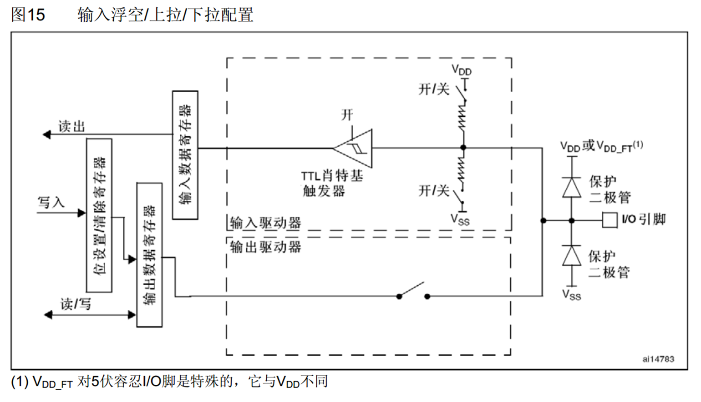

- 在使用浮空输入时，端口一定要接上一个连续的驱动源，不能出现悬空的状态
- 在输入模式下，输出驱动器是断开的

#### (2)模拟输入

- 是ADC模数转换器的专属配置

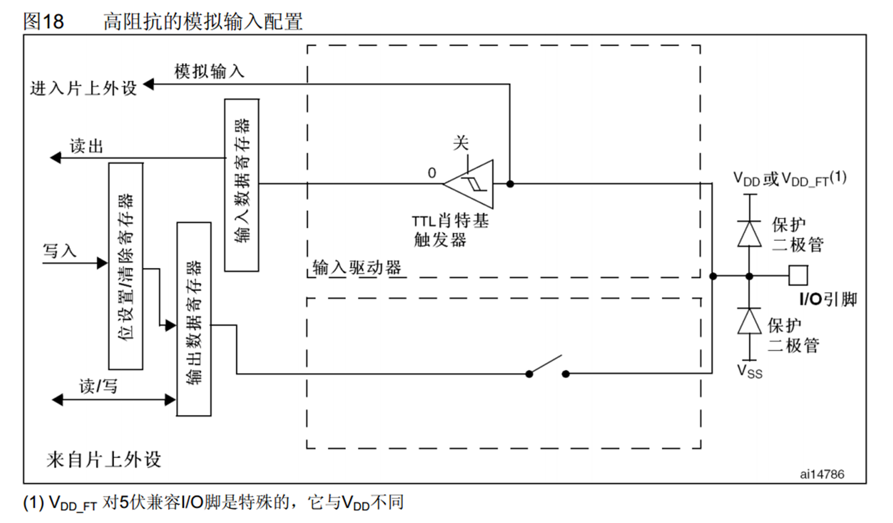

- 输出驱动器是断开的，施密特触发器也是关闭状态，由引脚直接接入片上外设，也就是ADC,使用ADC时，需要将引脚配置为模拟输入模式

#### (3) 开漏/推挽输出

- 都是数字输出，区别在于，开漏输出的高电平为高阻态没有驱动能力

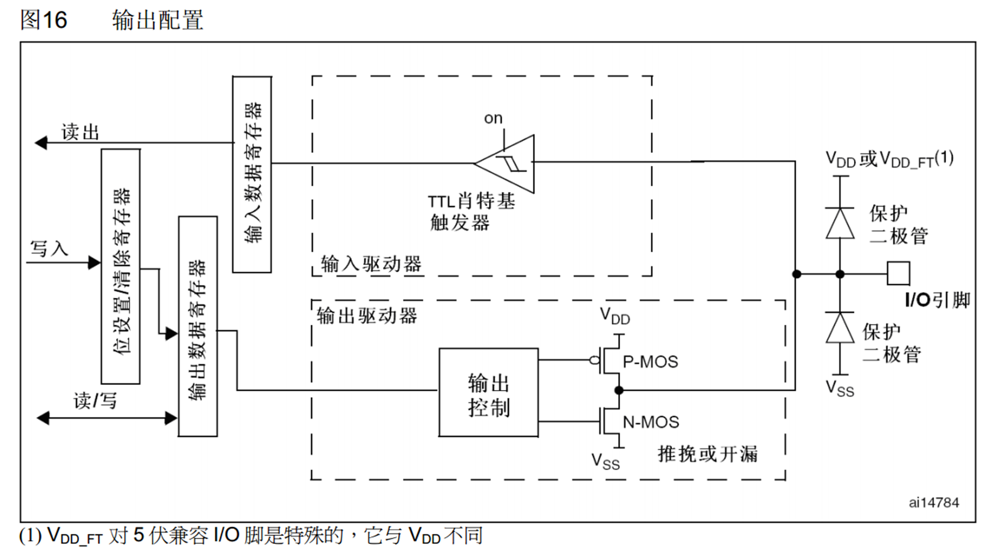

- 输出由输出数据寄存器控制，如果P-MOS无效就是开漏输出，如果P-MOS和N-MOS都有效，就是推挽输出。
- **在输出模式下，输入模式也是有效的，但是在输入模式下，输出模式无效，这是因为，一个端口只能有一个输出，但是可以有多个输入。**

#### (4) 复用开漏/推挽输出

- 与通用开漏/推挽输出不同的是，复用的输出，引脚电平是由片上外设控制的

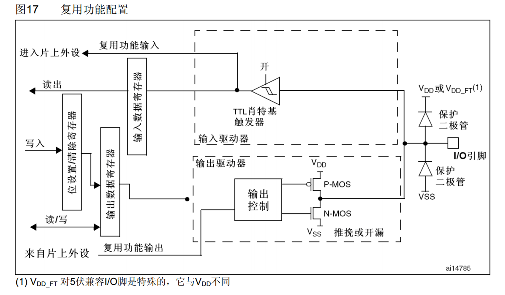

- 通用的输出是没有连接的，引脚的控制权转移到了片上外设，由片上外设来控制，在输入部分，普通的输入也是有效的，顺表接收一下电平信号

##### 总结

- 在GPIO的8种模式中，除了模拟输入这个模式会关闭数字的输入功能，在其他的7个模式中，所有的输入都是有效的

### (五)GPIO寄存器

#### (1)   端口配置低寄存器 GPIOx_CRL

- 配置低16位端口的输入输出模式，和输出速度

#### (2)   端口配置高寄存器 GPIOx_CRH

- 配置高16位端口的输入输出模式，和输出速度
- GPIO输出的速度，可以限制输出引脚的最大翻转速度，是为了低功耗和稳定性，一般要求不高配置50MHz

#### (3)  端口输入数据寄存器 GPIOx_IDR

- 对应的GPIO结构图中的输入数据寄存器
- 低16位对应16个引脚，高16位未使用

#### (4)  端口输出寄存器  GPIOx_ODR

- 对应GPIO结构图中的输出数据寄存器
- 低16位对应16个引脚，高16位未使用

#### (5)  端口位设置/清除寄存器 GPIOx_BSRR

- 对应GPIO结构图中的端口位设置/清除寄存器
- 高16位是进行位清除的，低16位是进行位设置的
- 写1就是清除对应的ODR位为0，或设置对应的ODR位为1；写0不产生影响

#### (6)  端口位清除寄存器  GPIOx_BRR

- 与BSRR寄存器的高16位功能是一样的，写1，对应的ODR位位0，写0不产生影响
- 低16位对应16个引脚，高16位未使用
- 为了方便使用，当只想对某一位进行位设置或位清除时，使用BSRR和BRR的低16位进行操作；如果对多个端口同时进行位设置和位清除，使用BSRR寄存器，保证了位设置和位清除的同步性，如果对信号的同步性要求不高，先位设置再位清除也没问题

#### (7)  端口配置锁定寄存器  GPIOx_LCKR

- 可以对端口的配置进行锁定，防止意外更改

## 十二、EXTI外部中断

### (一)基本概念

- 中断：在主程序运行过程中，出现了特定的中断触发条件(中断源)，使得CPU暂停当前正在运行的程序，转而去处理中断程序，处理完成后又返回原来被暂停的位置继续运行

​		**使用终端系统，能够极大地提高程序运行的效率，**比如，没有中断系统，为了防止外部中断被忽略或者串口数据被覆盖，那么主程序就只能不断地查询是否有这些事件发生，不能再干其它事情了，比如没有定时器中断，那主程序只有靠Delay函数，才能实现定时地功能，有了中断系统之后，主程序就可以放心执行其他事情，有中断的时候再去处理，效率就会大大提升。

- 中断优先级：当有多个中断源同时申请中断时，CPU会根据中断源的轻重缓急进行裁决，优先响应更加紧急的中断源

​		中断优先级根据程序设计的需求，自己设置，**中断优先级是为了在多个中断同时申请时，判断一下，应该先处理哪个，CPU会优先响应高优先级中断**

- 中断嵌套：当一个中断程序正在运行时，又有新的更高优先级的中断源申请中断，CPU再次暂停当前中断程序，转而去处理新的中断程序，处理完成后依次进行返回

​		在中断服务程序执行过程中，再次发生高优先级的中断，进行二次中断，**能否进行中断嵌套，是由中断优先级来决定的。**

### (二)中断执行流程

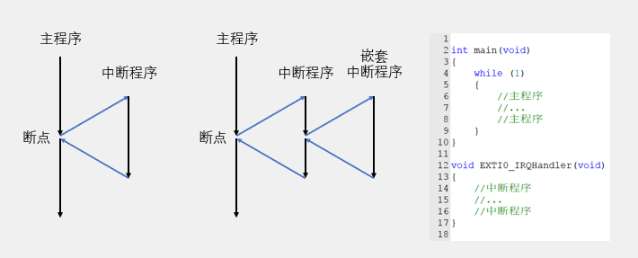

- 断点处，需要进行保护现场和还原现场，用C语言编程，这些工作编译器自动做好了

### (三)STM32中断

- **中断向量表**

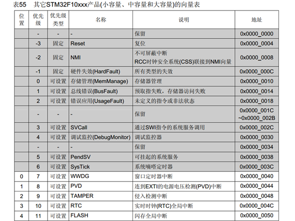

- 灰色部分为内核中断

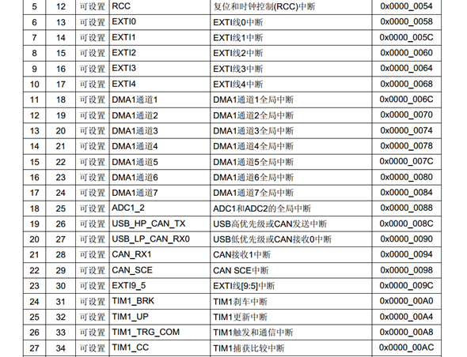

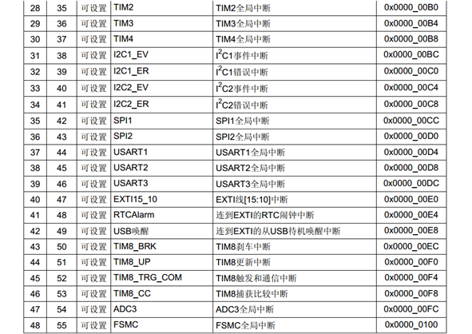

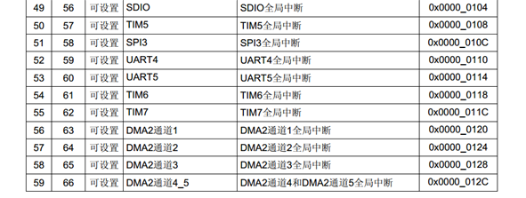

- 68个可屏蔽中断通道，包含EXTI、TIM、ADC、USART、SPI、I2C、RTC等多个外设
- **使用NVIC统一管理中断，每个中断通道都拥有16个可编程的优先等级，可对优先级进行分组，进一步设置抢占优先级和响应优先级**

### (四)NVIC基本结构

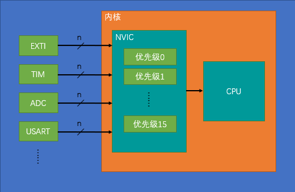

- NVIC：嵌套中断向量控制器，在STM32中，它是用来统一分配中断优先级和管理中断的，NVIC是一个**内核外设**，是CPU的小助手。
- STM32有很多的中断，如果把这些中断全部接到CPU上，那么CPU就要引出很多线进行适配，设计上很麻烦，并且如果很多中断同时申请，或者中断很多产生了拥堵，CPU也会很难处理，比较CPU主要是用来运算的，中断分配的任务就交给其他外设进行处理，即交给NVIC。
- NCIC有很多输入口，有多少个中断线路，都可以接过来，如图中的EXTI、TIM、ADC、USRAT等等，n代表着一个外设可能会占用多个中断通道，NVIC只有一个输出口，NVIC根据每个中断的优先级分配中断的先后顺序，然后告诉给CPU，CPU不知道中断分配的先后顺序，只负责按NVIC输出的顺序，处理中断。

### (五)NVIC优先级分组

- 为了处理不同形式的优先级，STM32的NVIC可以对优先级进行分组，分为**抢占优先级**和**响应优先级**。
- 响应优先级：当CPU正在执行中断服务程序时，正在”排队“的中断，发生了更高优先级的中断，那这个中断将会“插队”，等待当前中断服务程序结束后，立即响应。**响应优先级高的，可以“插队”响应。**
- 抢占优先级：当CPU真正执行中断服务程序时，发生了更紧急的事件，需要CPU处理，此时CPU将会进行**二次中断**，处理完这个紧急事件后，再去执行当前的中断服务程序，即发生中断嵌套，这种决定是不是可以中断嵌套的优先级，就叫做抢占优先级。**抢占优先级高的，可以进行中断嵌套。**

- **NVIC的中断优先级由优先级寄存器的4位(0~15)决定，这4位可以进行切分，分为高n位的抢占优先级和低4-n位的响应优先级**

- **抢占优先级高的可以中断嵌套，响应优先级高的可以优先排队，抢占优先级和响应优先级均相同的按中断号排队**

| **分组方式** | **抢占优先级**  | **响应优先级**  |
| ------------ | --------------- | --------------- |
| 分组0        | 0位，取值为0    | 4位，取值为0~15 |
| 分组1        | 1位，取值为0~1  | 3位，取值为0~7  |
| 分组2        | 2位，取值为0~3  | 2位，取值为0~3  |
| 分组3        | 3位，取值为0~7  | 1位，取值为0~1  |
| 分组4        | 4位，取值为0~15 | 0位，取值为0    |

- 因为优先级寄存器总共是4位，所有就有(0，4)、(1，3)、(2，2)、(3，1)、(4，0)这五种分组方式

### (六)EXTI简介

- EXTI(Extern Interrupt)外部中断

- EXTI可以监测指定GPIO口的电平信号，当其指定的GPIO口产生电平变化时，EXTI将立即向NVIC发出中断申请，经过NVIC裁决后即可中断CPU主程序，使CPU执行EXTI对应的中断程序。**检测引脚电平变化，触发中断**

- 支持的触发方式：上升沿/下降沿/双边沿/软件触发
	- 上升沿：电平由低电平变到高电平的瞬间触发中断
	- 下降沿：电平由高电平变到低电平的瞬间触发中断
	- 双边沿：上升沿或下降沿都可以触发中断
	- 软件触发：程序中执行一句代码就可以触发中断

-  支持的GPIO口：所有GPIO口，但**同号的Pin不能同时触发中断**，端口GPIO_Pin一样的，只能选1个作为中断引脚，**如果有多个中断引脚，要选择不同Pin的引脚。**

- 通道数：**16个GPIO_Pin(0-15)**，外加PVD输出、RTC闹钟、USB唤醒、以太网唤醒，加起来共20个中断线路，16个GPIO_Pin口是外部中断的主要功能，其余四个外部中断，其实是来“蹭网”的，因为**外部中断有个功能，从低功耗模式的停止模式下唤醒STM32**，对于PVD电源电压检测，当电压从电压过低恢复时，就需要PVD借助一下外部中断退出停止模式；对于RTC闹钟来说，有时候为了省电，RTC定一个闹钟后，STM32会进入停止模式，等到闹钟响的时候再唤醒，这也需要借助外部中断；USB唤醒和以太网唤醒也是类似的作用。

- 触发响应方式：中断响应/事件响应
	- 中断响应：申请中断，CPU执行中断函数
	- 事件响应：是STM32对外部中断增加的一种额外的功能，当外部中断检测到引脚电平变化时，正常的流程是选择触发中断，但在STM32中也可以选择触发一个事件，如果选择触发事件，那外部中断的信号就不会通向CPU了，而是通向其他外设，用来触发其他外设的操作，比如触发ADC转换、触发DMA等。

​	**中断响应是正常流程，引脚电平变化触发中断，事件响应不会触发中断，而是触发别的外设操作，属于外设之间的联合工作。**

### (七)EXTI基本结构

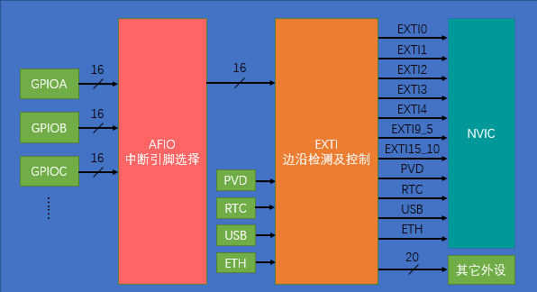

- 每个GPIO外设都有16个引脚，如果每个引脚都占用一个通道，那EXTI的16个通道显然就不够用了，所有就会有一个AFIO中断引脚选择的电路模块，**AFIO就是一个数据选择器，它可以在前面3个GPIO外设的16个引脚里选择其中一个连接到后面EXTI的通道里，**所以说，相同的Pin口不能同时触发中断，因为对于PA0、PB0、PC0、PD0……这些引脚，通过AFIO口选择之后，只能有其中一个能够接到EXTI的通道0上，这就是**所有GPIO口都可以触发中断，但相同的Pin不能同时触发中断**的原因。经过AFIO选择后的16个通道，就接到了EXTI边沿检测及控制电路上。经过EXTI电路之后，分为了两种输出，接到NVIC上的，就是用来触发中断的，需要注意的是**本来20路输入，应该有20路输出，但可能是由于ST公司觉得20个输出太多，比较占用NVIC的通道资源，所以将其中外部中断的9-5，和15-10，分到一个通道里，也就是说外部中断9-5会触发同一个中断函数，15-10也会触发发同一个中断函数，在编程时，需要在在两个中断函数里，再根据标志位来区分到底是哪个中断进来的，**下面有20条输出线路接到了其他外设，这就是触发其他外设操作的，也就是**事件响应**。

### (八)AFIO复用IO口

- AFIO主要用于引脚复用功能的选择和重定义，**数据选择器的作用**
- 在STM32中，AFIO主要完成两个任务：**复用功能引脚重映射、中断引脚选择**
	- 复用功能引脚重映射：参考引脚功能表，将默认复用功能切换到重定义功能当中
	- 中断引脚选择：选择哪一个端口的Pin口进行中断

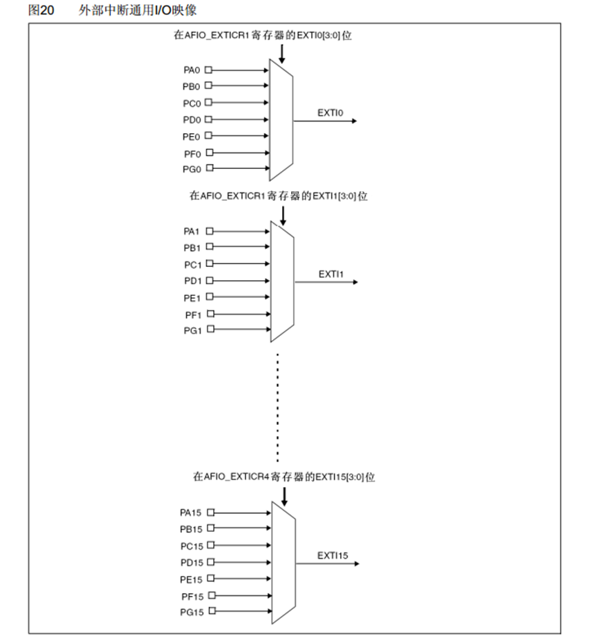

- 配置AFIO_EXTICRx(1~4)寄存器的对应位，就可以决定哪一个输入

### (九)EXTI内部框图

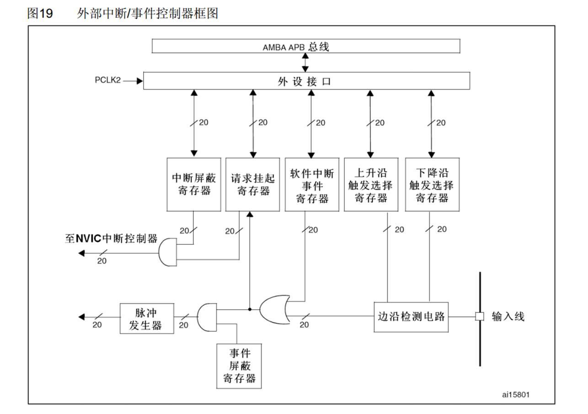

- 电路分析

​		输入线(20根)首先进入边沿检测电路，在上面的上升沿寄存器和下降沿寄存器可以选择是上升沿触发还是下降沿触发，或者两个都触发，接着触发信号就进入到或门的输入端，这这里，硬件触发和软件中断寄存器的值接到了这个或门上，也就是任意一个为1，或门就可以输出1，所有说，支持外部中断触发的方式包含有上升沿，下降沿，双边沿和软件触发；经过或门后，触发信号兵分两路，上一路是触发中断的，下一路是触发事件的；**触发中断时(中断触发)**，首先会置一个挂起寄存器，相当于中断标志位，通过读取这个寄存器就可以知道是哪个通道触发的中断，如果中断挂起寄存器置1，就会继续向左走，和中断屏蔽寄存器共同进入一个与门，然后至NVCI中断控制寄存器，这里的与门相当于开关的作用，当中断屏蔽寄存器给1时，另一个输入就是直接输出，也就是运行中断，而中断屏蔽寄存器给0，那另一端输入无论是什么，输出都是0，相当于屏蔽了这个中断；**触发事件时**(事件触发)，回到或门的下一路事件的输出部分，首先是一个事件屏蔽寄存器进行开关控制，最后通过一个脉冲发生器，到其他外设，这个脉冲发生器就是给一个电平脉冲，用来触发其他外设的动作。\20就是20根线，代表20个通道；上面的外设接口和APB总线，可以通过总线访问这些寄存器。

- 补充知识：

​		(1)与门(二极管)

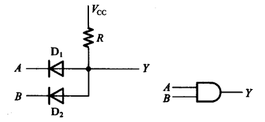

​		可以有多个输入，但只有一个输出，执行与的逻辑，有0则为0，全1才为1

​		(2)或门(二极管)

​		

​		可以有多个输入，但只能有一个输出，执行或的逻辑，有1则为1，全0才为0

​		(3)非门

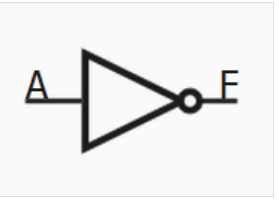

​		只有一个输入一个输出，执行非的逻辑，输入0输出1，输入1输出0

​		(4)数据选择器

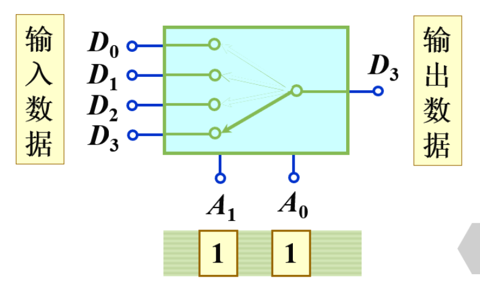

​			有多个输入，一个输出，A1和A0为选择控制端，根据控制端的数据，从输入选择一个接到输出

### (十)总结

- 使用外部中断模块的特性

​		对于STM32来说，想要获取的信号是外部驱动的，很快的，突发信号，比如旋转编码器的输出信号，可能很久不会去扭动它，这时就不需要STM32做任何事，当扭动它时，就会有很多脉冲波形需要STM32接收，这个信号是突发的，STM32并不知道什么时候会来，同时它是外部驱动的，STM32只能被动读取，而且这个信号非常快，STM32如果读取的稍微慢一点，就会错过很多波形，对于这种情况来说，就可以考虑使用STM32的外部中断了；还有比如红外遥控接收头的输出，接收到遥控数据后，会输出一段波形，这个波形转瞬即逝，所有就需要外部中断来读取；还有按键，虽然它的动作也是外部驱动的突发事件，但是并不推荐使用外部中断来读取按键，因为外部中断不好处理按键抖动和松手的检测问题，对于按键来说，它的输出波形也不是转瞬即逝的，所有要求不高的话，可以在主程序中循环读取，如果不想在主程序中读取的话，可以考虑定时器中断读取的方式，这样既可以做到后台读取按键值、不阻塞主程序，也可以很好的处理按键抖动和松手检测的问题

### (十一)外部中断编程流程

​	1、配置RCC，打开时钟

​		<1> 开启端口时钟：**RCC_APB2PerphClockCmd(RCC_APB2Periph_GPIOx,ENABLE);**

​		GPIOx都挂载在APB2的总线上，开启Pin口对应时钟：

​		<2>开启AFIO时钟：**RCC_APB2PerphClockCmd(RCC_APB2Periph_AFIO,ENABLE);**

​		<3>  EXTI和NVIC的时钟是默认开启的，不用再开启时钟，EXTI虽是独立外设，但是寄存器没有对应的EXTI时钟的控制位；NVIC属于内核外设，内核外设都不需要开启外设，RCC管理的是内核外的外设

​	2、配置GPIO，选择输入模式

​		使用官方库中GPIO_InitTypeDef结构体初始化GPIO口，Pin口，输入模式(浮空、上拉、下拉)，速度，再通过GPIO_Init()函数初始化GPIO

​	3、配置AFIO，选择哪一路的GPIO

​	**GPIO_EXTILineConfig(GPIO_PortSourseGPIOx,GPIO_PinSourex);**

​		**GPIO_PortSourseGPIOx**:选择某个GPIO外设作为外部中断源 (x:A-E)

​		**GPIO_PinSourex**:选择某个外部中断线路，对应Pin口(x:0-15)

​	4、配置EXTI，选择边沿触发方式(上升沿、下降沿和双边沿)以及触发响应方式(中断响应和事件响应)

​			使用EXTI_InitTypeDef结构体对EXTI进行初始化

​			<1> **EXTI_Line**：指定要配置的中断线路 EXTI_Linex,对应外部中断触发的Pin口

​			<2> **EXTI_LineCmd**：指定选择的中断线的新状态，是否开启中断,ENABLE or DISABLE

​			<3>**EXTI_Mode**：指定外部中断线的模式，选择触发模式，中断模式还是事件模式

​			<4>**EXTI_Trigger**：指定触发信号的有效边沿，上升沿、下降沿或双沿触发

​			再通过库函数 EXTI_Init(&EXTI_InitStruct);

​	5、配置NVIC，配置中断的优先级

​			先配置中断分组：

​			**NVIC_PriortyGroupConfig(NUIV_PriorityGroup_x);**[x:0-4]

​	配置优先级分组：先占优先级(pre-emption priority)和从占优先级(subpriority),即抢占优先级和响应优先级，配置几位抢占和几位响应。

​	**中断分组，整个工程只需要执行一次就可以，如果是在不同模块中进行分组，需要保证每个模块中的分组方式是同一种，最好放在主程序中**

​		使用NVIC_InitTypeDef结构体进行NVIC初始化

​		<1> **NVIC_IRQChannel**：指定中断通道来开启或关闭，在IRQn_Type枚举中，不同型号的芯片，中断通道列表也会有所不同

​		<2>**NVIC_IRQChannelCmd**：指定中断通道是否使能，ENABLE or DISABLE

​		<3>**NVIC_IRQChannelPreemptionPriority**：指定所选通道的抢占优先级

​		<4>**NVIC_TRQChannelSubPriority**：指定所选通道的响应优先级

​		指定所选通道的抢占优先级和响应优先级的值要对应，中断分组中的取值范围

​		再使用库函数：NVIC_Init(&NVIC_InitTypeDef);

​	6、写中断函数

​	在STM32中，中断函数的名字是固定的，每个中断通道都对应一个中断函数，即配置NVIC时，NVIC_IRQChannel的中断通道，可以在启动文件的中断向量表中找到对应的值，EXTIx_IRQHandler[x对应外部中断通道]

​	**中断函数都是无参，无返回值，名字对应中断通道，不能写错**

​	在写中断函数时，一般先进行一个中断标志位的判断，确保是我们想要的中断触发的这个函数，特别是5-9，10-15这两个中断通道。多个中断线都可以进入这同一个外部中断函数，要判断对应的中断源，才能触发对应的中断函数

​		要使用EXTI_GetITStatus(EXTI_Linex);函数，看一下EXTIx的中断标志位是不是为1，返回值是SET or RESET。

​		最后，中断服务程序结束后，一定要再调用清除中断标志位的函数，因为只要中断标志位置1了，程序就会跳转到中断服务程序，如果不清除中断标志位，那就会一直申请中断，引起**”中断风暴“**，这样程序将会不断响应中断，执行中断函数，那程序就会卡死在中断函数中。

​		**每次中断程序结束后，都要清除一下中断标志位**

​		EXTI_ClearITPendingBit(EXTI_Linex);  对应的中断源

## 十三、TIM定时器中断

### (一) TIM简介

- TIM(Timer)定时器

- 定时器可以对输入的时钟进行计数，并在计数值达到设定值时触发中断

- 16位计数器、预分频器、自动重装寄存器的时基单元，在72MHz计数时钟下可以实现最大59.65s的定时
	- 计数器：执行计数定时的一个寄存器，每来一个时钟(1/72us)，计数器加1；
	- 预分频器：可以对计时器的时钟进行分配，让这个计数更加灵活
	- 自动重装寄存器：计数的目标值；
	- 这三个部分构成了定时器最核心的部分，称为**时基单元**，时基单元中的计数器、预分配器、自动重装寄存器都是16位的，2^16^=65536,如果预分频器设置最大，自动重装寄存器也设置最大，那么定时器的最大定时时间就是59.65s,接近一分钟,72M/65536/65536得到的就是中断频率，然后取倒数。
	- **STM32的定时器支持级联的模式**，一个定时器的输出可以作为另一个定时器的输入，那么最大定时事件就是59.36s再乘2次65536大概是8000多年，如果还短，那就可以再级联一个定时器，定时时间将再延长65536*65536倍，这个时间大概是34万亿年，三个定时器级联定时，就可以从宇宙诞生，计到宇宙灭亡。

- 不仅具备基本的定时中断功能，而且还包含内、外时钟源选择、输入捕获、输出比较、编码器接口、主从触发模式等多种功能

- 根据复杂度和应用场景分为了**高级定时器**、**通用定时器**、**基本定时器**三种类型，高级定时器最为复杂


### (二)定时器类型


|  **类型**  |        **编号**        | **总线** |                           **功能**                           |
| :--------: | :--------------------: | :------: | :----------------------------------------------------------: |
| 高级定时器 |       TIM1、TIM8       |   APB2   | 拥有通用定时器全部功能，并额外具有重复计数器、死区生成、互补输出、刹车输入等功能 |
| 通用定时器 | TIM2、TIM3、TIM4、TIM5 |   APB1   | 拥有基本定时器全部功能，并额外具有内外时钟源选择、输入捕获、输出比较、编码器接口、主从触发模式等功能 |
| 基本定时器 |       TIM6、TIM7       |   APB1   |              拥有定时中断、主模式触发DAC的功能               |

- 不同型号的STM32单片机，拥有着不同的定时器资源
- 重复计数器、死区生成、互补输出、刹车输入等功能，主要是为了三相无刷电机的驱动设计的

#### (1)高级定时器

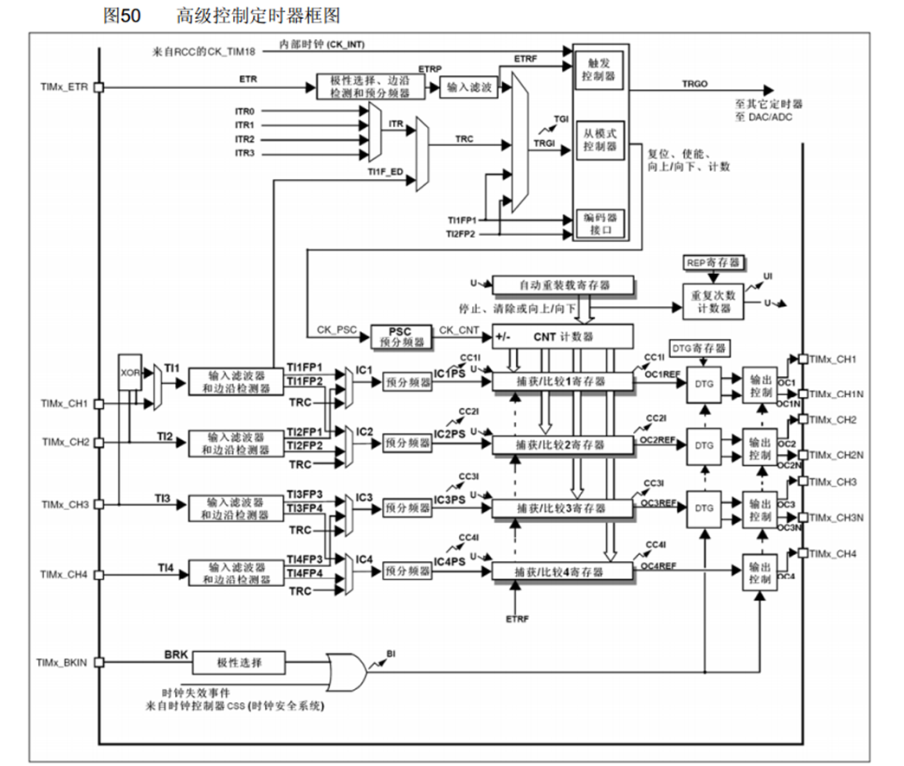


- 与通用定时器相比，主要改动的是右边和下边这几个部分
- 重复次数计数器：在申请中断的地方，增加了一个重复次数计数器，有了该计数器之后，就可以实现每隔几个计数周期，才发生一次更新事件和更新中断，与原来相比，就相当于对输出的更新信号又做了一次分频；一个通用定时器或基本定时器最长可定时59.35s，而高级定时器可定时长就需要再乘一个65536。
- DTG(Dead Time Generate，死区生成电路)，右边的输出引脚由原来的一个变成了两个互补的输出，可以输出一对互补的PWM波，这些电路是为了驱动三相无刷电机的，三相无刷电机是一个常用的外设，如四轴飞行器、电动车的后轮、电钻等，里面都可能是三相无刷电机，因为三相无刷电机的驱动一般需要三个桥臂，每个桥臂需要2个大概率开关管来控制，总共需要6个大概率开关管来控制，所以这里的输出PWM引脚的前三路就变成了互补的输出，而第四路却没什么变化，因为三相无刷电机只需要三路就好了，另外，为了防止互补输出的PWM驱动桥臂时，在开关切换的瞬间，由于器件的不理想，造成短暂的直通现象，所以在这之前加入了死区生成电路，在开关切换的瞬间，产生一定时长的死区，让桥臂的上下管全都关断，防止直通现象。
- 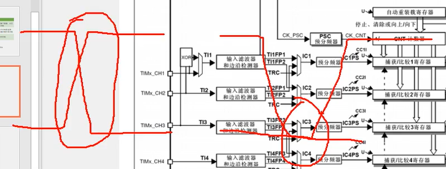
- 刹车输入：是为了给电机驱动提供安全保障的，如果外部引脚(BKIN)产生了刹车信号，或者内部时钟失效，产生了故障，那么控制电路就会自动切断电机的输出，防止意外的发生。

#### (2)通用定时器

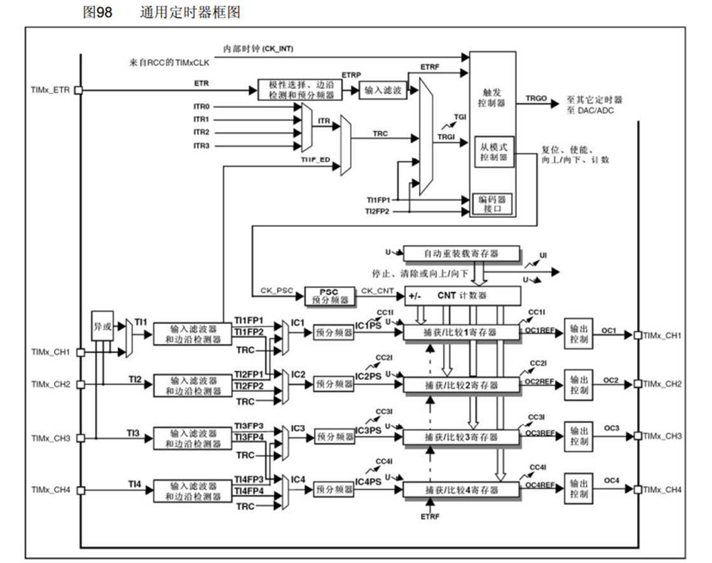

- 核心部分：由预分频器、计数器和自动重装寄存器组成的时基单元。

- 计数器：基本定时器的计数模式只有**向上计数**，对于通用定时器和高级定时器还支持**向下计数**和**中央对齐模式**。向下就是从重装值开始，向下自减，减到0之后，回到重装值同时申请中断，然后进行下一轮计数，依次循环；中央对齐模式，就是从0开始，向上自增，自增到重装值申请中断，再向下自减，减到0，再申请中断，然后继续下一轮，依次循环。
- 内外时钟源选择和主从触发模式(时基单元上面部分)
	- 对于基本定时器而言，定时只能选择内部时钟，也就是系统频率72MHz，而对通用定时器，时钟源不仅可以选择内部的72MHz时钟，还可以选择外部时钟。
	  - 第一个外部时钟来自TIMx_ETR引脚上的外部时钟(参考引脚分布表)，那么就可以在TIM2的ERT引脚，也就是PA0上接一个外部方波时钟，然后配置内部的极性选择、边沿检测和预分频器电路，在配置输入滤波电路，这些电路可以对外部时钟进行一定的整形，最后滤波后的信号兵分两路，上面一路ETRF进入触发控制器，接着就可以选择作为时基单元的时钟了，如果需要在ETR外部引脚提供时钟，或者相对ETR时钟进行计数，把这个定时器当作计数器来使用的话，就可以配置这一路的电路，在STM32中，这一路也叫做**“外部时钟模式2”**。
	  - 除了外部ETR引脚可以提供时钟外，下面TRGI(Trigger In)也可以提供时钟，TRGI从名字上来看，主要是用作触发输入来用的，触发输入可以触发定时器的**从模式**，触发输入作为外部时钟使用时，可以把TRGI当作外部时钟的输入来看，当TRGI当做外部时钟来使用时，这一路就叫做**“外部时钟模式1”**。通过这一路的外部时钟都要哪些？从上图中向左看，第一个引脚就是**ETR引脚的信号**，这里ETR引脚，既可以通过上面这一路进来当作时钟，又可以通过下面这一路进来当作时钟，两种情况对于时钟输入而言是等价的，不同的是，下面这一路输入会占用触发输入的通道，第二个就是**ITR信号**，这一部分的时钟信号来自其他定时器的，从右边可以看出，这个主模式的输出TRGO可以通向其他定时器，通向其他定时器时，就接到其他定时器的ITR引脚上了，ITR0到ITR3分别来自其他4个定时器的TRGO输出，具体连接方式参考手册**表78**，通过这一步就可以实现定时器级联的功能，(比如可以先初始化TM3，然后使用主模式把它的更新事件映射到TRGO上，接着再初始化TM2，这里选择ITR2，对应的就是TIM3的TRGO，后面再使用时钟为外部时钟模式1，这样TIM3的更新事件就可以驱动TIM2的时基单元，也就实现了定时器的级联。这里应该是先设置TIM2定时器，如果设置TIM2作为从定时器，设置一个定时器接到TIM2的ITR2上，那么就是TIM3接到这里。因为前面的表里有，然后TIM3计时中断，TIM2加一)；在ITR信号下面，还可以选择**TI1F_ED**，这里连接的是输入捕获单元的TIMx_CH1引脚，也就是从CH1引脚获得时钟，后面加个ED(Edge)是边沿的意思，也就是通过这一路的时钟，上升沿下降沿均有效，最后这个时钟还可以从**TI1FP1和TI2FP2**获得，其中TI1FP1连接到了CH1引脚的时钟，TI2FP2连接到了CH2引脚的时钟。**外部时钟模式1的输入可以是ETR引脚、其他定时器、CH1引脚的边沿、CH1引脚和CH2引脚，**复杂的输入，是为了某些特殊情况而设计的，比如为了定时器的级联设计了ITR部分。
	  - 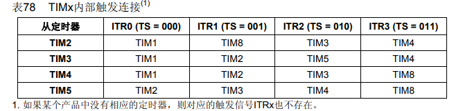
	  - 总结：ETR外部时钟模式2是走ETRF进入触发控制器，直接作为时基单元的时钟。而ETR外部时钟模式1是ETRF走TRGI进入从模式控制器(占用了触发输入通道)，作为时基单元的时钟。
	- 输入滤波器：过滤掉信号的抖动干扰，在固定的工作频率$f$下进行采样,如果连续N个采样点都为相同的电平，那么就代表输入信号稳定了，就输出采样值，如果这$N$个采样值都不全相同，那就说明信号有抖动，就会保持上一次的输出或者输出低电平，采用频率$f$和采样点数$N$都是滤波器的参数，频率越低，采样点数越多，滤波效果就越好，相应的信号延迟就越大。
	- **对于时钟输入而言，最常用的还是内部的72MHz的时钟，如果要使用外部时钟，首选ETR引脚外部时钟模式2的输入，这一路最简单最直接**
	- 定时器的主模式输出TRGO：这部分电路可以把内部的一些事件映射到这个TRGO引脚上，比如将上面基本定时器分析的，将更新事件，映射到TRGO，用于触发DAC，在这里也可以把定时器内部的一些事件映射到这里，用于触发其它定时器、DAC或ADC，通用定时器的触发输出的范围要比基本定时器更广一些。
	- 定时器的编码器接口：可以读取正交编码器的输出波形
- 输出比较电路(右下角)和输入捕获电路(左下角)
	- 输出比较电路，总共有四个通道，分别对应CH1到CH4引脚，可以用于输出PWM波形，驱动电机；
	- 输入捕获电路，也时有四个通道，分别对应CH1到CH4的引脚，可以用于测量输入方波的频率等；

​		中间的寄存器是捕获/比较寄存器，是输入捕获和输出比较电路共用的，因为**输入捕获和输出比较不可以同时使用**，这里的寄存器和引脚都是共用的。

- 带灰色阴影的寄存器，都设有“影子寄存器”，即缓冲寄存器。

#### (3)基本定时器

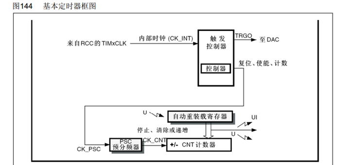

- 时基单元：预分频器、计数器和自动重装寄存器，构成了最基本的计数计时单元，也称**时基单元**。

- 框图分析：在预分频器之前，连接的CK_PSC就是基准计数时钟的输入，由于**基本定时器的时钟只能选择内部时钟**，也可以认为，这根线直接连接到了内部时钟CK_INT，而内部时钟的来源是RCC的TIMxCLK，TIMxCLK的频率值一般都是系统的主频72MHz,所以通向时基单元的计数基准频率就是72M。
- 预分频器：可以对72MHz的计数时钟进行预分频。该寄存器写0，这时候输出频率 = 输入频率 = 72MHz，就是不分频；该寄存器写1，那就是2分频，输出频率 = 输入频率/2 = 36MHz；如果写2，就是3分频，输出频率 = 输入频率/3 = 24MHz，**实际分频系数 = 预分频器的值+1**，这个预分频器是16位的，所以最大值可以写65535，也就是65536分频。**对输入的基准频率提前进行一个分频操作。**
- 计数器：可以对预分频后的计数时钟进行计数，计数时钟每来一个上升沿，计数器的值就加1，这个计数器也是16位的，计数范围是0-65535，溢出就会回到0重新开始计数；计数器的值在计时的过程中会不断地自增运行，当自增运行到目标值时，产生中断，就完成了定时的任务，这个存贮目标值的寄存器就是自动重装寄存器。
- 自动重装寄存器：自动重装寄存器也是16位的，存储的是我们写入的计数目标，在运行的过程中，计数值不断自增，自动重装值是固定目标，当计数器的值等于自动重装寄存器存储的值时，就会产生一个中断信号，并且清零计数器。
- UI这里向上箭头，代表这里会产生中断信号， 这种计数值等于自动重装值产生的中断，称为**“更新中断”**。更新中断后就会通往NVIC，再配置好NVIC的定时器通道，那么定时器的更新中断就可以得到CPU的响应了。U这里的向下箭头，代表的是产生一个事件，这里对应的事件，称为**“更新事件”**，更新事件不会触发中断，但是会触发电路其他电路的工作。

​	计数器计数自增，同时不断与自动重装寄存器进行比较，它两值相等时，即计时时间到，这时就会产生一个更新中断和更新事件，CPU响应中断，就完成了我们定时中断的任务了。

- 主从触发DAC的功能
	- STM32定时器的一大特色，就是这个主从触发模式，它可以让硬件在不受程序的控制下实现自动运行，使用好这个主从触发模式，在某些情景下将会极大地减轻CPU的负担。
	- 作用：在使用DAC的时候，可能会用DAC触发一段波形，就需要每个一段时间来触发一次DAC，让它输出下一个电压点。正常思路来实现的话，就是先设置一个定时器产生中断，每隔一段时间在中断程序中调用代码手动触发一次DAC转换，然后DAC输出，这样会使主程序处于频繁被中断的状态，会影响主程序的运行和其他中断的响应。所以定时器就设计了一个主模式，使用这个主模式可以把这个定时器的更新事件，，映射到触发输出TRGO(Trigger Out)的位置，然后TRGO直接接到DAC的触发转换引脚上，这样定时器的更新就不需要中断来触发DAC转换了，仅需要把更新事件通过主模式映射到TRGO，然后TRGO就会直接去触发DAC了，整个过程不需要软件的参与，实现了硬件的自动化，这就是主模式的作用。除了这个主模式外，还有更多的硬件自动化的设计。

### (三)定时中断基本结构

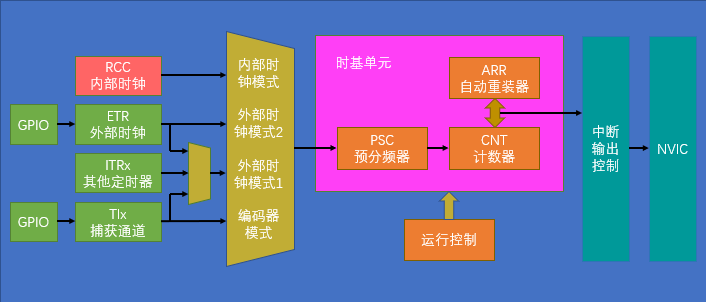

- 定时中断和内外时钟源的选择

​		PSC(Prescaler)预分频器、CNT(Counter)计数器、ARR(AutoReloadRegister)自动重装寄存器构成的时基单元。运行控制，控制寄存器的一些位，比如启动停止、向上或向下计数等等，操作这些寄存器就可以控制时基单元的运行。时基单元的左边是为时基单元提供时钟的部分，这里可以选择RCC提供的内部时钟，也可以选择ETR引脚提供的外部时钟模式2，还可以选择触发输入当作外部时钟，即外部时钟模式1，对应的有ETR外部时钟、ITRx其他定时器、TIx输入捕获通道，这些就是定时器的所有可选择的时钟源了，编码器模式是编码器独用的模式，普通的时钟用不到这个。时基单元右边是计时时间到，产生更新中断后的信号去向(如果是高级定时器的话，还会多一个重复计数器)，在这里中断信号会先在状态寄存器里置一个中断标志位，这个中断标志位会通过中断输出控制，到NVIC申请中断，中断输出控制的作用是，因为定时器模块有很多地方都要申请中断，不仅更新要申请中断，触发信号也会申请中断，输入捕获和输出比较匹配时也会申请中断，所有这些中断都要通过中断输出控制，需要这个中断时运行，不需要时禁止，中断输出控制就是一个中断输出的允许位。

### (四)预分频器时序

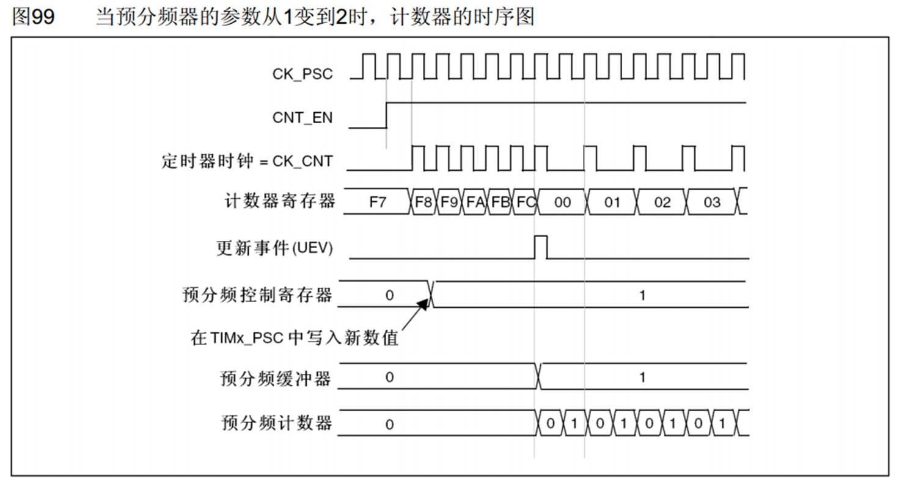

- CK_PSC：预分频器的输入时钟，选内部时钟的话一般是72MHz，这个时钟在不断的运行
- CNT_EN：计数器使能，高电平计时器正常运行，低电平计数器停止
- CK_CNT：计数器时钟，它计数预分频器的时钟输出，也是计数器的时钟输入。当CNT_EN是低电平，即计数器未使能时，计数器时钟不运行，然后使能后，前半段，预分频器系数为1(不分配)，计数器的时钟等于预分频器前的时钟，后半段，预分频器系数变为2(2分频)，计数器的时钟也变为预分频器前时钟的一半。
- 计数器寄存器：在计数器时钟的驱动下，计数器寄存器也跟随时钟的上升沿不断自增，当自增到FC之后，计数值变为0，就可以推断ARR自动重装寄存器的值就是FC。
- 更新事件(UEV)：当计数值和重装值相等，并且下一个时钟来临时，计数值才请零，同时产生一个更新事件，这就是一个计数周期的工作流程。
- 预分频器控制寄存器、预分频器缓冲器和预分频计数器，描述的是预分频寄存器的一种缓冲机制，也就是这个预分频器实际上是有两个。
	- 预分频器控制寄存器：供我们读写使用，并不直接决定分频系数
	- 预分频缓冲寄存器：**“影子寄存器”**，真正起作用的寄存器。当我们在某一个时刻将预分频器控制寄存器的值由0变为1，如果在此时立刻改变时钟的分频系数，就会导致计数器时钟和计数器寄存器，在一个计数周期内，前半部分和后半部分的频率不一样，计数计到一半，计数频率突然就发生改变。通过缓存寄存器，当在计数到一半时改变了分频器，这个变化不会立刻生效，会等到本次计数周期结束时，产生了更新实际，预分频器的值才会被传递到缓存寄存器中，才会生效
	- 预分频计数器：预分频器内部实际也是靠计数来分频的，当预分频器为0时，预分频计数器就一直为0，直接输出原频率，当预分频器为1时，计数器就0、1、0、1、0、1这样计数，当回到0时输出一个脉冲，这样的输出频率就是2分频，预分频器的值和实际的分频系数之间有一个数的偏移，
- 计数器计数频率：**CK_CNT = CK_PSC / (PSC + 1)**

### (五)计数器时序

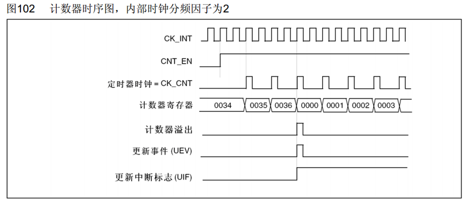

- CK_INT：内部时钟72MHz

- CNT_EN：时钟使能，高电平启动

- CK_CNT：计数器时钟，分频系数为2，2分频，频率是CK_INT/2 = 36MHz

- 计数器寄存器：在计数器时钟的每个上升沿自增

- 计数器溢出：当计数器寄存器自增到0036时，发生溢出，然后置0

- 更新事件(UEV)：计数器溢出，产生一个更新事件脉冲

- 更新中断标志(UIF)：计数器溢出，置一个更新中断标志位UIF，当这个标志位置1时，就会申请中断，中断响应后，需要在中断程序中手动清零

- ARR：自动重装寄存器，也是有一个缓冲寄存器的，这个缓冲寄存器用还是不用，可以自己设置。

- 计数器溢出频率：CK_CNT_OV = CK_CNT / (ARR + 1)

	​     												= CK_PSC / (PSC + 1) / (ARR + 1)

### (六)计数器无预装时序

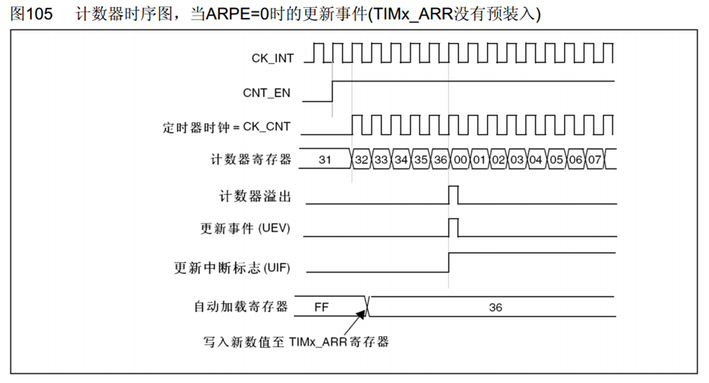

- 无缓冲寄存器，将自动重装寄存器的值突然由FF改为36时，计数器寄存器的目标值就由FF变为36，当计到36之后，就直接更新，进行下一轮计数


### (七)计数器有预装时序


- 有缓冲寄存器时，影子寄存器才是真正起作用的，将自动重装寄存器的值突然由F5改为36时，影子寄存器的值还是F5，计数器寄存器的目标值还是计到F5，才产生更新事件，此时，要更改的36才会被传递到影子寄存器，在下个一周期，更改的值才有效。
- 影子寄存器的目的是为了同步，让值的变化和更新事件同步发生，防止在运行图中更改造成错误。
- 如果不使用影子寄存器的话，F5改到36会立即生效，而此时计数值已经达到F1，超过了36，F1只能增加，但它的目标值却是36，比它还小很多，这样F1就只能一直加，直到加到FFFF，再回到0，再加到36，才能产生更新事件，这样就会造成一些小问题

### (八)时钟树


- STM32用来产生和配置时钟，并将配置好的时钟发送到各个外设的系统，时钟是所有外设运行的基础，所有时钟也是最先需要配置的东西。程序中主函数执行之前还会执行一个SystemInit的函数，这个函数就是用来配置这个时钟树的。
- 左边都为时钟的产生电路，右边都为时钟的分配电路，**SYSCLK**就是系统时钟72MHz。
	- 在时钟的产生电路分别有四个震荡源，分别是：内部的8MHz高速RC振荡器、外部的4-16MHz的高速石英晶体振荡器(也就是晶振，一般都接8MHz)、外部的32.768KHz的低速晶振(一般是给RTC提供时钟的)、内部的40KHz低速RC振荡器(可以给看门狗提供时钟)。上边的两个高速晶振，都是用来提供系统时钟的，AHB、APB2、APB1都是来源于这两个高速晶振，内部和外部都有一个8MHz的晶振，都可以用，但**外部的石英振荡器比内部的RC振荡器更加稳定**，一般都使用外部石英振荡器，如果电路比较简单，也可以使用内部RC振荡器的，就可以省下外部晶振的电路。
	- SystemInit函数中，首先会启动内部时钟选择内部8MHz作为系统时钟，暂时以内部8MHz的时钟运行，然后再启动外部时钟，配置外部时钟进入PLL锁相环进行倍频，8MHz倍频9倍，得到72MHz,等到锁相环输出稳定后选择锁相环输出(PLLCLK)作为系统时钟，这样就把系统时钟由8MHz切换到了72MHz。如果外部晶振出现了问题，系统时钟就无法切换到72MHz，就会以内部8MHz来运行，相比72MHz，大概就慢了10倍
	- CSS(Clock Security Ststem),时钟安全系统，复则切换时钟，可以检测外部时钟的运行状态，一但外部时钟失效，它就会自动把外部时钟切换为内部时钟，保证系统的运行，防止程序卡死造成事故，在高级定时器中，也有CSS的身影，在刹车输入这里，一旦CSS检测外部时钟失效，通过或门，就会立刻反应到输出比较这里，让这个输出控制的电机立刻停止，防止意外
- 右边时钟分配电路，首先SYSCLK系统时钟72MHz进入AHB总线，在进入AHB总线前，首先经过AHB预分频器，在SystenInit函数中配置的分频系数为1，即不分频，那么AHB的时钟就是72MHz，然后进入APB1总线。
	- APB1总线配置的分频系数是2，就是所以APB1总线的时钟为72/2=36MHz，通用定时器和基本定时器都是接在APB1上的，都是72MHz，而APB1的时钟是36MHz，APB1单独为定时器2-7开通了一路，当APB1的预分频系数为1时，通向定时器2-7的时钟不变，否在频率乘2，这样通向定时器2-7的时钟就是72MHz了；
	- APB2的分频系数为1，不分频，所以APB2的时钟和AHB一样，都是72MHz，接在APB2上的高级定时器也单独开了一路，也是如果APB1的分频系数为1，则频率不变，否则x2
	- 在时钟输出这里，都有一个与门进行输出控制，控制位写的是外部时钟使能，就是在初始化GPIO口时，使用的RCC_APB2PeriphClockCmd();的作用，打开时钟该位写1，让左边的时钟能够通过与门输出给外设

### (九) 定时中断编程流程（以TIM2为例）

​	1、RCC开启时钟，定时器的基准时钟和整个外设的工作时钟就都会同时打开

```
RCC_APB1PeriphClockCmd(RCC_APB1Periph_TIM2, ENABLE);
```

​	2、选择时基单元的时钟源，内部时钟模式（RCC内部时钟）/外部时钟模式2（ETR外部时钟）/外部时钟模式1（ETR外部时钟/ITRx其他定时器/TIx捕获通道）/编码器模式

```
TIM_InternalClockConfig(TIM2);	//如果不配置时钟源，上电默认为内部时钟
```

​	3、配置时基单元，预分频器（PSC)、自动重装器（ARR）和计数器（CNT）

```
TIM_TimeBaseInitTypeDef TIM_TimeBaseInitStructure;		//定义结构体变量
TIM_TimeBaseInitStructure.TIM_ClockDivision = TIM_CKD_DIV1;		//时钟分频，选择不分频，此参数用于配置滤波器时钟，不影响时基单元功能
TIM_TimeBaseInitStructure.TIM_CounterMode = TIM_CounterMode_Up;	//计数器模式，选择向上计数
TIM_TimeBaseInitStructure.TIM_Period = 10000 - 1;				//计数周期，即ARR的值
	//计数器溢出频率：CK_CNT_OV = CK_CNT / (ARR + 1)
	//						 = CK_PSC / (PSC + 1) / (ARR + 1)
	//CK_PSC = 72M
	//定时1s，也就是定时频率为1Hz
	//t = 1/f = 1/72MHz * (PSC+1)*(ARR+1)
	//1 = 72M/(7200)*(10000)
	//PSC = 7200 - 1; （0~65535）//对72M进行7200分频，得到10k的计数频率，10k的频率下计10000个数就是1s的时间
	//ARR = 10000 - 1；（0~65535）
	//预分频的值和自动重装的值不唯一，如果预分频给少点，自动重载给多点，就是以一个比较高的频率计比较多的数，也可以预分频给多点，自动重载给少点，就是以一个比较低的频率计比较少的数，两种方式都可以达到目标定时时间
TIM_TimeBaseInitStructure.TIM_Prescaler = 7200 - 1;	//预分频器，即PSC的值
TIM_TimeBaseInitStructure.TIM_RepetitionCounter = 0;	//重复计数器，高级定时器才会用到
TIM_TimeBaseInit(TIM2, &TIM_TimeBaseInitStructure);				//将结构体变量交给TIM_TimeBaseInit，配置TIM2的时基单元	
```

​	

​	4、配置输出中断控制，允许更新中断输出到NVIC

```
TIM_ClearFlag(TIM2, TIM_FLAG_Update);//清除定时器更新标志位
																//TIM_TimeBaseInit函数末尾，手动产生了更新事件
//若不清除此标志位，则开启中断后，会立刻进入一次中断，更新中断和更新时间同时发生，更新中断会置中断标志位，会导致一上电就触发中断
//如果不介意此问题，则不清除此标志位也可

TIM_ITConfig(TIM2, TIM_IT_Update, ENABLE);	//开启TIM2的更新中断
```


​	5、配置NVIC，，在NVIC中打开定时器的中断通道，并分配一个优先级

```
/*NVIC中断分组*/
	NVIC_PriorityGroupConfig(NVIC_PriorityGroup_2);	//配置NVIC为分组2
			//即抢占优先级范围：0~3，响应优先级范围：0~3
			//此分组配置在整个工程中仅需调用一次
			//若有多个中断，可以把此代码放在main函数内，while循环之前
			//若调用多次配置分组的代码，则后执行的配置会覆盖先执行的配置
	
	/*NVIC配置*/
	NVIC_InitTypeDef NVIC_InitStructure;			//定义结构体变量
	NVIC_InitStructure.NVIC_IRQChannel = TIM2_IRQn;	//选择配置NVIC的TIM2线
	NVIC_InitStructure.NVIC_IRQChannelCmd = ENABLE;	//指定NVIC线路使能
	NVIC_InitStructure.NVIC_IRQChannelPreemptionPriority = 2;	//指定NVIC线路的抢占优先级为2
	NVIC_InitStructure.NVIC_IRQChannelSubPriority = 1;	//指定NVIC线路的响应优先级为1
	NVIC_Init(&NVIC_InitStructure);			//将结构体变量交NVIC_Init，配置NVIC外设
```


​	6、运行控制，使能计数器

```
TIM_Cmd(TIM2, ENABLE);			//使能TIM2，定时器开始运行
```


​	7、编程定时器中断函数

```
/* 定时器中断函数，可以复制到使用它的地方
void TIM2_IRQHandler(void)
{
	if (TIM_GetITStatus(TIM2, TIM_IT_Update) == SET)
	{
		//编程触发中断时，要进行的操作
		TIM_ClearITPendingBit(TIM2, TIM_IT_Update);
	}
}
*/
```

### (十) 输出比较简介

- OC（Output Compare）输出比较
	- IC（Input Capture，输入捕获）
	- CC（Capture/Compare，一般表示输入捕获和输出比较的单元）
	- CCR（Capture/Compare Register，捕获/比较寄存器，通用定时器框图右下角）
- 输出比较可以通过比较CNT计数器与CCR捕获/比较寄存器值的关系，来对输出电平进行置1、置0或翻转的操作，**用于输出一定频率和占空比的PWM波形**
- 每个高级定时器和通用定时器都拥有4个输出比较通道
- 高级定时器的前3个通道额外拥有死区生成和互补输出的功能

#### 1、PWM简介

- PWM（Pulse Width Modulation）脉冲宽度调制

- 在具有**惯性的系统**中，可以通过对一系列脉冲的宽度进行调制，来等效地获得所需要的模拟参量，常应用于电机控速等领域（惯性系统，不会立刻停止）

- PWM参数：频率 = 1 / T~S~      占空比 = T~ON~/ T~S~      分辨率 = 占空比变化步距
	- 占空比：$t/T $,在一个脉冲周期T内，高电平t所占的比例，通过占空比就可以得到加在这个二极管两端的平均电压$U = (t/T)*Up~$,占空比乘以脉冲的电压幅值。
	- 分辨率：占空比跳变的步距，占空比变化的精细程度

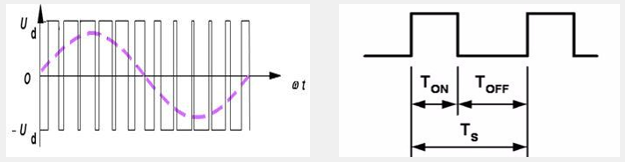

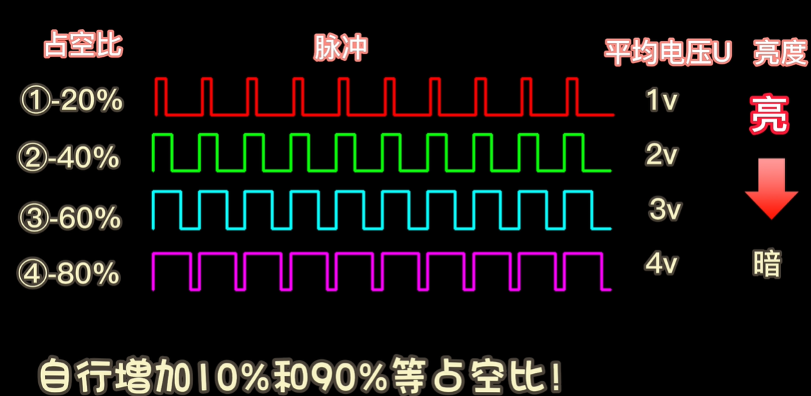

#### 2、输出比较通道

##### (1)编程思路

```
/*开启时钟*/
	RCC_APB1PeriphClockCmd(RCC_APB1Periph_TIM2, ENABLE);			//开启TIM2的时钟
	RCC_APB2PeriphClockCmd(RCC_APB2Periph_GPIOA, ENABLE);			//开启GPIOA的时钟
	
	/*GPIO初始化*/
	GPIO_InitTypeDef GPIO_InitStructure;
	GPIO_InitStructure.GPIO_Mode = GPIO_Mode_IPU;
	GPIO_InitStructure.GPIO_Pin = GPIO_Pin_0;
	GPIO_InitStructure.GPIO_Speed = GPIO_Speed_50MHz;
	GPIO_Init(GPIOA, &GPIO_InitStructure);						//将PA0引脚初始化为上拉输入
	
	/*外部时钟配置*/
	TIM_ETRClockMode2Config(TIM2, TIM_ExtTRGPSC_OFF, TIM_ExtTRGPolarity_NonInverted, 0x0F);
																//选择外部时钟模式2，时钟从TIM_ETR引脚输入
																//注意TIM2的ETR引脚固定为PA0，无法随意更改
																//最后一个滤波器参数加到最大0x0F，可滤除时钟信号抖动
	
	/*时基单元初始化*/
	TIM_TimeBaseInitTypeDef TIM_TimeBaseInitStructure;				//定义结构体变量
	TIM_TimeBaseInitStructure.TIM_ClockDivision = TIM_CKD_DIV1;		//时钟分频，选择不分频，此参数用于配置滤波器时钟，不影响时基单元功能
	TIM_TimeBaseInitStructure.TIM_CounterMode = TIM_CounterMode_Up;	//计数器模式，选择向上计数
	TIM_TimeBaseInitStructure.TIM_Period = 10 - 1;					//计数周期，即ARR的值
	TIM_TimeBaseInitStructure.TIM_Prescaler = 1 - 1;				//预分频器，即PSC的值
	TIM_TimeBaseInitStructure.TIM_RepetitionCounter = 0;			//重复计数器，高级定时器才会用到
	TIM_TimeBaseInit(TIM2, &TIM_TimeBaseInitStructure);				//将结构体变量交给TIM_TimeBaseInit，配置TIM2的时基单元	
	
	/*中断输出配置*/
	TIM_ClearFlag(TIM2, TIM_FLAG_Update);						//清除定时器更新标志位
																//TIM_TimeBaseInit函数末尾，手动产生了更新事件
																//若不清除此标志位，则开启中断后，会立刻进入一次中断
																//如果不介意此问题，则不清除此标志位也可
																
	TIM_ITConfig(TIM2, TIM_IT_Update, ENABLE);					//开启TIM2的更新中断
	
	/*NVIC中断分组*/
	NVIC_PriorityGroupConfig(NVIC_PriorityGroup_2);				//配置NVIC为分组2
																//即抢占优先级范围：0~3，响应优先级范围：0~3
																//此分组配置在整个工程中仅需调用一次
																//若有多个中断，可以把此代码放在main函数内，while循环之前
																//若调用多次配置分组的代码，则后执行的配置会覆盖先执行的配置
	
	/*NVIC配置*/
	NVIC_InitTypeDef NVIC_InitStructure;						//定义结构体变量
	NVIC_InitStructure.NVIC_IRQChannel = TIM2_IRQn;				//选择配置NVIC的TIM2线
	NVIC_InitStructure.NVIC_IRQChannelCmd = ENABLE;				//指定NVIC线路使能
	NVIC_InitStructure.NVIC_IRQChannelPreemptionPriority = 2;	//指定NVIC线路的抢占优先级为2
	NVIC_InitStructure.NVIC_IRQChannelSubPriority = 1;			//指定NVIC线路的响应优先级为1
	NVIC_Init(&NVIC_InitStructure);								//将结构体变量交给NVIC_Init，配置NVIC外设
	
	/*TIM使能*/
	TIM_Cmd(TIM2, ENABLE);			//使能TIM2，定时器开始运行
```

##### (2)输出比较模式

|     **模式**     |                           **描述**                           |
| :--------------: | :----------------------------------------------------------: |
|       冻结       |                  CNT=CCR时，REF保持为原状态                  |
| 匹配时置有效电平 |                   CNT=CCR时，REF置有效电平                   |
| 匹配时置无效电平 |                   CNT=CCR时，REF置无效电平                   |
|  匹配时电平翻转  |                    CNT=CCR时，REF电平翻转                    |
|  强制为无效电平  |               CNT与CCR无效，REF强制为无效电平                |
|  强制为有效电平  |               CNT与CCR无效，REF强制为有效电平                |
|     PWM模式1     | 向上计数：CNT<CCR时，REF置有效电平，CNT≥CCR时，REF置无效电平  向下计数：CNT>CCR时，REF置无效电平，CNT≤CCR时，REF置有效电平 |
|     PWM模式2     | 向上计数：CNT<CCR时，REF置无效电平，CNT≥CCR时，REF置有效电平  向下计数：CNT>CCR时，REF置有效电平，CNT≤CCR时，REF置无效电平 |

- 冻结模式：REF保持不变，维持上一个状态。（比如正在输出PWM波，突然想暂停一会输出，就会设置成这个模式），一但切换为冻结模式后，输出就暂停，并且高低电平也维持为暂停时刻的状态，保持不变
- 匹配时置有效电平：CNT = CCR时，REF置有效电平，也就是高电平
- 匹配时置无效电平：CNT = CCR时，REF置无效电平，也就是低电平
- 匹配时电平翻转：CNT = CCR 时，REF电平翻转，**可以方便地输出一个频率可调，占空比始终为50%的PWM波形**，比如设置CCR为0，那CNT每次更新清0，就会产生一次CNT = CCR的事件，就会导致输出电平翻转一次，每更新两次，输出为1个周期，并且高电平和低电平的时间始终时相等的，也就是占空比始 终为50%，当改变定时器更新频率时，输出波形的频率也会随之改变，它们的关系是：**输出波形的频率 = 更新频率/2**
- 强制为无效电平：CNT与CCR无效，REF强制为无效电平，如果想暂停波形输出，并且在暂停期间保持低电平
- 强制为有效电平：CNT与CCR有效，REF强制为有效电平，如果想暂停波形输出，并且在暂停期间保持高电平
- PWM模式1：用于输出频率和占空比都可调的PWM波形。一般使用向上计数
- PWM模式2：用于输出频率和占空比都可调的PWM波形。
- PWM模式1和PWM模式2，只是改变了REF电平的极性。REF输出后还有一个极性的配置，所以使用PWM模式1的正极性和PWM模式2的反极性最终的输出都是一样的

###### PWM基本结构

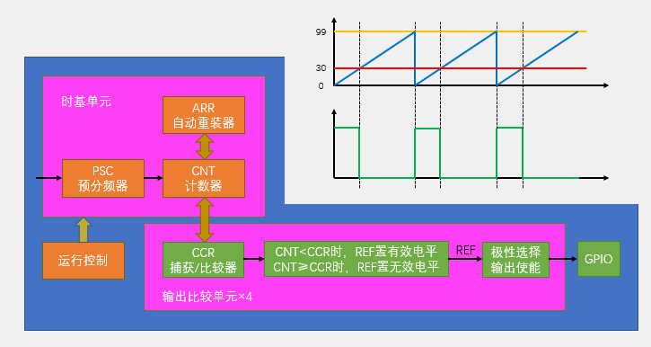

- 最右边为时钟源的选择，输出PWM，暂时不需要中断

- CNT不断自增运行，并且不断与CCR进行比较，输出模式控制器配置为PWM模式1。

- 蓝色线为CNT的值，黄色线为ARR的值。CNT不断自增到99，然后清零，继续自增，红色线为CCR，CCR设置为30，执行PWM模式1的逻辑，就得到了绿色线的输出。占空比受CCR值得调控，这里得REF就是频率可调，占空比也可调的PWM波形，最终通过极性选择，输出使能，最终通向GPIO口，就完成了PWM波形的输出

- 参数计算

	- PWM频率：**Freq = CK_PSC / (PSC + 1) / (ARR + 1)**，PWM的周期始终对应着计数器的一个溢出更新周期，所以PWM的频率就等于计数器的更新频率

	- PWM占空比：**Duty = CCR / (ARR + 1)**

	- PWM分辨率：**Reso = 1 / (ARR + 1)**，占空比最小的变化布距，值越小越好，也可以把CCR的范围定义为分辨率，那么值越大越好，占空比变化的越细腻越好

	- 输出一个1KHz，占空比为50%，且分辨率为1%的PWM波形

		- Freq = 1K = 72M / (PSC + 1) / (ARR + 1); ARR = 99; =>PSC = 719
		- Duty = 50% = CCR / (ARR+1);ARR+1 = 100;=>CCR = 50

		- Reso = 1% = 1 / (ARR + 1) *100% =>  ARR = 99

	- 输出一个周期为20ms,高电平时间为0.5ms-2.5ms的PWM波形

		- Freq = 1/20ms = 50Hz;
		- 由于PSC和ARR的参数不固定，需要不断测试，找到合适的值
		- 设置PSC + 1 = 72,ARR + 1 = 20k
		- Duty = 0.5ms = CCR / (ARR+1) ;ARR + 1 = 20K;=>CCR = 500;Duty = 2.5ms;=>CCR = 2500;

##### (3)通用定时器

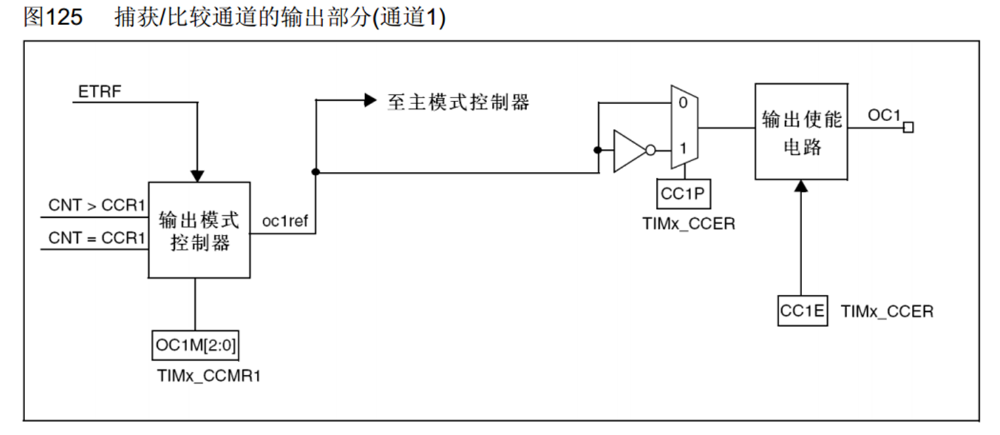

- 通用定时器框图右下角的的输出控制，左边是CCR和CNT比较的结果，右边为输出比较电路，最后通过TIM_CH1输出到GPIO引脚上
- 左边为CNT计数器和CCR1第一路的捕获/比较寄存器，它们进行比较，当CNT>CCR1,或者CNT = CCR1时 将给输出模式控制器传递一个信号，然后输出模式控制器就会改变它输出OC1REF的高低电平，REF信号(reference,参考信号)实际上就是指这里的高低电平；ETRF输入是定时器的小功能，一般不用；接着REF信号可以前往主模式控制器，将REF映射到主模式的TRGO输出上，但是REF的主要去向还是下面一路，到达极性选择，给CC1P寄存器写0，信号就往上走，信号电平不翻转，输入和输出一样，写1的话，信号就会往下走，信号通过一个非门取反，输出信号就是输入信号高低电平反转的信号，这就是极性选择，选择是不是要把高低电平反转一下；最后到达输出使能电路，选择要不要输出，最后是OC1引脚，这个引脚就是CH1通道的引脚，从引脚定义表里就可以知道具体是哪个GPIO口。
- 输出模式控制器工作原理，对应**上表**中的8种输出比较模式，模式控制器的输入是CNT和CCR的大小关系，输出是REF的高低电平，选择不同的模式可以更加灵活地控制REF输出；通过TIMx_CCMR1寄存器来配置。

##### (4)高级定时器

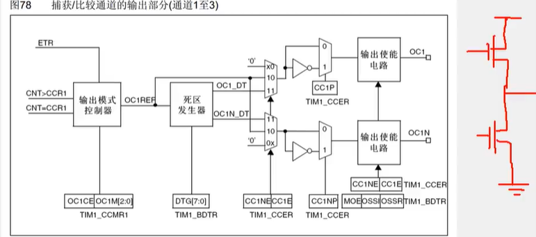

- 输出电路配合外部电路理解，在输出部分，通常要接两个MOS管，MOS管左边为控制极，P-MOS高电平导通，低电平断开，N-MOS低电平导通，高电平断开，构成一个最基本的推挽电路，中间为输出。上管导通，下管断开输出**高电平**，上管断开，下管导通就是**低电平**，如果上下管都导通，就是电源短路，这样是不允许的，如果上下管都断开，输出就是高阻态。如果有两个这样的推挽电路，就构成了**H桥电路**，就可以控制直流电机正反转了，如果有三个这样的电路，就可以用于驱动三相无刷电机了，这个就是这个电路的用途。如果直接用单片机来控制的话，就需要两个控制极，并且这两个控制极电平是相反的，也就是互补，因为只能用一个MOS管导通。（双路H桥型直流电机驱动芯片TB6612）
- H桥电路基本结构：

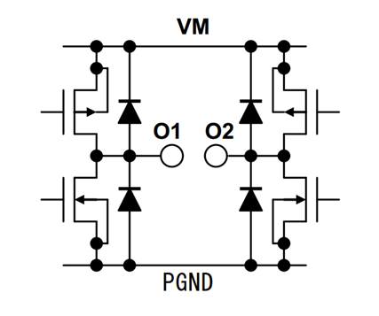

​		两路推挽电路构成的H桥型电路，输出O1和O2分别接电机正极和负极，左上和右下的MOS管导通，电流就从左边流向右边，如果右上和左下的MOS管导通，电流就从右边流向左边，H桥可以控制电流流动的方向，所以它就能够控制电机正反转。

- **死区生成和互补输出**：OC1和OC1N是两个互补的输出端口，分别控制上管和下管的导通和关闭。在切换上下管导通状态时，如果上管断开瞬间，下管就立即打开，可能因为器件的不理想，上管还没完全断开，下管已经导通了，出现短暂的上下管同时导通的现象，会导致功率损耗，引起器件发热，所以为了避免这个问题，就有了死区生成电路，它会在切换上下管导通状态时，延迟一小段时间，这样就避免了上下管同时导通的现象了。

##### (5) 同一个定时器输出不同通道的PWM的特点

- 对于同一个定时器的不同通道输出的PWM，它们的频率必须是一样的，因为不同通道共用一个计数器
- 它们的占空比由各自的CCR决定，占空比可以各自设定
- 由于计数器更新，所有的PWM同时跳变，所以它们的相位是同步的
- 如果驱动多个舵机或直流电机，使用一个定时器不同通道的PWM就完全可以了

