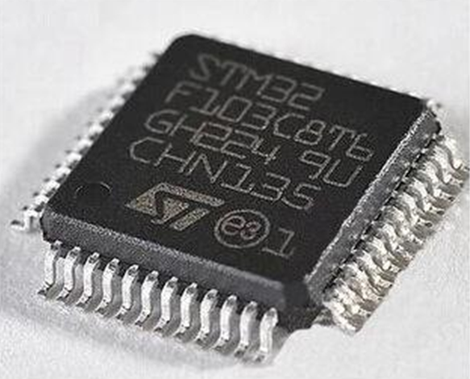
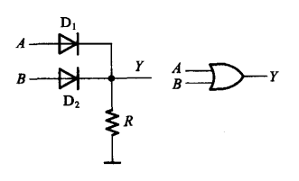
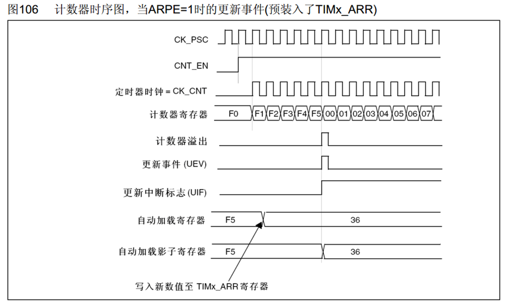
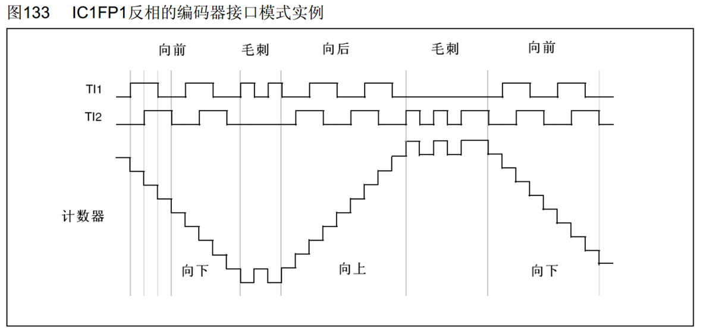
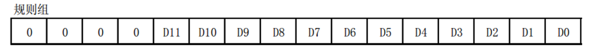
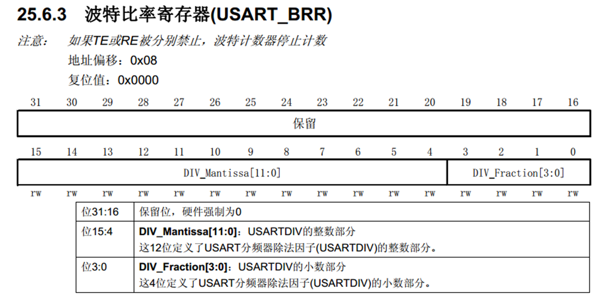
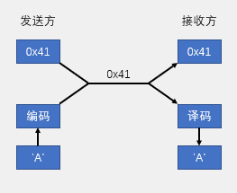
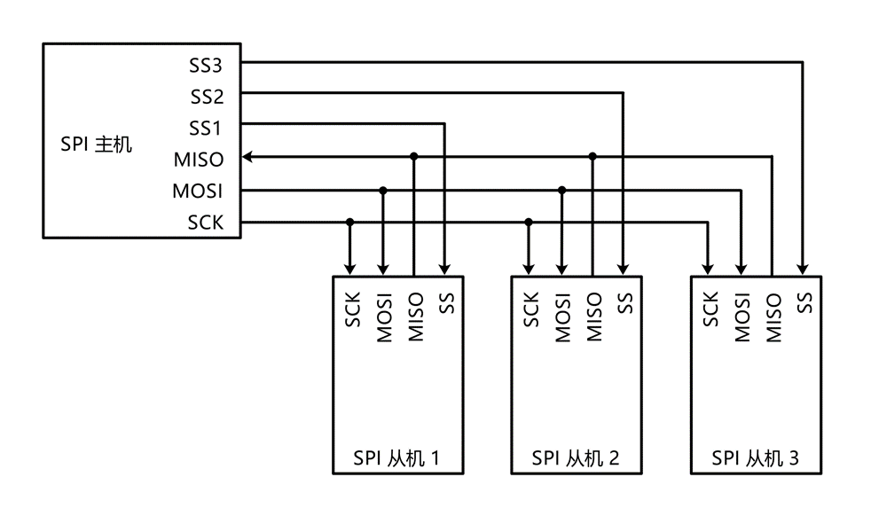
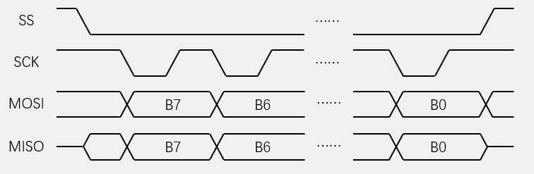
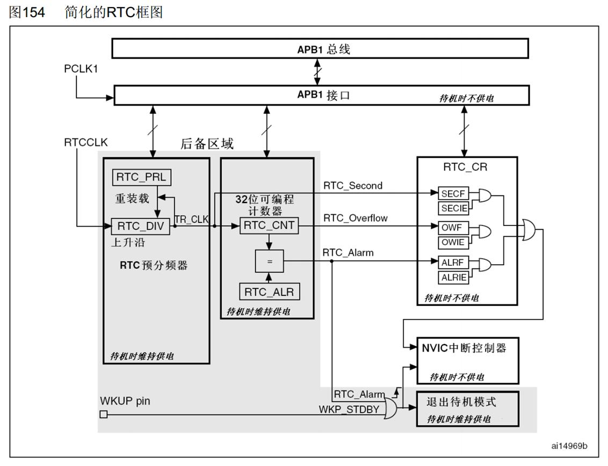

[TOC]

# STM32F103C8T6

## 一、STM32简介


- STM32是ST公司基于ARM Cortex-M内核开发的32位微控制器
- STM32常应用在嵌入式领域，如智能车、无人机、机器人、无线通信、物联网、工业控制、娱乐电子产品等
- STM32功能强大、性能优异、片上资源丰富、功耗低，是一款经典的嵌入式微控制器
- MCU厂商
	- ST(意法半导体，主打消费类电子)-STM32F1xx/STMF4xx
	- TI(德州仪器，主打低功耗的仪器仪表)-MSP430
	- MICROCHIP(微芯，主打工业控制)-pic16fxxx/pic18fxxx
	- NXP(恩智浦，主打汽车电子)-LPC2136
	- STC(宏晶，低端CPU)-STC89S51
	- 松瀚单片机---国产单片机

- MPU：
	- 三星：猎户座
	- 高通：晓龙
	- 华为：麒麟


## 二、ARM

- ARM即指ARM公司，也指ARM处理器内核  acorn RISC(reduce instrution sets computerh) machine
- ARM公司是全球领先的半导体知识产权(IP)提供商，全世界超过95%的智能手机和平板电脑都采用ARM架构
- ARM公司设计ARM内核，半导体厂商完善内核周边电路并生产芯片


- ARM公司根据不同场景生产了各种型号的内核

	- Classic 经典的ARM处理器  也是由ARM1内核逐渐演变而来的

		更改了命名方式，推出了Cortex系列的内核，并根据不同应用场景推出了三款子型号

		分别是：Cortex-A系类、Cortex-R系列、Cortex-M系列  **“ARM”**

	- Embedded  Cortex-R系列和Cortex-M系列适用于嵌入式领域，R系列(RealTime),主要面向实行很高的场景，比如硬盘控制器；M系列(Microcontroller),主要应用于单片机领域，

	- Application  Cortex-A系列适用于高端应用型的领域，主要应用在手机领域，也是性能最高，发展最快的系列

## 三、STM32F103C8T6



- 系列：主流系列STM32
- 内核：ARM Cortex-M3
- 主频：72MHz
- RAM：20K，即运行内存，实际的存储介质是SRAM
- ROM：64K，即程序存储器，实际存储介质是Flash闪存
- 供电：2.0~3.6V(标准3.3V)
- 封装：LQFP48，48个引脚

## 四、片上资源/外设 Peripheral

| **英文缩写** |      **名称**      | **英文缩写** |      **名称**      |
| :----------: | :----------------: | :----------: | :----------------: |
|     NVIC     | 嵌套向量中断控制器 |     CAN      |      CAN通信       |
|   SysTick    |   系统滴答定时器   |     USB      |      USB通信       |
|     RCC      |   复位和时钟控制   |     RTC      |      实时时钟      |
|     GPIO     |      通用IO口      |     CRC      |      CRC校验       |
|     AFIO     |      复用IO口      |     PWR      |      电源控制      |
|     EXTI     |      外部中断      |     BKP      |     备份寄存器     |
|     TIM      |       定时器       |     IWDG     |     独立看门狗     |
|     ADC      |     模数转换器     |     WWDG     |     窗口看门狗     |
|     DMA      |    直接内存访问    |     DAC      |     数模转换器     |
|    USART     | 同步/异步串口通信  |     SDIO     |      SD卡接口      |
|     I2C      |      I2C通信       |     FSMC     | 可变静态存储控制器 |
|     SPI      |      SPI通信       |   USB OTG    |    USB主机接口     |

## 五、命名规则


## 六、系统结构


- Cortex-M3：内核

- ICode：指令总线，用来加载程序指令

- DCode：指令总线，用来加载数据，比如常量和调试数据

	ICode和DCode主要用来连接Flash闪存，Flash里面存储的就是我们编写的程序

- System：系统总线

	- SRAM：用于存储程序运行时的变量数据
	- FSMC：可配置的静态存储器控制器，它具有4个片选输 出，支持PC卡/CF卡、SRAM、PSRAM、NOR和NAND

- AHB：即先进高性能总线，系统总线，用于挂载主要外设。挂载的一般是最基本的或者性能比较高的外设，比如复位和时钟这些最基本的电路，还有SDIO也是挂载在AHB总线上的；桥接一和桥接二分别接到了APB2和APB1两个外设总线上。APB即先进外设总线，用于连接一般的外设。因为AHB和APB的总线协议、总线速度、还有数据传送格式的差异，所以中间需要加两个桥接，来完成数据的转换和缓存。AHB的整体性能比APB高一些，其中APB2的性能又比APB1的性能高一些。**APB2一般是和AHB同频率，都是72MHz,APB1一般是36MHz**，所以APB2连接的都是一般外设中稍微重要的部分，比如GPIO端口，还有一些外设的1号选手等，比如USRAT1,SPI1,TIM1,TIM8.TM1和TM8一样都是高级定时器，所以也是重要的外设，还有ADC、EXTI、AFIO也是接在APB2上面的，其他次要一点的外设都会分配到APB1上去。

- DMA:”CPU的小秘书”，一些大量的数据搬运，让CPU来处理就太浪费资源了。比如有个外设ADC模式转换，这个模数转换可以成连续模式，比如1ms转换一次，转换完的数据必须转运出来，否则会被丢失，如果让CPU去转运的话，没过1ms就得转运一下数据，影响CPU的正常工作。DMA可以代替CPU去处理这些简单但是需要反复去干的事情，DMA通过DMA总线连接到总线矩阵上，它可以用于和CPU一样的总线控制权，来访问这些外设小弟。 当需要DMA搬运数据时，外设小弟就会通过请求线发送DMA请求，然后DMA就会获得总线控制权，访问并转运数据，整个过程不需要CPU参与，省下了CPU的事件用来干其他事情。

## 七、引脚定义


- 红色：电源相关引脚
- 蓝色：最小系统相关引脚
- 绿色：IO口、功能口引脚
- FT：能够容忍5V的电压
- 调试端口：
	- STLINK：PA13、PA14
	- JLINK：PA13、PA14、PA15、PB3、PB4

## 八、启动配置

- 启动配置的作用就是指定程序开始运行的位置，一般情况下，程序都是在Flash程序存储器开始执行，但是在某些情况下，我们也可以让程序在别的地方开始执行，用以完成特殊的功能。


- 主闪存存储器：正常执行Flash内存里面的程序
- 系统存储器：用来做串口下载用的，系统存储器存的就是STM32中的一段BootLoader程序，BootLoader程序的作用就是接收串口的数据，然后刷新到主闪存中，这样就可以使用串口下载程序了。当需要串口下载程序时就要将启动模式，配置成改该模式。PB13、PB14、PA15、PB3、PB4这五个调试调试端口，它们既可以用来下载程序，也可以作为普通IO口使用，如果在程序中把这5个端口全配置成了IO口，那么这个芯片就没有调试端口了，也就下载不了程序。所以在配置这五个端口时，要特别注意，如果全部变成IO口了，就下载不进去程序了，就需要使用串口的方式下载程序。如果没有STLINK或JLINK，就可以使用串口来下载程序。
- 内置SRM：主要用来进行程序调试

**BOOT引脚的值是在上电复位后的一瞬间有效的，之后就随便了**，BOOT1和PB2是在同一个引脚上，也就是上电的瞬间，是BOOT1的功能，当第4个时钟过后，就是PB2的功能

## 九、最小系统电路


- 晶振电路：如果需要RTC功能，需要再接一个32.768KHz的晶振，电路和8MHz晶振一样，接在3、4号引脚，OSC32就是32.768KHz的意思，**32768是2的15次方**，内部RTC电路通过2的15次方分频就可以生成1s的时间信号。

- 复位电路：用来给单片机提供复位信号，NRST是**低电平**复位的，当这个复位电路在上电的瞬间，电容是没有电的，电源通过电阻开始向电容充电，并且此时电容呈现的是短路状态，NRST引脚就会产生低电平，当电容逐渐充满电时，电容就相当于断路，此时NRST就会被R1上拉为高电平，上电瞬间的波形就是先低电平，然后逐渐高电平，这个低电平就会给单片机提供一个复位信号。按键提供了手动复位的功能，当按下按键时，电容放电，并且NRST引脚也通过按键被直接接地了，即手动产生了低电平复位信号，按键松手后，NRST又回归高电平，此时单片机就从复位状态转为工作状态。

## 十、新建工程

- 关于启动文件——型号分类及缩写

 | **缩写** | **释义**           | **Flash****容量** | **型号**          |
 | -------- | ------------------ | ----------------- | ----------------- |
 | LD_VL    | 小容量产品超值系列 | 16~32K            | STM32F100         |
 | MD_VL    | 中容量产品超值系列 | 64~128K           | STM32F100         |
 | HD_VL    | 大容量产品超值系列 | 256~512K          | STM32F100         |
 | LD       | 小容量产品         | 16~32K            | STM32F101/102/103 |
 | MD       | 中容量产品         | 64~128K           | STM32F101/102/103 |
 | HD       | 大容量产品         | 256~512K          | STM32F101/102/103 |
 | XL       | 加大容量产品       | 大于512K          | STM32F101/102/103 |
 | CL       | 互联型产品         | -                 | STM32F105/107     |

- **新建工程步骤**


- 工程架构


## 十一、GPIO

### (一)GPIO简介

- GPIO(General Purpose Input Output)通用输入输出口

- 可配置为8种输入输出模式

- 引脚电平：0V~3.3V，部分引脚可容忍5V，从引脚定义中可以看出，带FT的引脚就可以容忍5v

- 输出模式下可控制端口输出高低电平，用以驱动LED、控制蜂鸣器、模拟通信协议输出时序等

- 输入模式下可读取端口的高低电平或电压，用于读取按键输入、外接模块电平信号输入、ADC电压采集、模拟通信协议接收数据等

### (二)GPIO基本结构


- 寄存器就是特殊寄存器，内核可以通过APB2总线对寄存器进行读写，这样就可以完成输出电平和读取电平的操作了，STM32是32位的单片机，所以寄存器也是32位的，但是端口只有16位，所以这个寄存器只有低16位对应的有端口
- 驱动器是用来增强信号的驱动能力的，寄存器只负责存储数据，驱动器来负责增大驱动能力。

### (三)GPIO位结构


- 输入部分——上半部分电路
  - 保护二极管：对输入电压进行限幅，上面二极管接V~DD~3.3v,下面二极管接V~SS~0V，当输入电压比3.3v还要高，那上方这个二极管就会导通，输入电压产生的电流就会直接流入V~DD~而不会流入内部电路，这样就可以避免过高的电压对内部造成伤害；如果输入电压比0V还低(相对V~SS~电压)，所以是可以有负电压的，这时下方二极管就会导通，电流会从V~SS~直接流出去，而不会从内部电流汲取电流。
  - 上拉电阻V~DD~，下拉电阻V~SS~，上面导通，下面断开就是**上拉输入模式**，上面断开，下面导通就是**下拉输入模式**，两个都断开就是**浮空输入模式**。上拉、下拉是为了给输入提供一个默认的输入电平。对于一个数字的端口，输入不是高电平就是低电平，如果输入引脚什么都不接，就说不清到底是高电平还是低电平，实际上，如果什么都不接，输入就会处于一种浮空的状态，引脚的输入电平极易受到外界干扰而改变，**为了避免引脚悬空导致的输入数据不确定，我们就需要在这里加上上拉或者下拉电阻了**，如果接入上拉输入，当引脚悬空时，还有上拉电阻保证引脚的高电平，上拉输入又可以称作默认为高电平的输入模式，下拉输入又可以默认为低电平的输入模式。这里的上拉和下拉电阻的组织都比较大，目的是尽量不影响正常的输入操作。
  - 施密特触发器(图中肖密特触发器—由肖特基管组成的)，作用是对输入电压进行整形，执行逻辑是，当输入电压大于某一阈值，输出就会瞬间升为高电平，如果输入电压小于某一阈值，输入就会瞬间降为低电平；因为引脚的波形是外界输入的，虽然是数字信号，实际情况下会产生各种失真，通过施密特触发器，可以有效的避免因信号波动造成的输出抖动现象，经整形的波形就可以直接写入输入数据寄存器了。再用程序读取输入寄存器对应某一位的数据，就可以知道端口的输入电平了
  - 模拟输入，连接到ADC上的，ADC需要接受模拟量，所以这根线连接在施密特触发器前
  - 复用功能输入，连接到其他需要读取端口的外设上的，比如串口的输入引脚，这根线接受的是数字量，所以在施密特触发器后面。
- 输出部分——下半部分
  - 输出数据寄存器控制，即普通IO口输出，写输出数据寄存器的某一位就可以操作对应的某个端口了；
  - 位设置/清除寄存器，可以用来单独操作输出数据寄存器的某一位，而不影响其他位。因为数据输出寄存器同时控制16个端口，并且这个寄存器只能整体读写，所以如果想单独控制其中某一个端口而不影响其他端口的话，就需要通过特殊的方式。第一种方式，先读出这个寄存器，然后按位与和按位或的方式更改某一位，最后再将更改后的数据写回去；第二种方式是通过位设置和位清除寄存器，对某一位进行清零或置一的操作；第三种方式通过，读写STM32的位带区。
  - 两个MOS管，P-MOS和N-MOS，输出控制的信号负责MOS管的导通和关闭，负责将IO口接到V~DD~或者V~SS~，可以选择**推挽、开漏或者关闭三种输出方式**。在**推挽输出**模式下，P-MOS和N-MOS均有效；数据寄存器为1时，上管导通，下管断开，输出直接接到V~DD~，就是输出高电平；数据寄存器为0时，上管断开，下管导通，输出直接接到V~SS~，就是输出低电平。这种模式下，高低电平均有较强的驱动能力，推挽输出也可以叫强推输出模式；**在推挽输出模式下，STM32对IO口具有绝对的控制权，高低电平都由STM32决定**。在**开漏输出**模式下，P-MOS是无效的，只有N-MOS工作，数据寄存器为1时下管断开，这时输出相当于断开，也就是高阻模式，数据寄存器为0时，下管导通，这时输出直接接到V~SS~，也就是输出低电平，这种模式下，只有低电平有驱动能力，高电平是没有驱动能力的；**开漏模式可以作为通信协议的驱动方式**，比如I^2^C通信的引脚，就是使用的开漏模式，在多机通信的模式下，这个模式**可以避免各个设备的相互干扰，另外，开漏输出还可以用于输出5V的电平信号**，比如在IO口外接一个上拉电阻到5v的电源，当输出低电平时，由内部的N-MOS直接接V~SS~，当输出高电平时，由外部的上拉电阻拉高至5V，就可以输出5V的电平信号，用于兼容一些5V电平的设备；关闭状态，**当引脚配置为输入模式时，P-MOS和N-MOS都无效，也就是输出关闭，端口的电平由外部信号来控制**。
  - 片上外设控制

### (四)GPIO模式

- 通过配置GPIO的端口配置寄存器，端口可以配置成以下8种模式

| **模式名称** | **性质** |                      **特征**                      |
| ------------ | :------: | :------------------------------------------------: |
| 浮空输入     | 数字输入 |      可读取引脚电平，若引脚悬空，则电平不确定      |
| 上拉输入     | 数字输入 | 可读取引脚电平，内部连接上拉电阻，悬空时默认高电平 |
| 下拉输入     | 数字输入 | 可读取引脚电平，内部连接下拉电阻，悬空时默认低电平 |
| 模拟输入     | 模拟输入 |           GPIO无效，引脚直接接入内部ADC            |
| 开漏输出     | 数字输出 |    可输出引脚电平，高电平为高阻态，低电平接VSS     |
| 推挽输出     | 数字输出 |      可输出引脚电平，高电平接VDD，低电平接VSS      |
| 复用开漏输出 | 数字输出 |    由片上外设控制，高电平为高阻态，低电平接VSS     |
| 复用推挽输出 | 数字输出 |      由片上外设控制，高电平接VDD，低电平接VSS      |

#### (1)浮空/上拉/下拉输入

- 这三个模式的电路结构基本是一样的，区别在于上拉电阻和下拉电阻的连接，都属于数字的输入口。


- 在使用浮空输入时，端口一定要接上一个连续的驱动源，不能出现悬空的状态
- 在输入模式下，输出驱动器是断开的
- 上拉、下拉输入根据外部模块的空闲电平状态来决定，保持一致即可
- 不确定外部模块的默认的输出状态，或者外部信号功率非常小，这时就尽量选择浮空输入模式，浮空输入没有上拉电阻和下拉电阻去影响外部信号，缺点是当引脚悬空时，没有默认电平了，输入就容易受到噪声干扰，来回不断地跳变

#### (2)模拟输入

- 是ADC模数转换器的专属配置


- 输出驱动器是断开的，施密特触发器也是关闭状态，由引脚直接接入片上外设，也就是ADC,使用ADC时，需要将引脚配置为模拟输入模式

#### (3) 开漏/推挽输出

- 都是数字输出，区别在于，开漏输出的高电平为高阻态没有驱动能力


- 输出由输出数据寄存器控制，如果P-MOS无效就是开漏输出，如果P-MOS和N-MOS都有效，就是推挽输出。
- **在输出模式下，输入模式也是有效的，但是在输入模式下，输出模式无效，这是因为，一个端口只能有一个输出，但是可以有多个输入。**

#### (4) 复用开漏/推挽输出

- 与通用开漏/推挽输出不同的是，复用的输出，引脚电平是由片上外设控制的


- 通用的输出是没有连接的，引脚的控制权转移到了片上外设，由片上外设来控制，在输入部分，普通的输入也是有效的，顺表接收一下电平信号

##### 总结

- 在GPIO的8种模式中，除了模拟输入这个模式会关闭数字的输入功能，在其他的7个模式中，所有的输入都是有效的

### (五)GPIO寄存器

#### (1)   端口配置低寄存器 GPIOx_CRL

- 配置低16位端口的输入输出模式，和输出速度

#### (2)   端口配置高寄存器 GPIOx_CRH

- 配置高16位端口的输入输出模式，和输出速度
- GPIO输出的速度，可以限制输出引脚的最大翻转速度，是为了低功耗和稳定性，一般要求不高配置50MHz

#### (3)  端口输入数据寄存器 GPIOx_IDR

- 对应的GPIO结构图中的输入数据寄存器
- 低16位对应16个引脚，高16位未使用

#### (4)  端口输出寄存器  GPIOx_ODR

- 对应GPIO结构图中的输出数据寄存器
- 低16位对应16个引脚，高16位未使用

#### (5)  端口位设置/清除寄存器 GPIOx_BSRR

- 对应GPIO结构图中的端口位设置/清除寄存器
- 高16位是进行位清除的，低16位是进行位设置的
- 写1就是清除对应的ODR位为0，或设置对应的ODR位为1；写0不产生影响

#### (6)  端口位清除寄存器  GPIOx_BRR

- 与BSRR寄存器的高16位功能是一样的，写1，对应的ODR位位0，写0不产生影响
- 低16位对应16个引脚，高16位未使用
- 为了方便使用，当只想对某一位进行位设置或位清除时，使用BSRR和BRR的低16位进行操作；如果对多个端口同时进行位设置和位清除，使用BSRR寄存器，保证了位设置和位清除的同步性，如果对信号的同步性要求不高，先位设置再位清除也没问题

#### (7)  端口配置锁定寄存器  GPIOx_LCKR

- 可以对端口的配置进行锁定，防止意外更改

## 十二、EXTI外部中断

### (一)基本概念

- 中断：在主程序运行过程中，出现了特定的中断触发条件(中断源)，使得CPU暂停当前正在运行的程序，转而去处理中断程序，处理完成后又返回原来被暂停的位置继续运行

​		**使用终端系统，能够极大地提高程序运行的效率，**比如，没有中断系统，为了防止外部中断被忽略或者串口数据被覆盖，那么主程序就只能不断地查询是否有这些事件发生，不能再干其它事情了，比如没有定时器中断，那主程序只有靠Delay函数，才能实现定时地功能，有了中断系统之后，主程序就可以放心执行其他事情，有中断的时候再去处理，效率就会大大提升。

- 中断优先级：当有多个中断源同时申请中断时，CPU会根据中断源的轻重缓急进行裁决，优先响应更加紧急的中断源

​		中断优先级根据程序设计的需求，自己设置，**中断优先级是为了在多个中断同时申请时，判断一下，应该先处理哪个，CPU会优先响应高优先级中断**

- 中断嵌套：当一个中断程序正在运行时，又有新的更高优先级的中断源申请中断，CPU再次暂停当前中断程序，转而去处理新的中断程序，处理完成后依次进行返回

​		在中断服务程序执行过程中，再次发生高优先级的中断，进行二次中断，**能否进行中断嵌套，是由中断优先级来决定的。**

### (二)中断执行流程


- 断点处，需要进行保护现场和还原现场，用C语言编程，这些工作编译器自动做好了

### (三)STM32中断

- **中断向量表**


- 灰色部分为内核中断


- 68个可屏蔽中断通道，包含EXTI、TIM、ADC、USART、SPI、I2C、RTC等多个外设
- **使用NVIC统一管理中断，每个中断通道都拥有16个可编程的优先等级，可对优先级进行分组，进一步设置抢占优先级和响应优先级**

### (四)NVIC基本结构


- NVIC：嵌套中断向量控制器，在STM32中，它是用来统一分配中断优先级和管理中断的，NVIC是一个**内核外设**，是CPU的小助手。
- STM32有很多的中断，如果把这些中断全部接到CPU上，那么CPU就要引出很多线进行适配，设计上很麻烦，并且如果很多中断同时申请，或者中断很多产生了拥堵，CPU也会很难处理，比较CPU主要是用来运算的，中断分配的任务就交给其他外设进行处理，即交给NVIC。
- NCIC有很多输入口，有多少个中断线路，都可以接过来，如图中的EXTI、TIM、ADC、USRAT等等，n代表着一个外设可能会占用多个中断通道，NVIC只有一个输出口，NVIC根据每个中断的优先级分配中断的先后顺序，然后告诉给CPU，CPU不知道中断分配的先后顺序，只负责按NVIC输出的顺序，处理中断。

### (五)NVIC优先级分组

- 为了处理不同形式的优先级，STM32的NVIC可以对优先级进行分组，分为**抢占优先级**和**响应优先级**。
- 响应优先级：当CPU正在执行中断服务程序时，正在”排队“的中断，发生了更高优先级的中断，那这个中断将会“插队”，等待当前中断服务程序结束后，立即响应。**响应优先级高的，可以“插队”响应。**
- 抢占优先级：当CPU真正执行中断服务程序时，发生了更紧急的事件，需要CPU处理，此时CPU将会进行**二次中断**，处理完这个紧急事件后，再去执行当前的中断服务程序，即发生中断嵌套，这种决定是不是可以中断嵌套的优先级，就叫做抢占优先级。**抢占优先级高的，可以进行中断嵌套。**

- **NVIC的中断优先级由优先级寄存器的4位(0~15)决定，这4位可以进行切分，分为高n位的抢占优先级和低4-n位的响应优先级**

- **抢占优先级高的可以中断嵌套，响应优先级高的可以优先排队，抢占优先级和响应优先级均相同的按中断号排队**

| **分组方式** | **抢占优先级**  | **响应优先级**  |
| ------------ | --------------- | --------------- |
| 分组0        | 0位，取值为0    | 4位，取值为0~15 |
| 分组1        | 1位，取值为0~1  | 3位，取值为0~7  |
| 分组2        | 2位，取值为0~3  | 2位，取值为0~3  |
| 分组3        | 3位，取值为0~7  | 1位，取值为0~1  |
| 分组4        | 4位，取值为0~15 | 0位，取值为0    |

- 因为优先级寄存器总共是4位，所有就有(0，4)、(1，3)、(2，2)、(3，1)、(4，0)这五种分组方式

### (六)EXTI简介

- EXTI(Extern Interrupt)外部中断

- EXTI可以监测指定GPIO口的电平信号，当其指定的GPIO口产生电平变化时，EXTI将立即向NVIC发出中断申请，经过NVIC裁决后即可中断CPU主程序，使CPU执行EXTI对应的中断程序。**检测引脚电平变化，触发中断**

- 支持的触发方式：上升沿/下降沿/双边沿/软件触发
	- 上升沿：电平由低电平变到高电平的瞬间触发中断
	- 下降沿：电平由高电平变到低电平的瞬间触发中断
	- 双边沿：上升沿或下降沿都可以触发中断
	- 软件触发：程序中执行一句代码就可以触发中断

-  支持的GPIO口：所有GPIO口，但**同号的Pin不能同时触发中断**，端口GPIO_Pin一样的，只能选1个作为中断引脚，**如果有多个中断引脚，要选择不同Pin的引脚。**

- 通道数：**16个GPIO_Pin(0-15)**，外加PVD输出、RTC闹钟、USB唤醒、以太网唤醒，加起来共20个中断线路，16个GPIO_Pin口是外部中断的主要功能，其余四个外部中断，其实是来“蹭网”的，因为**外部中断有个功能，从低功耗模式的停止模式下唤醒STM32**，对于PVD电源电压检测，当电压从电压过低恢复时，就需要PVD借助一下外部中断退出停止模式；对于RTC闹钟来说，有时候为了省电，RTC定一个闹钟后，STM32会进入停止模式，等到闹钟响的时候再唤醒，这也需要借助外部中断；USB唤醒和以太网唤醒也是类似的作用。

- 触发响应方式：中断响应/事件响应
	- 中断响应：申请中断，CPU执行中断函数
	- 事件响应：是STM32对外部中断增加的一种额外的功能，当外部中断检测到引脚电平变化时，正常的流程是选择触发中断，但在STM32中也可以选择触发一个事件，如果选择触发事件，那外部中断的信号就不会通向CPU了，而是通向其他外设，用来触发其他外设的操作，比如触发ADC转换、触发DMA等。

​	**中断响应是正常流程，引脚电平变化触发中断，事件响应不会触发中断，而是触发别的外设操作，属于外设之间的联合工作。**

### (七)EXTI基本结构


- 每个GPIO外设都有16个引脚，如果每个引脚都占用一个通道，那EXTI的16个通道显然就不够用了，所有就会有一个AFIO中断引脚选择的电路模块，**AFIO就是一个数据选择器，它可以在前面3个GPIO外设的16个引脚里选择其中一个连接到后面EXTI的通道里，**所以说，相同的Pin口不能同时触发中断，因为对于PA0、PB0、PC0、PD0……这些引脚，通过AFIO口选择之后，只能有其中一个能够接到EXTI的通道0上，这就是**所有GPIO口都可以触发中断，但相同的Pin不能同时触发中断**的原因。经过AFIO选择后的16个通道，就接到了EXTI边沿检测及控制电路上。经过EXTI电路之后，分为了两种输出，接到NVIC上的，就是用来触发中断的，需要注意的是**本来20路输入，应该有20路输出，但可能是由于ST公司觉得20个输出太多，比较占用NVIC的通道资源，所以将其中外部中断的9-5，和15-10，分到一个通道里，也就是说外部中断9-5会触发同一个中断函数，15-10也会触发发同一个中断函数，在编程时，需要在在两个中断函数里，再根据标志位来区分到底是哪个中断进来的，**下面有20条输出线路接到了其他外设，这就是触发其他外设操作的，也就是**事件响应**。

### (八)AFIO复用IO口

- AFIO主要用于引脚复用功能的选择和重定义，**数据选择器的作用**
- 在STM32中，AFIO主要完成两个任务：**复用功能引脚重映射、中断引脚选择**
	- 复用功能引脚重映射：参考引脚功能表，将默认复用功能切换到重定义功能当中
	- 中断引脚选择：选择哪一个端口的Pin口进行中断


- 配置AFIO_EXTICRx(1~4)寄存器的对应位，就可以决定哪一个输入

### (九)EXTI内部框图


- 电路分析

​		输入线(20根)首先进入边沿检测电路，在上面的上升沿寄存器和下降沿寄存器可以选择是上升沿触发还是下降沿触发，或者两个都触发，接着触发信号就进入到或门的输入端，这这里，硬件触发和软件中断寄存器的值接到了这个或门上，也就是任意一个为1，或门就可以输出1，所有说，支持外部中断触发的方式包含有上升沿，下降沿，双边沿和软件触发；经过或门后，触发信号兵分两路，上一路是触发中断的，下一路是触发事件的；**触发中断时(中断触发)**，首先会置一个挂起寄存器，相当于中断标志位，通过读取这个寄存器就可以知道是哪个通道触发的中断，如果中断挂起寄存器置1，就会继续向左走，和中断屏蔽寄存器共同进入一个与门，然后至NVCI中断控制寄存器，这里的与门相当于开关的作用，当中断屏蔽寄存器给1时，另一个输入就是直接输出，也就是运行中断，而中断屏蔽寄存器给0，那另一端输入无论是什么，输出都是0，相当于屏蔽了这个中断；**触发事件时**(事件触发)，回到或门的下一路事件的输出部分，首先是一个事件屏蔽寄存器进行开关控制，最后通过一个脉冲发生器，到其他外设，这个脉冲发生器就是给一个电平脉冲，用来触发其他外设的动作。\20就是20根线，代表20个通道；上面的外设接口和APB总线，可以通过总线访问这些寄存器。

- 补充知识：

​		(1)与门(二极管)


​		可以有多个输入，但只有一个输出，执行与的逻辑，有0则为0，全1才为1

​		(2)或门(二极管)

​		

​		可以有多个输入，但只能有一个输出，执行或的逻辑，有1则为1，全0才为0

​		(3)非门


​		只有一个输入一个输出，执行非的逻辑，输入0输出1，输入1输出0

​		(4)数据选择器


​			有多个输入，一个输出，A1和A0为选择控制端，根据控制端的数据，从输入选择一个接到输出

### (十)总结

- 使用外部中断模块的特性

​		对于STM32来说，想要获取的信号是外部驱动的，很快的，突发信号，比如旋转编码器的输出信号，可能很久不会去扭动它，这时就不需要STM32做任何事，当扭动它时，就会有很多脉冲波形需要STM32接收，这个信号是突发的，STM32并不知道什么时候会来，同时它是外部驱动的，STM32只能被动读取，而且这个信号非常快，STM32如果读取的稍微慢一点，就会错过很多波形，对于这种情况来说，就可以考虑使用STM32的外部中断了；还有比如红外遥控接收头的输出，接收到遥控数据后，会输出一段波形，这个波形转瞬即逝，所有就需要外部中断来读取；还有按键，虽然它的动作也是外部驱动的突发事件，但是并不推荐使用外部中断来读取按键，因为外部中断不好处理按键抖动和松手的检测问题，对于按键来说，它的输出波形也不是转瞬即逝的，所有要求不高的话，可以在主程序中循环读取，如果不想在主程序中读取的话，可以考虑定时器中断读取的方式，这样既可以做到后台读取按键值、不阻塞主程序，也可以很好的处理按键抖动和松手检测的问题

### (十一)外部中断初始化配置

​	1、配置RCC，打开时钟

​		<1> 开启端口时钟：**RCC_APB2PerphClockCmd(RCC_APB2Periph_GPIOx,ENABLE);**

​		GPIOx都挂载在APB2的总线上，开启Pin口对应时钟：

​		<2>开启AFIO时钟：**RCC_APB2PerphClockCmd(RCC_APB2Periph_AFIO,ENABLE);**

​		<3>  EXTI和NVIC的时钟是默认开启的，不用再开启时钟，EXTI虽是独立外设，但是寄存器没有对应的EXTI时钟的控制位；NVIC属于内核外设，内核外设都不需要开启外设，RCC管理的是内核外的外设

​	2、配置GPIO，选择输入模式

​		使用官方库中GPIO_InitTypeDef结构体初始化GPIO口，Pin口，输入模式(浮空、上拉、下拉)，速度，再通过GPIO_Init()函数初始化GPIO

​	3、配置AFIO，选择哪一路的GPIO

​	**GPIO_EXTILineConfig(GPIO_PortSourseGPIOx,GPIO_PinSourex);**

​		**GPIO_PortSourseGPIOx**:选择某个GPIO外设作为外部中断源 (x:A-E)

​		**GPIO_PinSourex**:选择某个外部中断线路，对应Pin口(x:0-15)

​	4、配置EXTI，选择边沿触发方式(上升沿、下降沿和双边沿)以及触发响应方式(中断响应和事件响应)

​			使用EXTI_InitTypeDef结构体对EXTI进行初始化

​			<1> **EXTI_Line**：指定要配置的中断线路 EXTI_Linex,对应外部中断触发的Pin口

​			<2> **EXTI_LineCmd**：指定选择的中断线的新状态，是否开启中断,ENABLE or DISABLE

​			<3>**EXTI_Mode**：指定外部中断线的模式，选择触发模式，中断模式还是事件模式

​			<4>**EXTI_Trigger**：指定触发信号的有效边沿，上升沿、下降沿或双沿触发

​			再通过库函数 EXTI_Init(&EXTI_InitStruct);

​	5、配置NVIC，配置中断的优先级

​			先配置中断分组：

​			**NVIC_PriortyGroupConfig(NUIV_PriorityGroup_x);**[x:0-4]

​	配置优先级分组：先占优先级(pre-emption priority)和从占优先级(subpriority),即抢占优先级和响应优先级，配置几位抢占和几位响应。

​	**中断分组，整个工程只需要执行一次就可以，如果是在不同模块中进行分组，需要保证每个模块中的分组方式是同一种，最好放在主程序中**

​		使用NVIC_InitTypeDef结构体进行NVIC初始化

​		<1> **NVIC_IRQChannel**：指定中断通道来开启或关闭，在IRQn_Type枚举中，不同型号的芯片，中断通道列表也会有所不同

​		<2>**NVIC_IRQChannelCmd**：指定中断通道是否使能，ENABLE or DISABLE

​		<3>**NVIC_IRQChannelPreemptionPriority**：指定所选通道的抢占优先级

​		<4>**NVIC_TRQChannelSubPriority**：指定所选通道的响应优先级

​		指定所选通道的抢占优先级和响应优先级的值要对应，中断分组中的取值范围

​		再使用库函数：NVIC_Init(&NVIC_InitTypeDef);

​	6、写中断函数

​	在STM32中，中断函数的名字是固定的，每个中断通道都对应一个中断函数，即配置NVIC时，NVIC_IRQChannel的中断通道，可以在启动文件的中断向量表中找到对应的值，EXTIx_IRQHandler[x对应外部中断通道]

​	**中断函数都是无参，无返回值，名字对应中断通道，不能写错**

​	在写中断函数时，一般先进行一个中断标志位的判断，确保是我们想要的中断触发的这个函数，特别是5-9，10-15这两个中断通道。多个中断线都可以进入这同一个外部中断函数，要判断对应的中断源，才能触发对应的中断函数

​		要使用EXTI_GetITStatus(EXTI_Linex);函数，看一下EXTIx的中断标志位是不是为1，返回值是SET or RESET。

​		最后，中断服务程序结束后，一定要再调用清除中断标志位的函数，因为只要中断标志位置1了，程序就会跳转到中断服务程序，如果不清除中断标志位，那就会一直申请中断，引起**”中断风暴“**，这样程序将会不断响应中断，执行中断函数，那程序就会卡死在中断函数中。

​		**每次中断程序结束后，都要清除一下中断标志位**

​		EXTI_ClearITPendingBit(EXTI_Linex);  对应的中断源

## 十三、TIM定时器中断

### (一) TIM简介

- TIM(Timer)定时器

- 定时器可以对输入的时钟进行计数，并在计数值达到设定值时触发中断

- 16位计数器、预分频器、自动重装寄存器的时基单元，在72MHz计数时钟下可以实现最大59.65s的定时
	- 计数器：执行计数定时的一个寄存器，每来一个时钟(1/72us)，计数器加1；
	- 预分频器：可以对计时器的时钟进行分配，让这个计数更加灵活
	- 自动重装寄存器：计数的目标值；
	- 这三个部分构成了定时器最核心的部分，称为**时基单元**，时基单元中的计数器、预分配器、自动重装寄存器都是16位的，2^16^=65536,如果预分频器设置最大，自动重装寄存器也设置最大，那么定时器的最大定时时间就是59.65s,接近一分钟,72M/65536/65536得到的就是中断频率，然后取倒数。
	- **STM32的定时器支持级联的模式**，一个定时器的输出可以作为另一个定时器的输入，那么最大定时事件就是59.36s再乘2次65536大概是8000多年，如果还短，那就可以再级联一个定时器，定时时间将再延长65536*65536倍，这个时间大概是34万亿年，三个定时器级联定时，就可以从宇宙诞生，计到宇宙灭亡。

- 不仅具备基本的定时中断功能，而且还包含内、外时钟源选择、输入捕获、输出比较、编码器接口、主从触发模式等多种功能

- 根据复杂度和应用场景分为了**高级定时器**、**通用定时器**、**基本定时器**三种类型，高级定时器最为复杂


### (二)定时器类型


|  **类型**  |        **编号**        | **总线** |                                               **功能**                                               |
| :--------: | :--------------------: | :------: | :--------------------------------------------------------------------------------------------------: |
| 高级定时器 |       TIM1、TIM8       |   APB2   |           拥有通用定时器全部功能，并额外具有重复计数器、死区生成、互补输出、刹车输入等功能           |
| 通用定时器 | TIM2、TIM3、TIM4、TIM5 |   APB1   | 拥有基本定时器全部功能，并额外具有内外时钟源选择、输入捕获、输出比较、编码器接口、主从触发模式等功能 |
| 基本定时器 |       TIM6、TIM7       |   APB1   |                                  拥有定时中断、主模式触发DAC的功能                                   |

- 不同型号的STM32单片机，拥有着不同的定时器资源
- 重复计数器、死区生成、互补输出、刹车输入等功能，主要是为了三相无刷电机的驱动设计的

#### 1、高级定时器


- 与通用定时器相比，主要改动的是右边和下边这几个部分
- 重复次数计数器：在申请中断的地方，增加了一个重复次数计数器，有了该计数器之后，就可以实现每隔几个计数周期，才发生一次更新事件和更新中断，与原来相比，就相当于对输出的更新信号又做了一次分频；一个通用定时器或基本定时器最长可定时59.35s，而高级定时器可定时长就需要再乘一个65536。
- DTG(Dead Time Generate，死区生成电路)，右边的输出引脚由原来的一个变成了两个互补的输出，可以输出一对互补的PWM波，这些电路是为了驱动三相无刷电机的，三相无刷电机是一个常用的外设，如四轴飞行器、电动车的后轮、电钻等，里面都可能是三相无刷电机，因为三相无刷电机的驱动一般需要三个桥臂，每个桥臂需要2个大概率开关管来控制，总共需要6个大概率开关管来控制，所以这里的输出PWM引脚的前三路就变成了互补的输出，而第四路却没什么变化，因为三相无刷电机只需要三路就好了，另外，为了防止互补输出的PWM驱动桥臂时，在开关切换的瞬间，由于器件的不理想，造成短暂的直通现象，所以在这之前加入了死区生成电路，在开关切换的瞬间，产生一定时长的死区，让桥臂的上下管全都关断，防止直通现象。
- 
- 刹车输入：是为了给电机驱动提供安全保障的，如果外部引脚(BKIN)产生了刹车信号，或者内部时钟失效，产生了故障，那么控制电路就会自动切断电机的输出，防止意外的发生。

#### 2、通用定时器


- 核心部分：由预分频器、计数器和自动重装寄存器组成的时基单元。

- 计数器：基本定时器的计数模式只有**向上计数**，对于通用定时器和高级定时器还支持**向下计数**和**中央对齐模式**。向下就是从重装值开始，向下自减，减到0之后，回到重装值同时申请中断，然后进行下一轮计数，依次循环；中央对齐模式，就是从0开始，向上自增，自增到重装值申请中断，再向下自减，减到0，再申请中断，然后继续下一轮，依次循环。
- 内外时钟源选择和主从触发模式(时基单元上面部分)
	- 对于基本定时器而言，定时只能选择内部时钟，也就是系统频率72MHz，而对通用定时器，时钟源不仅可以选择内部的72MHz时钟，还可以选择外部时钟。
	  - 第一个外部时钟来自TIMx_ETR引脚上的外部时钟(参考引脚分布表)，那么就可以在TIM2的ERT引脚，也就是PA0上接一个外部方波时钟，然后配置内部的极性选择、边沿检测和预分频器电路，在配置输入滤波电路，这些电路可以对外部时钟进行一定的整形，最后滤波后的信号兵分两路，上面一路ETRF进入触发控制器，接着就可以选择作为时基单元的时钟了，如果需要在ETR外部引脚提供时钟，或者相对ETR时钟进行计数，把这个定时器当作计数器来使用的话，就可以配置这一路的电路，在STM32中，这一路也叫做**“外部时钟模式2”**。
	  - 除了外部ETR引脚可以提供时钟外，下面TRGI(Trigger In)也可以提供时钟，TRGI从名字上来看，主要是用作触发输入来用的，触发输入可以触发定时器的**从模式**，触发输入作为外部时钟使用时，可以把TRGI当作外部时钟的输入来看，当TRGI当做外部时钟来使用时，这一路就叫做**“外部时钟模式1”**。通过这一路的外部时钟都要哪些？从上图中向左看，第一个引脚就是**ETR引脚的信号**，这里ETR引脚，既可以通过上面这一路进来当作时钟，又可以通过下面这一路进来当作时钟，两种情况对于时钟输入而言是等价的，不同的是，下面这一路输入会占用触发输入的通道，第二个就是**ITR信号**，这一部分的时钟信号来自其他定时器的，从右边可以看出，这个主模式的输出TRGO可以通向其他定时器，通向其他定时器时，就接到其他定时器的ITR引脚上了，ITR0到ITR3分别来自其他4个定时器的TRGO输出，具体连接方式参考手册**表78**，通过这一步就可以实现定时器级联的功能，(比如可以先初始化TM3，然后使用主模式把它的更新事件映射到TRGO上，接着再初始化TM2，这里选择ITR2，对应的就是TIM3的TRGO，后面再使用时钟为外部时钟模式1，这样TIM3的更新事件就可以驱动TIM2的时基单元，也就实现了定时器的级联。这里应该是先设置TIM2定时器，如果设置TIM2作为从定时器，设置一个定时器接到TIM2的ITR2上，那么就是TIM3接到这里。因为前面的表里有，然后TIM3计时中断，TIM2加一)；在ITR信号下面，还可以选择**TI1F_ED**，这里连接的是输入捕获单元的TIMx_CH1引脚，也就是从CH1引脚获得时钟，后面加个ED(Edge)是边沿的意思，也就是通过这一路的时钟，上升沿下降沿均有效，最后这个时钟还可以从**TI1FP1和TI2FP2**获得，其中TI1FP1连接到了CH1引脚的时钟，TI2FP2连接到了CH2引脚的时钟。**外部时钟模式1的输入可以是ETR引脚、其他定时器、CH1引脚的边沿、CH1引脚和CH2引脚，**复杂的输入，是为了某些特殊情况而设计的，比如为了定时器的级联设计了ITR部分。
	  - 
	  - 总结：ETR外部时钟模式2是走ETRF进入触发控制器，直接作为时基单元的时钟。而ETR外部时钟模式1是ETRF走TRGI进入从模式控制器(占用了触发输入通道)，作为时基单元的时钟。
	- 输入滤波器：过滤掉信号的抖动干扰，在固定的工作频率$f$下进行采样,如果连续N个采样点都为相同的电平，那么就代表输入信号稳定了，就输出采样值，如果这$N$个采样值都不全相同，那就说明信号有抖动，就会保持上一次的输出或者输出低电平，采用频率$f$和采样点数$N$都是滤波器的参数，频率越低，采样点数越多，滤波效果就越好，相应的信号延迟就越大。
	- **对于时钟输入而言，最常用的还是内部的72MHz的时钟，如果要使用外部时钟，首选ETR引脚外部时钟模式2的输入，这一路最简单最直接**
	- 定时器的主模式输出TRGO：这部分电路可以把内部的一些事件映射到这个TRGO引脚上，比如将上面基本定时器分析的，将更新事件，映射到TRGO，用于触发DAC，在这里也可以把定时器内部的一些事件映射到这里，用于触发其它定时器、DAC或ADC，通用定时器的触发输出的范围要比基本定时器更广一些。
	- 定时器的编码器接口：可以读取正交编码器的输出波形
- 输出比较电路(右下角)和输入捕获电路(左下角)
	- 输出比较电路，总共有四个通道，分别对应CH1到CH4引脚，可以用于输出PWM波形，驱动电机；
	- 输入捕获电路，也时有四个通道，分别对应CH1到CH4的引脚，可以用于测量输入方波的频率等；

​		中间的寄存器是捕获/比较寄存器，是输入捕获和输出比较电路共用的，因为**输入捕获和输出比较不可以同时使用**，这里的寄存器和引脚都是共用的。

- 带灰色阴影的寄存器，都设有“影子寄存器”，即缓冲寄存器。

#### 3、基本定时器


- 时基单元：预分频器、计数器和自动重装寄存器，构成了最基本的计数计时单元，也称**时基单元**。

- 框图分析：在预分频器之前，连接的CK_PSC就是基准计数时钟的输入，由于**基本定时器的时钟只能选择内部时钟**，也可以认为，这根线直接连接到了内部时钟CK_INT，而内部时钟的来源是RCC的TIMxCLK，TIMxCLK的频率值一般都是系统的主频72MHz,所以通向时基单元的计数基准频率就是72M。
- 预分频器：可以对72MHz的计数时钟进行预分频。该寄存器写0，这时候输出频率 = 输入频率 = 72MHz，就是不分频；该寄存器写1，那就是2分频，输出频率 = 输入频率/2 = 36MHz；如果写2，就是3分频，输出频率 = 输入频率/3 = 24MHz，**实际分频系数 = 预分频器的值+1**，这个预分频器是16位的，所以最大值可以写65535，也就是65536分频。**对输入的基准频率提前进行一个分频操作。**
- 计数器：可以对预分频后的计数时钟进行计数，计数时钟每来一个上升沿，计数器的值就加1，这个计数器也是16位的，计数范围是0-65535，溢出就会回到0重新开始计数；计数器的值在计时的过程中会不断地自增运行，当自增运行到目标值时，产生中断，就完成了定时的任务，这个存贮目标值的寄存器就是自动重装寄存器。
- 自动重装寄存器：自动重装寄存器也是16位的，存储的是我们写入的计数目标，在运行的过程中，计数值不断自增，自动重装值是固定目标，当计数器的值等于自动重装寄存器存储的值时，就会产生一个中断信号，并且清零计数器。
- UI这里向上箭头，代表这里会产生中断信号， 这种计数值等于自动重装值产生的中断，称为**“更新中断”**。更新中断后就会通往NVIC，再配置好NVIC的定时器通道，那么定时器的更新中断就可以得到CPU的响应了。U这里的向下箭头，代表的是产生一个事件，这里对应的事件，称为**“更新事件”**，更新事件不会触发中断，但是会触发电路其他电路的工作。

​	计数器计数自增，同时不断与自动重装寄存器进行比较，它两值相等时，即计时时间到，这时就会产生一个更新中断和更新事件，CPU响应中断，就完成了我们定时中断的任务了。

- 主从触发DAC的功能
	- STM32定时器的一大特色，就是这个主从触发模式，它可以让硬件在不受程序的控制下实现自动运行，使用好这个主从触发模式，在某些情景下将会极大地减轻CPU的负担。
	- 作用：在使用DAC的时候，可能会用DAC触发一段波形，就需要每个一段时间来触发一次DAC，让它输出下一个电压点。正常思路来实现的话，就是先设置一个定时器产生中断，每隔一段时间在中断程序中调用代码手动触发一次DAC转换，然后DAC输出，这样会使主程序处于频繁被中断的状态，会影响主程序的运行和其他中断的响应。所以定时器就设计了一个主模式，使用这个主模式可以把这个定时器的更新事件，，映射到触发输出TRGO(Trigger Out)的位置，然后TRGO直接接到DAC的触发转换引脚上，这样定时器的更新就不需要中断来触发DAC转换了，仅需要把更新事件通过主模式映射到TRGO，然后TRGO就会直接去触发DAC了，整个过程不需要软件的参与，实现了硬件的自动化，这就是主模式的作用。除了这个主模式外，还有更多的硬件自动化的设计。

### (三)定时中断基本结构


- 定时中断和内外时钟源的选择

​		PSC(Prescaler)预分频器、CNT(Counter)计数器、ARR(AutoReloadRegister)自动重装寄存器构成的时基单元。运行控制，控制寄存器的一些位，比如启动停止、向上或向下计数等等，操作这些寄存器就可以控制时基单元的运行。时基单元的左边是为时基单元提供时钟的部分，这里可以选择RCC提供的内部时钟，也可以选择ETR引脚提供的外部时钟模式2，还可以选择触发输入当作外部时钟，即外部时钟模式1，对应的有ETR外部时钟、ITRx其他定时器、TIx输入捕获通道，这些就是定时器的所有可选择的时钟源了，编码器模式是编码器独用的模式，普通的时钟用不到这个。时基单元右边是计时时间到，产生更新中断后的信号去向(如果是高级定时器的话，还会多一个重复计数器)，在这里中断信号会先在状态寄存器里置一个中断标志位，这个中断标志位会通过中断输出控制，到NVIC申请中断，中断输出控制的作用是，因为定时器模块有很多地方都要申请中断，不仅更新要申请中断，触发信号也会申请中断，输入捕获和输出比较匹配时也会申请中断，所有这些中断都要通过中断输出控制，需要这个中断时运行，不需要时禁止，中断输出控制就是一个中断输出的允许位。

#### 1、预分频器时序


- CK_PSC：预分频器的输入时钟，选内部时钟的话一般是72MHz，这个时钟在不断的运行
- CNT_EN：计数器使能，高电平计时器正常运行，低电平计数器停止
- CK_CNT：计数器时钟，它计数预分频器的时钟输出，也是计数器的时钟输入。当CNT_EN是低电平，即计数器未使能时，计数器时钟不运行，然后使能后，前半段，预分频器系数为1(不分配)，计数器的时钟等于预分频器前的时钟，后半段，预分频器系数变为2(2分频)，计数器的时钟也变为预分频器前时钟的一半。
- 计数器寄存器：在计数器时钟的驱动下，计数器寄存器也跟随时钟的上升沿不断自增，当自增到FC之后，计数值变为0，就可以推断ARR自动重装寄存器的值就是FC。
- 更新事件(UEV)：当计数值和重装值相等，并且下一个时钟来临时，计数值才请零，同时产生一个更新事件，这就是一个计数周期的工作流程。
- 预分频器控制寄存器、预分频器缓冲器和预分频计数器，描述的是预分频寄存器的一种缓冲机制，也就是这个预分频器实际上是有两个。
	- 预分频器控制寄存器：供我们读写使用，并不直接决定分频系数
	- 预分频缓冲寄存器：**“影子寄存器”**，真正起作用的寄存器。当我们在某一个时刻将预分频器控制寄存器的值由0变为1，如果在此时立刻改变时钟的分频系数，就会导致计数器时钟和计数器寄存器，在一个计数周期内，前半部分和后半部分的频率不一样，计数计到一半，计数频率突然就发生改变。通过缓存寄存器，当在计数到一半时改变了分频器，这个变化不会立刻生效，会等到本次计数周期结束时，产生了更新实际，预分频器的值才会被传递到缓存寄存器中，才会生效
	- 预分频计数器：预分频器内部实际也是靠计数来分频的，当预分频器为0时，预分频计数器就一直为0，直接输出原频率，当预分频器为1时，计数器就0、1、0、1、0、1这样计数，当回到0时输出一个脉冲，这样的输出频率就是2分频，预分频器的值和实际的分频系数之间有一个数的偏移，
- 计数器计数频率：**CK_CNT = CK_PSC / (PSC + 1)**

#### 2、计数器时序


- CK_INT：内部时钟72MHz

- CNT_EN：时钟使能，高电平启动

- CK_CNT：计数器时钟，分频系数为2，2分频，频率是CK_INT/2 = 36MHz

- 计数器寄存器：在计数器时钟的每个上升沿自增

- 计数器溢出：当计数器寄存器自增到0036时，发生溢出，然后置0

- 更新事件(UEV)：计数器溢出，产生一个更新事件脉冲

- 更新中断标志(UIF)：计数器溢出，置一个更新中断标志位UIF，当这个标志位置1时，就会申请中断，中断响应后，需要在中断程序中手动清零

- ARR：自动重装寄存器，也是有一个缓冲寄存器的，这个缓冲寄存器用还是不用，可以自己设置。

- 计数器溢出频率：CK_CNT_OV = CK_CNT / (ARR + 1)

	​     												= CK_PSC / (PSC + 1) / (ARR + 1)

#### 3、计数器无预装时序


- 无缓冲寄存器，将自动重装寄存器的值突然由FF改为36时，计数器寄存器的目标值就由FF变为36，当计到36之后，就直接更新，进行下一轮计数

####  4、计数器有预装时序



- 有缓冲寄存器时，影子寄存器才是真正起作用的，将自动重装寄存器的值突然由F5改为36时，影子寄存器的值还是F5，计数器寄存器的目标值还是计到F5，才产生更新事件，此时，要更改的36才会被传递到影子寄存器，在下个一周期，更改的值才有效。
- 影子寄存器的目的是为了同步，让值的变化和更新事件同步发生，防止在运行图中更改造成错误。
- 如果不使用影子寄存器的话，F5改到36会立即生效，而此时计数值已经达到F1，超过了36，F1只能增加，但它的目标值却是36，比它还小很多，这样F1就只能一直加，直到加到FFFF，再回到0，再加到36，才能产生更新事件，这样就会造成一些小问题

#### 5、时钟树


- STM32用来产生和配置时钟，并将配置好的时钟发送到各个外设的系统，时钟是所有外设运行的基础，所有时钟也是最先需要配置的东西。程序中主函数执行之前还会执行一个SystemInit的函数，这个函数就是用来配置这个时钟树的。
- 左边都为时钟的产生电路，右边都为时钟的分配电路，**SYSCLK**就是系统时钟72MHz。
  - 在时钟的产生电路分别有四个震荡源，分别是：内部的8MHz高速RC振荡器、外部的4-16MHz的高速石英晶体振荡器(也就是晶振，一般都接8MHz)、外部的32.768KHz的低速晶振(一般是给RTC提供时钟的)、内部的40KHz低速RC振荡器(可以给看门狗提供时钟)。上边的两个高速晶振，都是用来提供系统时钟的，AHB、APB2、APB1都是来源于这两个高速晶振，内部和外部都有一个8MHz的晶振，都可以用，但**外部的石英振荡器比内部的RC振荡器更加稳定**，一般都使用外部石英振荡器，如果电路比较简单，也可以使用内部RC振荡器的，就可以省下外部晶振的电路。
  - SystemInit函数中，首先会启动内部时钟选择内部8MHz作为系统时钟，暂时以内部8MHz的时钟运行，然后再启动外部时钟，配置外部时钟进入PLL锁相环进行倍频，8MHz倍频9倍，得到72MHz,等到锁相环输出稳定后选择锁相环输出(PLLCLK)作为系统时钟，这样就把系统时钟由8MHz切换到了72MHz。如果外部晶振出现了问题，系统时钟就无法切换到72MHz，就会以内部8MHz来运行，相比72MHz，大概就慢了10倍
  - CSS(Clock Security Ststem),时钟安全系统，复则切换时钟，可以检测外部时钟的运行状态，一但外部时钟失效，它就会自动把外部时钟切换为内部时钟，保证系统的运行，防止程序卡死造成事故，在高级定时器中，也有CSS的身影，在刹车输入这里，一旦CSS检测外部时钟失效，通过或门，就会立刻反应到输出比较这里，让这个输出控制的电机立刻停止，防止意外
- 右边时钟分配电路，首先SYSCLK系统时钟72MHz进入AHB总线，在进入AHB总线前，首先经过AHB预分频器，在SystenInit函数中配置的分频系数为1，即不分频，那么AHB的时钟就是72MHz，然后进入APB1总线。
  - APB1总线配置的分频系数是2，就是所以APB1总线的时钟为72/2=36MHz，通用定时器和基本定时器都是接在APB1上的，都是72MHz，而APB1的时钟是36MHz，APB1单独为定时器2-7开通了一路，当APB1的预分频系数为1时，通向定时器2-7的时钟不变，否在频率乘2，这样通向定时器2-7的时钟就是72MHz了；
  - APB2的分频系数为1，不分频，所以APB2的时钟和AHB一样，都是72MHz，接在APB2上的高级定时器也单独开了一路，也是如果APB1的分频系数为1，则频率不变，否则x2
  - 在时钟输出这里，都有一个与门进行输出控制，控制位写的是外部时钟使能，就是在初始化GPIO口时，使用的RCC_APB2PeriphClockCmd();的作用，打开时钟该位写1，让左边的时钟能够通过与门输出给外设
- 高速时钟，一般供内部程序和主要外设使用，低俗使用一般供RTC，看门狗使用

#### 6、定时中断编程流程（以TIM2为例）

​	1、RCC开启时钟，定时器的基准时钟和整个外设的工作时钟就都会同时打开

```
RCC_APB1PeriphClockCmd(RCC_APB1Periph_TIM2, ENABLE);
```

​	2、选择时基单元的时钟源，内部时钟模式（RCC内部时钟）/外部时钟模式2（ETR外部时钟）/外部时钟模式1（ETR外部时钟/ITRx其他定时器/TIx捕获通道）/编码器模式

```
TIM_InternalClockConfig(TIM2);	//如果不配置时钟源，上电默认为内部时钟
```

​	3、配置时基单元，预分频器（PSC)、自动重装器（ARR）和计数器（CNT）

```
TIM_TimeBaseInitTypeDef TIM_TimeBaseInitStructure;		//定义结构体变量
TIM_TimeBaseInitStructure.TIM_ClockDivision = TIM_CKD_DIV1;		//时钟分频，选择不分频，此参数用于配置滤波器时钟，不影响时基单元功能
TIM_TimeBaseInitStructure.TIM_CounterMode = TIM_CounterMode_Up;	//计数器模式，选择向上计数
TIM_TimeBaseInitStructure.TIM_Period = 10000 - 1;				//计数周期，即ARR的值
	//计数器溢出频率：CK_CNT_OV = CK_CNT / (ARR + 1)
	//						 = CK_PSC / (PSC + 1) / (ARR + 1)
	//CK_PSC = 72M
	//定时1s，也就是定时频率为1Hz
	//t = 1/f = 1/72MHz * (PSC+1)*(ARR+1)
	//1 = 72M/(7200)*(10000)
	//PSC = 7200 - 1; （0~65535）//对72M进行7200分频，得到10k的计数频率，10k的频率下计10000个数就是1s的时间
	//ARR = 10000 - 1；（0~65535）
	//预分频的值和自动重装的值不唯一，如果预分频给少点，自动重载给多点，就是以一个比较高的频率计比较多的数，也可以预分频给多点，自动重载给少点，就是以一个比较低的频率计比较少的数，两种方式都可以达到目标定时时间
TIM_TimeBaseInitStructure.TIM_Prescaler = 7200 - 1;	//预分频器，即PSC的值
TIM_TimeBaseInitStructure.TIM_RepetitionCounter = 0;	//重复计数器，高级定时器才会用到
TIM_TimeBaseInit(TIM2, &TIM_TimeBaseInitStructure);				//将结构体变量交给TIM_TimeBaseInit，配置TIM2的时基单元	
```

​	4、配置输出中断控制，允许更新中断输出到NVIC

```
TIM_ClearFlag(TIM2, TIM_FLAG_Update);//清除定时器更新标志位
																//TIM_TimeBaseInit函数末尾，手动产生了更新事件
//若不清除此标志位，则开启中断后，会立刻进入一次中断，更新中断和更新时间同时发生，更新中断会置中断标志位，会导致一上电就触发中断
//如果不介意此问题，则不清除此标志位也可

TIM_ITConfig(TIM2, TIM_IT_Update, ENABLE);	//开启TIM2的更新中断
```

​	5、配置NVIC，，在NVIC中打开定时器的中断通道，并分配一个优先级

```
/*NVIC中断分组*/
	NVIC_PriorityGroupConfig(NVIC_PriorityGroup_2);	//配置NVIC为分组2
			//即抢占优先级范围：0~3，响应优先级范围：0~3
			//此分组配置在整个工程中仅需调用一次
			//若有多个中断，可以把此代码放在main函数内，while循环之前
			//若调用多次配置分组的代码，则后执行的配置会覆盖先执行的配置
	
	/*NVIC配置*/
	NVIC_InitTypeDef NVIC_InitStructure;			//定义结构体变量
	NVIC_InitStructure.NVIC_IRQChannel = TIM2_IRQn;	//选择配置NVIC的TIM2线
	NVIC_InitStructure.NVIC_IRQChannelCmd = ENABLE;	//指定NVIC线路使能
	NVIC_InitStructure.NVIC_IRQChannelPreemptionPriority = 2;	//指定NVIC线路的抢占优先级为2
	NVIC_InitStructure.NVIC_IRQChannelSubPriority = 1;	//指定NVIC线路的响应优先级为1
	NVIC_Init(&NVIC_InitStructure);			//将结构体变量交NVIC_Init，配置NVIC外设
```

​	6、运行控制，使能计数器

```
TIM_Cmd(TIM2, ENABLE);			//使能TIM2，定时器开始运行
```

​	7、编程定时器中断函数

```
/* 定时器中断函数，可以复制到使用它的地方
void TIM2_IRQHandler(void)
{
	if (TIM_GetITStatus(TIM2, TIM_IT_Update) == SET)
	{
		//编程触发中断时，要进行的操作
		TIM_ClearITPendingBit(TIM2, TIM_IT_Update);
	}
}
*/
```

### (四) 输出比较

- OC（Output Compare）输出比较
	- IC（Input Capture，输入捕获）
	- CC（Capture/Compare，一般表示输入捕获和输出比较的单元）
	- CCR（Capture/Compare Register，捕获/比较寄存器，通用定时器框图右下角）
- 输出比较可以通过比较CNT计数器与CCR捕获/比较寄存器值的关系，来对输出电平进行置1、置0或翻转的操作，**用于输出一定频率和占空比的PWM波形**
- 每个高级定时器和通用定时器都拥有4个输出比较通道
- 高级定时器的前3个通道额外拥有死区生成和互补输出的功能

#### 1、PWM简介

- PWM（Pulse Width Modulation）脉冲宽度调制

- 在具有**惯性的系统**中，可以通过对一系列脉冲的宽度进行调制，来等效地获得所需要的模拟参量，常应用于电机控速等领域（惯性系统，不会立刻停止）

- PWM参数：频率 = 1 / T~S~      占空比 = T~ON~/ T~S~      分辨率 = 占空比变化步距
	- 占空比：$t/T $,在一个脉冲周期T内，高电平t所占的比例，通过占空比就可以得到加在这个二极管两端的平均电压$U = (t/T)*Up~$,占空比乘以脉冲的电压幅值。
	- 分辨率：占空比跳变的步距，占空比变化的精细程度


#### 2、输出比较通道（高级定时器）


- 输出电路配合外部电路理解，在输出部分，通常要接两个MOS管，MOS管左边为控制极，P-MOS高电平导通，低电平断开，N-MOS低电平导通，高电平断开，**构成一个最基本的推挽电路**，中间为输出。上管导通，下管断开输出**高电平**，上管断开，下管导通就是**低电平**，如果上下管都导通，就是电源短路，这样是不允许的，如果上下管都断开，输出就是高阻态。如果有两个这样的推挽电路，就构成了**H桥电路**，就可以控制直流电机正反转了，如果有三个这样的电路，就可以用于驱动三相无刷电机了，这个就是这个电路的用途。如果直接用单片机来控制的话，就需要两个控制极，并且这两个控制极电平是相反的，也就是互补，因为只能用一个MOS管导通。（双路H桥型直流电机驱动芯片TB6612）
- H桥电路基本结构：


​		两路推挽电路构成的H桥型电路，输出O1和O2分别接电机正极和负极，左上和右下的MOS管导通，电流就从左边流向右边，如果右上和左下的MOS管导通，电流就从右边流向左边，H桥可以控制电流流动的方向，所以它就能够控制电机正反转。

- **死区生成和互补输出**：OC1和OC1N是两个互补的输出端口，分别控制上管和下管的导通和关闭。在切换上下管导通状态时，如果上管断开瞬间，下管就立即打开，可能因为器件的不理想，上管还没完全断开，下管已经导通了，出现短暂的上下管同时导通的现象，会导致功率损耗，引起器件发热，所以为了避免这个问题，就有了死区生成电路，它会在切换上下管导通状态时，延迟一小段时间，这样就避免了上下管同时导通的现象了。

#### 3、输出比较通道（通用定时器）


- 通用定时器框图右下角的的输出控制，左边是CCR和CNT比较的结果，右边为输出比较电路，最后通过TIM_CH1输出到GPIO引脚上
- 左边为CNT计数器和CCR1第一路的捕获/比较寄存器，它们进行比较，当CNT>CCR1,或者CNT = CCR1时 将给输出模式控制器传递一个信号，然后输出模式控制器就会改变它输出OC1REF的高低电平，REF信号(reference,参考信号)实际上就是指这里的高低电平；ETRF输入是定时器的小功能，一般不用；接着REF信号可以前往主模式控制器，将REF映射到主模式的TRGO输出上，但是REF的主要去向还是下面一路，到达极性选择，给CC1P寄存器写0，信号就往上走，信号电平不翻转，输入和输出一样，写1的话，信号就会往下走，信号通过一个非门取反，输出信号就是输入信号高低电平反转的信号，这就是极性选择，选择是不是要把高低电平反转一下；最后到达输出使能电路，选择要不要输出，最后是OC1引脚，这个引脚就是CH1通道的引脚，从引脚定义表里就可以知道具体是哪个GPIO口。
- 输出模式控制器工作原理，对应**上表**中的8种输出比较模式，模式控制器的输入是CNT和CCR的大小关系，输出是REF的高低电平，选择不同的模式可以更加灵活地控制REF输出；通过TIMx_CCMR1寄存器来配置。

#### 4、输出比较模式

|     **模式**     |                                                          **描述**                                                          |
| :--------------: | :------------------------------------------------------------------------------------------------------------------------: |
|       冻结       |                                                 CNT=CCR时，REF保持为原状态                                                 |
| 匹配时置有效电平 |                                                  CNT=CCR时，REF置有效电平                                                  |
| 匹配时置无效电平 |                                                  CNT=CCR时，REF置无效电平                                                  |
|  匹配时电平翻转  |                                                   CNT=CCR时，REF电平翻转                                                   |
|  强制为无效电平  |                                              CNT与CCR无效，REF强制为无效电平                                               |
|  强制为有效电平  |                                              CNT与CCR无效，REF强制为有效电平                                               |
|     PWM模式1     | 向上计数：CNT<CCR时，REF置有效电平，CNT≥CCR时，REF置无效电平  向下计数：CNT>CCR时，REF置无效电平，CNT≤CCR时，REF置有效电平 |
|     PWM模式2     | 向上计数：CNT<CCR时，REF置无效电平，CNT≥CCR时，REF置有效电平  向下计数：CNT>CCR时，REF置有效电平，CNT≤CCR时，REF置无效电平 |

- 冻结模式：REF保持不变，维持上一个状态。（比如正在输出PWM波，突然想暂停一会输出，就会设置成这个模式），一但切换为冻结模式后，输出就暂停，并且高低电平也维持为暂停时刻的状态，保持不变
- 匹配时置有效电平：CNT = CCR时，REF置有效电平，也就是高电平
- 匹配时置无效电平：CNT = CCR时，REF置无效电平，也就是低电平
- 匹配时电平翻转：CNT = CCR 时，REF电平翻转，**可以方便地输出一个频率可调，占空比始终为50%的PWM波形**，比如设置CCR为0，那CNT每次更新清0，就会产生一次CNT = CCR的事件，就会导致输出电平翻转一次，每更新两次，输出为1个周期，并且高电平和低电平的时间始终时相等的，也就是占空比始 终为50%，当改变定时器更新频率时，输出波形的频率也会随之改变，它们的关系是：**输出波形的频率 = 更新频率/2**
- 强制为无效电平：CNT与CCR无效，REF强制为无效电平，如果想暂停波形输出，并且在暂停期间保持低电平
- 强制为有效电平：CNT与CCR有效，REF强制为有效电平，如果想暂停波形输出，并且在暂停期间保持高电平
- PWM模式1：用于输出频率和占空比都可调的PWM波形。一般使用向上计数
- PWM模式2：用于输出频率和占空比都可调的PWM波形。
- PWM模式1和PWM模式2，只是改变了REF电平的极性。REF输出后还有一个极性的配置，所以使用PWM模式1的正极性和PWM模式2的反极性最终的输出都是一样的

#### 5、PWM基本结构


- 最右边为时钟源的选择，输出PWM，暂时不需要中断

- CNT不断自增运行，并且不断与CCR进行比较，输出模式控制器配置为PWM模式1。

- 蓝色线为CNT的值，黄色线为ARR的值。CNT不断自增到99，然后清零，继续自增，红色线为CCR，CCR设置为30，执行PWM模式1的逻辑，就得到了绿色线的输出。占空比受CCR值得调控，这里得REF就是频率可调，占空比也可调的PWM波形，最终通过极性选择，输出使能，最终通向GPIO口，就完成了PWM波形的输出

- **参数计算**
	- PWM频率：**Freq = CK_PSC / (PSC + 1) / (ARR + 1)**，PWM的周期始终对应着计数器的一个溢出更新周期，所以PWM的频率就等于计数器的更新频率
	
	- PWM占空比：**Duty = CCR / (ARR + 1)**
	
	- PWM分辨率：**Reso = 1 / (ARR + 1)**，占空比最小的变化布距，值越小越好，也可以把CCR的范围定义为分辨率，那么值越大越好，占空比变化的越细腻越好
	
	- 输出一个1KHz，占空比为50%，且分辨率为1%的PWM波形
	
		- Freq = 1K = 72M / (PSC + 1) / (ARR + 1); ARR = 99; =>PSC = 719
		- Duty = 50% = CCR / (ARR+1);ARR+1 = 100;=>CCR = 50
	
		- Reso = 1% = 1 / (ARR + 1) *100% =>  ARR = 99
	
	- 输出一个周期为20ms,高电平时间为0.5ms-2.5ms的PWM波形
	
		- Freq = 1/20ms = 50Hz;
		- 由于PSC和ARR的参数不固定，需要不断测试，找到合适的值
		- 设置PSC + 1 = 72,ARR + 1 = 20k
		- Duty = 0.5ms = CCR / (ARR+1) ;ARR + 1 = 20K;=>CCR = 500;Duty = 2.5ms;=>CCR = 2500;

#### 6、舵机

##### (1) 舵机简介

- 舵机是一种小型伺服电机

- 舵机是一种根据输入PWM信号占空比来控制输出角度的装置
- 输入PWM信号要求：周期为20ms(50Hz)，高电平宽度为0.5ms~2.5ms
- 常见的舵机SG90，有三根输入线，两根电源线，一根信号线，PWM输入到信号线，控制舵机角度
- 舵机不是单独的电机，内部是由直流电机驱动的，里面还有控制电路板，是电机的控制系统，大概执行逻辑是：PWM信号输入到控制板，给控制板一个指定的目标角度，电位器检测输出轴的当前角度，如果大于目标角度，电机就会反转，如果小于目标角度，电机就会正转，最终使输出轴固定在指定角度（负反馈控制）
- 应用场景：机器人、机械臂使用舵机来控制关节，遥控车、遥控船使用舵机控制方向


##### (2) 硬件电路


- 一般电机都是大功率设备，它的驱动电源也必须是一个大功率的输出设备，如果单独供电，负极要和STM32共地

#### 7、直流电机及驱动

##### (1) 直流电机简介

- 直流电机是一种将电能转换为机械能的装置，有两个电极，当电极正接时，电机正转，当电极反接时，电机反转
- **直流电机属于大功率器件，GPIO口无法直接驱动，需要配合电机驱动电路来操作**
- **TB6612** 是一款双路H桥型的直流电机驱动芯片，可以驱动两个直流电机并且控制其转速和方向
	- H桥电路，H桥可以改变电流流过的方向，所以就能控制电机正反转


##### (2) 硬件电路


#### 8、同一个定时器输出不同通道的PWM的特点

- 对于同一个定时器的不同通道输出的PWM，它们的频率必须是一样的，因为不同通道共用一个计数器
- 它们的占空比由各自的CCR决定，占空比可以各自设定
- 由于计数器更新，所有的PWM同时跳变，所以它们的相位是同步的
- 如果驱动多个舵机或直流电机，使用一个定时器不同通道的PWM就完全可以了

#### 9、输出比较通道初始化配置

（1）RCC开启时钟

```
/*开启时钟*/
	RCC_APB1PeriphClockCmd(RCC_APB1Periph_TIM2, ENABLE);			//开启TIM2的时钟
	RCC_APB2PeriphClockCmd(RCC_APB2Periph_GPIOA, ENABLE);			//开启GPIOA的时钟
```

（2）配置时基单元，包括时钟源选择

```
/*配置时钟源*/
	TIM_InternalClockConfig(TIM2);		//选择TIM2为内部时钟，若不调用此函数，TIM默认也为内部时钟
	
	/*时基单元初始化*/
	TIM_TimeBaseInitTypeDef TIM_TimeBaseInitStructure;				//定义结构体变量
	TIM_TimeBaseInitStructure.TIM_ClockDivision = TIM_CKD_DIV1;     //时钟分频，选择不分频，此参数用于配置滤波器时钟，不影响时基单元功能
	TIM_TimeBaseInitStructure.TIM_CounterMode = TIM_CounterMode_Up; //计数器模式，选择向上计数
	TIM_TimeBaseInitStructure.TIM_Period = 100 - 1;					//计数周期，即ARR的值
	TIM_TimeBaseInitStructure.TIM_Prescaler = 720 - 1;				//预分频器，即PSC的值
	TIM_TimeBaseInitStructure.TIM_RepetitionCounter = 0;            //重复计数器，高级定时器才会用到
	TIM_TimeBaseInit(TIM2, &TIM_TimeBaseInitStructure);             //将结构体变量交给TIM_TimeBaseInit，配置TIM2的时基单元
```

（3）配置输出比较单元

```
/*输出比较初始化*/
	TIM_OCInitTypeDef TIM_OCInitStructure;							//定义结构体变量
	TIM_OCStructInit(&TIM_OCInitStructure);							//结构体初始化，若结构体没有完整赋值
																	//则最好执行此函数，给结构体所有成员都赋一个默认值
																	//避免结构体初值不确定的问题
	TIM_OCInitStructure.TIM_OCMode = TIM_OCMode_PWM1;				//输出比较模式，选择PWM模式1
	TIM_OCInitStructure.TIM_OCPolarity = TIM_OCPolarity_High;		//输出极性，选择为高，若选择极性为低，则输出高低电平取反
	TIM_OCInitStructure.TIM_OutputState = TIM_OutputState_Enable;	//输出使能
	TIM_OCInitStructure.TIM_Pulse = 0;								//初始的CCR值
	TIM_OC1Init(TIM2, &TIM_OCInitStructure);						//将结构体变量交给TIM_OC1Init，配置TIM2的输出比较通道1
```

（4）配置GPIO，把PWM对应得GPIO口，配置为复用推挽输出得配置，对应关系参考引脚定义表

```
/*GPIO重映射*/
//	RCC_APB2PeriphClockCmd(RCC_APB2Periph_AFIO, ENABLE);			//开启AFIO的时钟，重映射必须先开启AFIO的时钟
//	GPIO_PinRemapConfig(GPIO_PartialRemap1_TIM2, ENABLE);			//将TIM2的引脚部分重映射，具体的映射方案需查看参考手册
//	GPIO_PinRemapConfig(GPIO_Remap_SWJ_JTAGDisable, ENABLE);		//将JTAG引脚失能，作为普通GPIO引脚使用
	
	/*GPIO初始化*/
	GPIO_InitTypeDef GPIO_InitStructure;
	GPIO_InitStructure.GPIO_Mode = GPIO_Mode_AF_PP;
	GPIO_InitStructure.GPIO_Pin = GPIO_Pin_0;		//GPIO_Pin_15;
	GPIO_InitStructure.GPIO_Speed = GPIO_Speed_50MHz;
	GPIO_Init(GPIOA, &GPIO_InitStructure);							//将PA0引脚初始化为复用推挽输出	
																	//受外设控制的引脚，均需要配置为复用模式		
```

（5）运行控制，启动定时器

```
/*TIM使能*/
	TIM_Cmd(TIM2, ENABLE);			//使能TIM2，定时器开始运行
```

### (五) 输入捕获

- IC（Input Capture）输入捕获，通用定时器框图左下角部分
- 对于同一个定时器的同一个通道，输出捕获和输入比较只能使用其中一个，不能同时使用
- 输入捕获模式下，当通道输入引脚出现指定电平跳变时，当前CNT的值将被锁存到CCR中，可用于测量PWM波形的频率、占空比、脉冲间隔、电平持续时间等参数
- 每个高级定时器和通用定时器都拥有4个输入捕获通道
- 可配置为**PWMI模式**，同时测量频率和占空比，PWM输入模式
- 可配合**主从触发模式**，实现硬件全自动测量

#### 1、频率测量


- 由左向右，频率逐渐降低

- 测频法：在闸门时间T内，对上升沿计次，得到N，适合测量高频信号，在闸门时间内，上升沿出现次数越多，测量精度越高；测频法测量自带一个均值滤波，在闸门时间内如果频率有变化，得到的闸门时间内的平均频率；测量速度取决于闸门时间；**高频适合使用测频法**。

	​												$f_x=N / T$

	- 实现方法：在使用对射式红外传感器时，每来一个上升沿计次+1，同时配置一个定时时长为1s定时器（闸门时间），中断服务程序就是读取计次值，同时计次清零，每次读取的计次值就是频率

- 测周法：两个上升沿内，以标准频率fc计次，得到N ，适合测量低频信号，信号频率f~c~越低越好，低频信号，周期较长，计次就会越多，测量精度就越高；测量速度取决于待测信号的频率；由于测周法只测量一个周期，所以测量会受噪声的影响，波动较大；**低频适合使用测周法**。

​													$f_x=f_c / N$

- 中界频率：测频法与测周法误差相等的频率点，计次数量N越大，误差越小，精度越高，在这些方法中，计次可能存在正负1误差，在测频法中，在闸门时间内不能保证每一个周期信号都是完整的，而在测周法中，一个数刚计到一半，计时就结束了，为了减少这种正负1的误差的影响，就需要多计一些数，当计次N比较大时，正负1误差对N的影响就会比较很小。当存在一个频率，使得测频法和测周法计次的N相同，就说明误差相同，就得到了中界频率。

​												$ N/T = f_c/N(N相同)$

​												$f_m=√(f_c / T)$

- 当待测频率小于中界频率时，测周法误差更小；当待测信号频率大于中界频率时，测周法误差更小

#### 2、电路分析


- 从输入引脚进来后，先经过一个三输入的异或门，异或门的输入接到了CH1、CH2、CH3三个输入引脚，当三个输入引脚的任意一个有电平翻转时，输出引脚就产生一次电平翻转，之后输出通过数据选择器，到达输入捕获通道1，数据选择器选择异或门的输出，输入就是3个引脚的异或值，数据选择器就选择CH1、CH2、CH3。（三输入异或门的设计也是为了服务三相无刷电机，无刷电机有3个霍尔传感器检测转子的位置，可以根据转子的位置进行换相，通过这个异或门，就可以在前三个通道接上无刷电机的霍尔传感器，该定时器就作为无刷电机的接口定时器，去驱动换相电路的工作），经过数据选择器后到达输入滤波器和边沿检测器（高电平触发还是低电平触发），当出现到直定电平时，边沿检测电路就会触发后续电路执行动作。
- 在图中可以看到，这里设计了两套输入滤波器，第一套电路，经过滤波和极性选择，得到TIFP1（TI1 Filter Polarity 1），输出给通道1得后续电路，第二套电路，经过另一个滤波和极性选择，得到TIFP2（TI1 Filter Polarity 2），输入给下面通道2得后续电路；同理TI2经过两套滤波和极性选择得到 TI2FP1和TI2FP2，其中TI2FP1输出给IC1，TI2FP2输出给IC2；这样设计，两个信号进来，可以选择各走各的，也可以选择进行一个交叉，让CH2引脚输入给通道1，CH1引脚输入给通道2，交叉连接的目的，可以灵活切换后续捕获电路的输入；也可以把一个引脚的输入，同时映射到两个捕获单元，也就是PWMI的经典结构，第一个捕获通道，使用上升沿触发，用来捕获周期，第二个通道，使用下降沿触发，用来捕获占空比。TRC信号也可以选择作为捕获部分的输入，用来驱动无刷电机。
- 经过数据选择器选择的信号到达预分频器，每个通道都有独立的预分频器，可以对输入信号进行分频，分频后的信号就可以触发捕获电路进行工作，每来一个触发信号，CNT的值，就会向CCR转运一次，转运的同时，会发送一个捕获事件CC1I，这个事件会在状态寄存器置标志位，同时也可以产生中断，如果需要在捕获瞬间处理一些事情，就可以开启捕获中断。
- 比如配置上升沿触发捕获，每来一个上升沿，CNT转运到CCR一次，又因为CNT计数器是由内部的标准时钟驱动的，所以CNT的数值，就可以用来记录两个上升沿之间的时间间隔，这个时间间隔就是周期，取倒数就是测周法测量的频率，上升沿用于触发输入捕获，CNT用于计数计时，每来一个上升沿，取一下CNT的值，自动存在CCR里，CCR捕获的值就是计数值N，CNT的驱动时钟就是f~c~，公式计算就得到待测信号频率，每次捕获后，要对CNT进行清零，计下一个周期的数；这个在一次捕获后自动将CNT清零的步骤，可以使用主从触发模式，自动来完成。

#### 3、输入捕获通道


- TI1就是滤波器输入，也是CH1的引脚；输出的TI1F就是滤波后的信号；fDTS是滤波器的采样时钟来源；CCMR1寄存器里的ICF位可以控制滤波器的参数(参考手册p228,采样频率越低，采样个数N越大，滤波效果就越好）；滤波后的信号经过边沿检测器，捕获上升沿或下降沿（使用CCER寄存器中的CC1P位就可以选择极性）；最终得到TI1FP1触发信号，通过数据选择器进去通道1后续的捕获电路（实际还有一套一样的电路得到TI1FP2，连通到通道2的后续电路），同样，通道2有TI2FP1，连通到通道1的后续，而通道2的TI2FP2，连通到通道2的后续，共4种连接方式；然后再经过数据选择器，进入后续捕获部分电路，CC1S位可以对数据选择器进行选择，ICPS位可以配置最后的分频器，最后CC1E位控制输出使能或失能。
- TI1FP1信号和TI1的边沿信号（TI1F_ED）都可以通向从模式控制器

#### 4、主从触发模式


- 利用主从触发模式完成硬件自动化的操作
- 主模式、触发源选择和从模式三个功能的简称，主从触发模式
- 主模式可以将定时器内部的信号，映射到TRGO引脚，用于触发别的外设
- 从模式可以接收其他外设或者自身外设的一些信号，用于控制自身定时器的运行，也就是被别的信号控制
- 触发源选择，选择从模式的触发信号源，选择指定的信号得到TRGI，TRGI去触发从模式，从模式可以在列表里，选择一项操作来自动执行
- 选择TI1FP1作为触发信号源，从模式操作选择Reset，这样TI1FP1的信号就可以自动触发从模式，从模式自动清零CNT，实现硬件自动清零
- 参考手册p283

#### 5、输入捕获基本结构


- 输入捕获通道1的GPIO口，输入左上角的方波信号，经过滤波器 和边沿检测，选择TI1FP1为上升沿触发，最后输入选择直连的通道，分频器选择不分频，当TI1FP1出现上升沿之后，CNT的当前计数值转运到CCR1里；同时触发源选择，选择TI1FP1为触发信号，从模式选择复位操作，这样TI1FP1的上升沿就会通过上面一路，去触发CNT清零；先把CNT的值转运到CCR里，再触发从模式给CNT清零，或者是非阻塞的同时转移，CNT的值转移到CCR，同时0转移到CNT里。
- 左上角，当信号出现一个上升沿，CCR1 = CNT 就是把CNT的值转云到CCR1里，这是输入捕获自动执行的，然后CNT = 0，清零计数器，这是从模式自动执行的；当电路工作时，CCR1的值，始终保持为最新一个周期的计数值，计数值也就是N，想要得到信号的频率，只需要读取CCR1得到N的值，再计算$f_c/N$,不需要读取时，整个电路全自动测量，不需要占用任何软件资源。
- CNT的值是有上限的，ARR一般设置为最大值65535，CNT最大计65535个数，如果信号频率太低，CNT计数值可能会溢出；
- 从模式的触发源选择：在触发源选择中只有TI1FP1和TI2FP2，没有TI3和TI4的信号，如果使用从模式自动清零CNT，就只能使用通道1和通道2；对于通道3和通道4，只能开启捕获中断，在中断里手动清零，这样的话，程序就会处于频繁中断的状态，比较消耗软件资源

#### 6、PWMI基本结构


- 与上图不同的是，在下方，多了一个通道。首先TI1FP1配置上升沿触发，触发捕获和清零CNT，正常的捕获周期；这时来一个TI1FP2，配置为下降沿触发，通过交叉通道，去触发通道2的捕获单元。
- 参考左上角波形图，最开始为上升沿，CCR1捕获，同时清零CNT，之后CNT一直++；在下降沿这个时刻，触发CCR2捕获，这时CCR2的值。就是从CNT到下降沿的计数值，也就是高电平期间的计数值，CCR2捕获并不触发CNT清零，CNT继续++，直到下一个上升沿，CCR1捕获周期，CNT清零。
- 这样CCR1就是一整个周期的计数值，CCR2就是高电平期间的计数值，CCR2 / CCR1就能得到占空比，这就是PWMI模式，使用两个通道来捕获频率和占空比的思路

#### 7、输入捕获初始化配置

​		（1）RCC开启时钟，打开GPIO和TIM的时钟

```
RCC_APB1PeriphClockCmd(RCC_APB1Periph_TIM3, ENABLE);			//开启TIM3的时钟
	RCC_APB2PeriphClockCmd(RCC_APB2Periph_GPIOA, ENABLE);			//开启GPIOA的时钟
```

​		（2）GPIO初始化，把GPIO配置为输入模式，一般选择上拉输入或浮空输入模式

```
/*GPIO初始化*/
	GPIO_InitTypeDef GPIO_InitStructure;
	GPIO_InitStructure.GPIO_Mode = GPIO_Mode_IPU;
	GPIO_InitStructure.GPIO_Pin = GPIO_Pin_6;
	GPIO_InitStructure.GPIO_Speed = GPIO_Speed_50MHz;
	GPIO_Init(GPIOA, &GPIO_InitStructure);		//将PA6引脚初始化为上拉输入
```

​		（3）配置时基单元，让CNT计数器在内部时钟的驱动下自增运行

```
/*配置时钟源*/
	TIM_InternalClockConfig(TIM3);		//选择TIM3为内部时钟，若不调用此函数，TIM默认也为内部时钟
TIM_TimeBaseInitTypeDef TIM_TimeBaseInitStructure;				//定义结构体变量
	TIM_TimeBaseInitStructure.TIM_ClockDivision = TIM_CKD_DIV1;     //时钟分频，选择不分频，此参数用于配置滤波器时钟，不影响时基单元功能
	TIM_TimeBaseInitStructure.TIM_CounterMode = TIM_CounterMode_Up; //计数器模式，选择向上计数
	TIM_TimeBaseInitStructure.TIM_Period = 65536 - 1;               //计数周期，即ARR的值
	TIM_TimeBaseInitStructure.TIM_Prescaler = 72 - 1;               //预分频器，即PSC的值
	TIM_TimeBaseInitStructure.TIM_RepetitionCounter = 0;            //重复计数器，高级定时器才会用到
	TIM_TimeBaseInit(TIM3, &TIM_TimeBaseInitStructure);             //将结构体变量交给TIM_TimeBaseInit，配置TIM3的时基单元
```

​		（4）配置输入捕获单元，包括滤波器，极性、直连通道还是交叉通道、分频器这些参数

```
/*输入捕获初始化*/
	TIM_ICInitTypeDef TIM_ICInitStructure;							//定义结构体变量
	TIM_ICInitStructure.TIM_Channel = TIM_Channel_1;				//选择配置定时器通道1
	TIM_ICInitStructure.TIM_ICFilter = 0xF;							//输入滤波器参数，可以过滤信号抖动
	TIM_ICInitStructure.TIM_ICPolarity = TIM_ICPolarity_Rising;		//极性，选择为上升沿触发捕获
	TIM_ICInitStructure.TIM_ICPrescaler = TIM_ICPSC_DIV1;			//捕获预分频，选择不分频，每次信号都触发捕获
	TIM_ICInitStructure.TIM_ICSelection = TIM_ICSelection_DirectTI;	//输入信号交叉，选择直通，不交叉
	TIM_ICInit(TIM3, &TIM_ICInitStructure);							//将结构体变量交给TIM_ICInit，配置TIM3的输入捕获通道
```

​		（5）选择从模式的触发源，选择TI1FP1

```
/*选择触发源及从模式*/
	TIM_SelectInputTrigger(TIM3, TIM_TS_TI1FP1);					//触发源选择TI1FP1
	
```

​		（6）选择触发之后执行的操作，执行Reset操作

```
TIM_SelectSlaveMode(TIM3, TIM_SlaveMode_Reset);					//从模式选择复位
																	//即TI1产生上升沿时，会触发CNT归零
```

​		（7）最后，开启定时器

```
/*TIM使能*/
	TIM_Cmd(TIM3, ENABLE);			//使能TIM3，定时器开始运行
```

#### 8、输入捕获测量频率的性能

​		下限：输出比较PWM波形的频率为1MHz，计数器最大只能计到65535，所以所测量的最低频率为 **Freq = CK_PSC / (PSC + 1) / (ARR + 1) = 72M/65535/72 = 15 Hz**，如果信号频率再低，计数器将溢出（测得的频率等于fc/N，这里的N值就是CNT里面过去的，当N越大，频率越小，但是CNT最大不能超过ARR的值(最大为65535)所以测量的最小频率大概是15Hz），如果想降低最低频率的限制，可以把预分频加大一点，这样标准频率就更低，所支持测量的最低频率也就更低。

​		上限：支持测量的最大频率，随着待测频率的增大，误差也会逐渐增大，如果非要找个频率上限，那应该就是标准频率1MHz,超过1MHz，信号频率比标准频率还高，就无法测量了；实际上当信号频率接近1MHz时，误差已经非常大了，最大频率要根据误差的要求。正负1误差，计100个数，误差1个，相对误差就是百分之一，计一千个数，误差一个，相对误差就是千分之一，如果要求误差为千分之一时，那这个测量上限就是1M/1000 = 1KHz。如果要提高待测频率的上限，就降低PSC的值，提高标准频率，上限就会提高。如果频率还要更高，就要考虑测频法。除了正负1误差外实际测量时，还有晶振误差，STM32晶振在计次几百万次之后，误差积累，也会造成影响。

###  (六)编码器接口

- Encoder Interface 编码器接口

- 编码器接口可接收增量（正交）编码器的信号，根据编码器旋转产生的正交信号脉冲，自动控制CNT自增或自减，从而指示编码器的位置、旋转方向和旋转速度

- 每个高级定时器和通用定时器都拥有1个编码器接口

- 两个输入引脚借用了输入捕获的通道1和通道2，每个定时器的CH1和CH2

- 使用场景：编码器测速一般应用于电机控制的项目上，使用PWM驱动电机，再使用编码器测量电机的速度，最后使用PID算法进行闭环控制

	​		编码器的A相和B相，分别接到STM32的定时器的编码器接口，编码器接口自动控制定时器时基单元中的CNT计数器进行自增或自减，比如在初始化后，CNT初始值为0，编码器右转，CNT++，右转产生一个脉冲，CNT就加1一次，比如右转产生10个脉冲然后停下来，CNT就由0自增到10，停下来；编码器左转，CNT--，左转产生一个脉冲，CNT就减1一次，比如再左转产生5个脉冲然后停下来，CNT就由原来的10自减到5，停下来；编码器接口就相当于一个带有方向控制的外部时钟，同时控制着CNT的计数时钟和计数方向，这样CNT的值就表示了编码器的位置，如果每隔一段时间取CNT的值再将CNT清0，每次取出的值就表示了编码器的速度。编码器测速实际上就是，测频法测正交脉冲的频率，CNT计次，然后每隔一段时间取一次计次。而编码器接口计次更高级，能根据旋转方向，不仅能自增计次，还能自减计次，是**带方向的测速。**

#### 1、正交编码器


- 正交编码器一般可以测量位置，或者带有方向的速度值，一般有两个信号输出引脚，一个是A相一个是B相

- 方波的频率就代表了速度，取任意一相的频率就知道旋转速度了，但是只有一相的信号，无法测量旋转方向。
- 获取旋转方向的解决方案：
	- 定义一个方向输出引脚，正转置高电平，反转置低电平，但是这样的信号并不是正交信号
	- 正交信号，朝一个方向转时，A相提前B相90度，朝另一个方向转时A相置后90度
	- 二者相比，正交信号精度更高，A、B相都可以计次，相当于计次频率提高了一次，其次就是正交信号可以抗噪声，因为正交信号，两个信号必须时交替跳变，所以可以设计一个抗噪声电路，如果一个信号不变，另一个信号连续跳变，也就是产生了噪声，那么这时的计次值是不会变化的

#### 2、编码器电路结构


​		编码器接口有两个输入端，TI1FP1和TI2FP2分别接到编码器的A相和B相，编码接口的两个引脚借用了输入捕获单元的前两个通道，通道1和通道2，最终编码器的输入引脚分别接在CH1和CH2，编码器接口的输出部分就相当于从模式控制器，去控制CNT的计数时钟和计数方向。

​		如果出现了边沿信号，并且对于另一相的状态为正转，则控制CNT自增，否则控制CNT自减。

​		需要注意的时：使用定时器编码器接口时，之前一直使用的72MHz内部时钟，和在实际单元初始化时设置的计数方向，并不会使用，此时的计数时钟和计数方向都处于编码器接口托管的状态，计数器的自增和自减受编码器控制。

#### 3、编码器接口基本结构


​		输入捕获的前两个通道，通过GPIO口接入编码器的A、B相，然后通过滤波器和边沿检测选择，产生TI1FP1和TI2FP2，通向编码器接口，编码器通过预分频器控制CNT计数器的时钟，同时，编码器接口根据编码器的旋转方向，控制CNT的计数方向，编码器正转时CNT自增，编码器翻转时CNT自减。

​		ARR在这里也是有效的，一般设置ARR为65535，最大量程；这样的话，利用补码的特性，很容易得到负数，可以把这16位的无符号数转换为16位的有符号数，根据补码的定义，65535就对应-1（负数补码为原码取反+1），就可以之间得到负数

#### 4、工作模式


- 在TI1和TI2上计数（精度最高）

| **边沿** | **另一相状态** |
| -------- | -------------- |
| A相↑     | B相低电平      |
| A相↓     | B相高电平      |
| B相↑     | A相高电平      |
| B相↓     | A相低电平      |

| **边沿** | **另一相状态** |
| -------- | -------------- |
| A相↑     | B相高电平      |
| A相↓     | B相低电平      |
| B相↑     | A相低电平      |
| B相↓     | A相高电平      |

- 正转的状态都向上计数，反转的状态都向下计数

#### 5、实例（均不反向）


- 在毛刺出现的地方，就是因为信号出现了噪声，在这个时候，TI2没有变化，TI1却跳变了好几次，这不符合正交编码器的信号规律，实行上表的逻辑，出现毛刺噪声时，计数并不受毛刺噪声的影响，这就是正交编码器抗噪声的原理。

#### 6、实例（TI1反相，TI2不反相）




- 展示极性的变化对计数的影响
- TI1和TI2从接口进来，都会经过极性选择的部分，在输入捕获模式下，极性选择是选择上升沿有效还是下降沿有效的，根据分析，编码器接口，始终都是上升沿和下降沿都有效的，上升沿和下降沿都需要计次；所以在输入捕获模式下的极性选择就不再是边沿的极性选择了，而是高低电平的极性选择，选择上升沿的参数，就是信号直通过来，高低电平极性不反转，选择下降沿的参数，信号会通过一个非门过来，高低电平极性反转；极性的选择也就是要不要在这里加一个非门反转电平。
- 通过改变任意一个引脚反相，就能反转计数方向，也可以之间交换A、B相两个引脚

#### 7、编码器接口初始化配置

（1）RCC开启时钟，开启GPIO和定时器的时钟

```
RCC_APB1PeriphClockCmd(RCC_APB1Periph_TIM3, ENABLE);			//开启TIM3的时钟
	RCC_APB2PeriphClockCmd(RCC_APB2Periph_GPIOA, ENABLE);			//开启GPIOA的时钟
```

（2）配置GPIO，配置PA6和PA7为输入模式

```
/*GPIO初始化*/
	GPIO_InitTypeDef GPIO_InitStructure;
	GPIO_InitStructure.GPIO_Mode = GPIO_Mode_IPU;
	GPIO_InitStructure.GPIO_Pin = GPIO_Pin_6 | GPIO_Pin_7;
	GPIO_InitStructure.GPIO_Speed = GPIO_Speed_50MHz;
	GPIO_Init(GPIOA, &GPIO_InitStructure);							//将PA6和PA7引脚初始化为上拉输入
```

（3）配置时基单元，预分频器不分频，ARR一般给最大65535

```
/*时基单元初始化*/
	TIM_TimeBaseInitTypeDef TIM_TimeBaseInitStructure;				//定义结构体变量
	TIM_TimeBaseInitStructure.TIM_ClockDivision = TIM_CKD_DIV1;     //时钟分频，选择不分频，此参数用于配置滤波器时钟，不影响时基单元功能
	TIM_TimeBaseInitStructure.TIM_CounterMode = TIM_CounterMode_Up; //计数器模式，选择向上计数
	TIM_TimeBaseInitStructure.TIM_Period = 65536 - 1;               //计数周期，即ARR的值
	TIM_TimeBaseInitStructure.TIM_Prescaler = 1 - 1;                //预分频器，即PSC的值
	TIM_TimeBaseInitStructure.TIM_RepetitionCounter = 0;            //重复计数器，高级定时器才会用到
	TIM_TimeBaseInit(TIM3, &TIM_TimeBaseInitStructure);             //将结构体变量交给TIM_TimeBaseInit，配置TIM3的时基单元
```

（4）配置输入捕获单元，只有滤波器和极性选择两个参数有用

```
/*输入捕获初始化*/
	TIM_ICInitTypeDef TIM_ICInitStructure;							//定义结构体变量
	TIM_ICStructInit(&TIM_ICInitStructure);							//结构体初始化，若结构体没有完整赋值
																	//则最好执行此函数，给结构体所有成员都赋一个默认值
																	//避免结构体初值不确定的问题
																	
																	TIM_ICInitStructure.TIM_Channel = TIM_Channel_1;				//选择配置定时器通道1
	TIM_ICInitStructure.TIM_ICFilter = 0xF;							//输入滤波器参数，可以过滤信号抖动
	TIM_ICInit(TIM3, &TIM_ICInitStructure);							//将结构体变量交给TIM_ICInit，配置TIM3的输入捕获通道
	TIM_ICInitStructure.TIM_Channel = TIM_Channel_2;				//选择配置定时器通道2
	TIM_ICInitStructure.TIM_ICFilter = 0xF;							//输入滤波器参数，可以过滤信号抖动
	TIM_ICInit(TIM3, &TIM_ICInitStructure);							//将结构体变量交给TIM_ICInit，配置TIM3的输入捕获通道
```

（5）配置编码器接口模式

```
/*编码器接口配置*/
	TIM_EncoderInterfaceConfig(TIM3, TIM_EncoderMode_TI12, TIM_ICPolarity_Rising, TIM_ICPolarity_Rising);
																	//配置编码器模式以及两个输入通道是否反相
																	//注意此时参数的Rising和Falling已经不代表上升沿和下降沿了，而是代表是否反相
																	//此函数必须在输入捕获初始化之后进行，否则输入捕获的配置会覆盖此函数的部分配置
```

（6）启动定时器

```

	/*TIM使能*/
	TIM_Cmd(TIM3, ENABLE);			//使能TIM3，定时器开始运行
```

- 初始化结束后，CNT就会跟着编码器旋转而自增自减，如果想直到编码器的位置，直接读取CNT的值就可以了，如果需要知道编码器的速度和方向，就需要每隔一段固定的闸门时间，取出一次CNT，然后把CNT清零

## 十四、ADC数模转换器

### (一) ADC简介

- ADC（Analog-Digital Converter）模拟-数字转换器，模数转换器或AD转换器
- ADC可以将引脚上连续变化的模拟电压转换为内存中存储的数字变量，建立模拟电路到数字电路的桥梁，ADC读取引脚上得模拟电压，转换为一个数据，存在寄存器里，从寄存器中读取数据就可以进行显示、判断、记录等操作。
	- DAC，数字-模拟转换器，使用DAC可以将数字变量转化为模拟电压；PWM控制LED得亮度、电机的速度，就是DAC的功能，同时PWM只有完全导通和完全断开两种状态，在这两种状态上都没有功率损耗，所以在直流电机调速这种大概率的应用场景，使用PWM来等效模拟量，是比DAC更好的选择，并且PWM电路更加简单，更加常用。目前DAC的应用主要是在波形生成这些领域，比如信号发生器、音频解码芯片等。
- 12位逐次逼近型ADC，1us转换时间
	- 分辨率：一般用多少位来表示，12位AD值，表示范围就是0-4095，位数越高，量化结果就越精细，对应分辨率就越高
	- 转换时间：也就是转换频率，1us表示从AD转换开始到产生结果，需要花1us的时间，对应的AD转换频率就是1MHz，这是STM32ADC的最快转换频率，对应转换高频率的信号，就要考虑转换频率是否够用
- 输入电压范围：0-3.3V，转换结果范围：0-4095
- 18个输入通道，可测量16个外部和2个内部信号源
	- 16个外部信号源就是16个GPIO口，在引脚上直接接模拟信号就可以，不需要额外的电路
	- 2个内部信号源是内部温度传感器和内部参考电压，温度传感器可以测量CPU的温度，内部参考电压是1.2V左右的基准电压，这个基准电压是不随外部供电电压变化而变化的，如果芯片的供电电压不是3.3V，那么测量外部引脚的电压可能不对，这时就可以读取基准电压进行校准，就能得到正确的电压值
- 规则组和注入组两个转换单元
	- 属于STM32的增强功能，普通AD转换流程是，启动一次转换、读一次值，再启动，再读值，这样的流程，而STM32可以列一个组，一次性启动一个组，连续转换多个值；并且有两个组，一个是用于常规使用的规则组，一个是用于突发事件的注入组。
- 模拟看门狗自动监测输入电压范围
	- ADC常用于测量温度，光线强度这些值，并且经常会有阈值的需求，这种对阈值的判断就可以使用模拟看门狗来自动执行；模拟看门狗可以检测指定的某系通道，当AD值高于它设定的上阈值或低于下阈值时，就会申请中断，就可以再中断函数里执行相应的操作。
- STM32F103C8T6 ADC资源：ADC1、ADC2，10个外部输入通道

### (二) 逐次逼近型ADC


- ADC0809：独立的8位主次逼近型ADC
- 在以前单片机的性能不是很强，就需要外挂一个ADC芯片才能进行AD转换，ADC0809就是比较经典的ADC芯片。
- IN0-IN7，是8路输入通道，通过选择开关，选中1路，输入到比较器进行转换；地址锁存和译码就是选择哪个通道就把通道号放在这三个脚上，并且给ALE一个锁存信号，对应上面的通路开关就自动拨好了，相当于38译码器。
- STM32内部ADC拥有18个输入通道
- 逐次逼近法计算电压对应的编码数据：电压比较器可以判断两个输入信号电压的大小关系，输出一个高低电平，代表谁大谁小。在这个电压比较器的输入端，一个是待测电压，另一个是DAC的电压输出端，DAC是数模转换器，给它数字信号就能够输出数据对应的电压，DAC内部是使用加权电阻网络来实现的转换。
- 输入端有一个外部通道输入的，未知编码的电压和一个DAC输出的已知编码的电压，它们同时输入到电压比较器，进行大小判断，通过调整DAC的数据来调整输出电压，直到DAC的输出电压与外部通道输入的电压近似相等，这样DAC输入的数据，就是外部电压的编码数据了，电压调节的过程就是依靠逐次逼近SAR来完成的。
- 为了最快找到未知电压的编码，通常使用二分查找法进行寻找。这里是8位的ADC，编码范围为0-255，第一次给DAC输入255的一半，也就是128，然后与外部输入的电压进行比较，如果DAC的输出电压大了，就再给ADC输入128的一半，64，再与外部输入电压进行比较……依次比较，就能最快找到未知电压的编码，使用二进制表示的话，这些数字就是二进制的位权，也就是对二进制从高位到低位依次判断是1还是0的过程。
- AD转换结束后，DAC的输入数据，就是未知电压的编码，通过D0-D7输出，EOC是end fo Convert,转换结束信号，START是开始转换，给一个输入脉冲，开始转换；CLOCK是ADC时钟，因为ADC内部是一步一步进行判断的，需要时钟推动这个过程。VREF+和VREF-是DAC的参考电压，比如给一个数255代表5V还是3.3V就由这个参考电压决定；同时DAC的参考电压也决定了ADC的输入范围，所以也是ADC的参考电压。VCC和GND为整个芯片电路的供电，通常参考电压的正极和VCC是一样的，会接在一起，参考电压的负极和GND也是一样的，也会接在一起。一般情况下，ADC输入电压的范围和ADC的供电是一样的。

### (三) ADC框图


- ADCx_IN0—ADCx_IN15为ADC的输入通道对应16个GPIO口，还有两个内部的通道，一个是内部温度传感器，另一个是V~REFINT~（V Reference Internal），内部参考电压，共18个输入通道。经过模拟多路开关选择指定通道，输出进入模数转换器，模数转换器执行逐次比较多阿过程，转换结果会放在数据寄存器中，读取寄存器就能够知道转换结果。
- STM32的ADC转换器，在模拟多路开关选择可以同时选择多个，并且在转换的时候，分成了两个组，规则通道组和注入通道组，其中规则通道组一次性最多可以选择16个通道，注入组最多一次性可选4个通道，大大提高了ADC转换的效率。
- 规则组虽然可以同时转换16个通道，但是数据寄存器只能存一个结果，如果不想之前的结果被覆盖，在转换完成之后，就要尽快把结果取走（使用DMA转运数据）。而对于注入组来说，注入通道的数据寄存器有四个，就不用担心数据被覆盖的问题。
- 左下角为触发转换的部分，对于STM32来说，触发转换的信号有两种，一种是软件触发，在程序中手动调用一条代码，就可以启动转换；另一种为硬件触发，就是框图左下角的触发源，靠上的为注入组的触发源，下面的为规则组的触发源。这些触发源主要来自定时器，有定时器的各个通道，还有TRGO定时器的主模式的输出。定时器可以通向ADC、DAC这些外设，用于触发转换，因为ADC经常需要过一个固定时间段转换一次，比如每隔1ms转换一次，正常思路为，使用定时器，每隔1ms申请中断，在中断里手动开启转换，但是频繁进中断会对主程序产生影响，并且不同中断直接，因为优先级的不同，也会导致某些中断不能及时得到响应，如果触发ADC转换的中断不能及时得到响应，那么ADC的转换频率就会受到影响，对于这种需要频繁进中断，并且在中断里只完成了简单工作的情况，一般都会有硬件的阿支持，比如这里就可以给TIM3定个1ms的时间，并把TIM3的更新时间选择TRGO的输出，在ADC中，选择开始触发信号为TIM3的TRGO，这样TIM3的更新时间就可以通过硬件自动触发ADC转换整个过程不需要进入中断，节省了中断资源，这就是定时器触发的作用。触发源也可以选择外部中断引脚来触发中断。
- V~REF+~，V~REF-~，为ADC的参考电压，决定了ADC输入电压的范围，V~DDA~，V~SSA~为ADC的供电引脚，一般V~REF+~和V~DDA~接在一起，V~REF-~和V~SSA~接在一起，但在STM32的内部已经连接好了，在引脚定义中可以看到V~DDA~和V~SSA~，V~DDA~和V~SSA~是内部模拟部分的电源，比如ADC、RC振荡器、锁相环等

- ADCCLK是ADC的时钟，来自ADC预分频器，ADC预分频器来源于RCC，**ADC的输入时钟不得超过14MHz，对于ADC预分频器只能选择6分频，结果是12MHz和8分频，结果是9MHz。**
- DMA请求，触发DMA进行数据转运

- 注入通道数据寄存器和规则通道数据寄存器用于存放结果
- 模拟看门狗，可以存放阈值高限和阈值底限，如果启动了看门狗，并且指定了看门通道，那这个看门狗就会关注它看门的通道，一旦超过了这个阈值范围，就会在上面，申请一个模拟看门狗的中断，最后通向NVIC。
- 对于规则组和注入组而言，它们转换完成后也会有对应的EOC和JEOC的完成信号，这两个状态会在状态寄存器里置标志位，读取标志位就能知道转换是否结束，这两个标志位也可以到达NVIC，申请中断，开启NVIC对应通道，就会触发中断。

### (四) ADC基本结构图


- 18个输入通道，16个GPIO口和内部温度温度传感器和参考电压通道
- AD转换器，分为规则组和注入组，规则组最多可以选择16个通道，注入组最多可以选择4个通道
- ADC_DR数据寄存器低16位为ADC1的转换数据，高16位为ADC2的转换数据
- 转换后的结果存在AD数据寄存器中，规则组只有1个数据存储器，注入组有4个数据存储器
- 触发控制，提供了开始转换STATR信号，触发控制可以选择软件触发和硬件触发；硬件触发主要来自于定时器，也可以选择外部中断的引脚。
- ADC时钟ADCCLK，来自RCC提供的时钟，ADC逐次比较的过程就是由这个时钟推动的。
- 模拟看门狗，布置模拟看门狗用于检测转换结果的范围，超出设定的阈值，将通过中断输出控制，想NVIC申请中断。
- 规则组和注入组转换完成后会有一个EOC信号，会置一个标志位，也可以通向NVIC
- 开关控制，用于给ADC上电

### (五) 输入通道

| **通道** | **ADC1**     | **ADC2** | **ADC3** |
| -------- | ------------ | -------- | -------- |
| 通道0    | PA0          | PA0      | PA0      |
| 通道1    | PA1          | PA1      | PA1      |
| 通道2    | PA2          | PA2      | PA2      |
| 通道3    | PA3          | PA3      | PA3      |
| 通道4    | PA4          | PA4      | PF6      |
| 通道5    | PA5          | PA5      | PF7      |
| 通道6    | PA6          | PA6      | PF8      |
| 通道7    | PA7          | PA7      | PF9      |
| 通道8    | PB0          | PB0      | PF10     |
| 通道9    | PB1          | PB1      |          |
| 通道10   | PC0          | PC0      | PC0      |
| 通道11   | PC1          | PC1      | PC1      |
| 通道12   | PC2          | PC2      | PC2      |
| 通道13   | PC3          | PC3      | PC3      |
| 通道14   | PC4          | PC4      |          |
| 通道15   | PC5          | PC5      |          |
| 通道16   | 温度传感器   |          |          |
| 通道17   | 内部参考电压 |          |          |

- 双ADC模式，ADC1和ADC2一起工作，它们可以配合组成同步模式、交叉模式等模式
	- 交叉模式：ADC1和ADC2交叉的对一个通道进行采样，可以进一步提高采样率

- 只有ADC1拥有通道16和通道17，ADC2和ADC3是没有的

### (六) 规则组的转换模式

#### 1、单次转换，非扫描模式


- 在非扫描模式下，规则组的通道只有序列一的位置有效，这时选中一组的方式就退化为简单的选中一个的方式了；在序列1的位置指定要转换的通道，如通道2，就可以触发转换，ADC就会对这个通道2进行模数转换，转换完成后，将结果放在数据寄存器里，同时给EOC标志位置1，判断EOC的标志位，转换结束，就可以读取数据寄存器中的值，如果想再启动转换，就需要再启动一次，转换结束，置EOC标志位，读取结果；如果想换个通道，就需要在转换前，将序列1的通道改变为其他通道。

#### 2、连续转换，非扫描模式


- 也是非扫描模式，所以只有序列1有效，与单次转换不同的是，在一次转换后不会停止，而是立刻开启下一轮的转换，然后一直持续下去，只需要触发一次，就可以一直转换，该模式的好处是，开始转换之后不需要等待一段时间，因为一直都在转换，所以不需要手动开始转换，也不用判断是否结束，想读取AD值，直接从数据寄存器取就可以了。

#### 3、单次转换，扫描模式


- 单次转换，每触发一次，转换结束后，就会停下来，下次转换就得再触发才能开始；扫描模式，就会用到这个菜单列表，可以再这个序列的位置指定任意的通道，并且也可以是重复的；再初始化结构体里，需要提供通道数目，这样ADC就会根据这个通道数目，扫描前7个位置进行AD转换，转换结果都放在数据寄存器中，因为规则组数据寄存器只有一个，为了防止数据被覆盖，就需要DMA及时将数据取走，7个通道转换完成后，产生EOC信号，转换结束；然后再触发下一次就又开始新一轮的转换。

#### 4、连续转换，扫描模式


- 与上一个模式不同的是，该模式下，在结束AD转换后，会立刻开始下一轮转换
- 在扫描模式下，还可以有另一种模式，叫间断模式。间断模式的作用是，在扫描的过程中，每隔几个转换，就暂停一次，需要再次触发才能继续。

### (七) 触发控制


- 规则组的触发源
- EXTI线11 / TIM8_TRGO事件：具体是引脚还是定时器，需要用AFIO重映射来确定 
- 触发方式的选择，通过配置EXTSEL寄存器来设置

### (八) 数据对其

- ADC是12位的，它的转换结果就是一个12位的数据，而数据寄存器是16位的，就存在一个数据对其的问题
- 数据右对齐，高位补0



- 数据左对齐，地位补0


- 数据左对齐，读取的结果会比实际结果大，实际上左对齐就是把数据左移4位，就相当于把结果x16；左对齐的用途是，如果不想要这么高的分辨率，觉得0-4095数太大，只想做个简单判断，就可以选中左对齐，取高8位，舍弃后4位的精度，这样12位ADC就退化为8位ADC。

- 一般是用右对齐，读取16位数据寄存器，直接就是转换结果；如果为了裁剪精度，先取出数据，再做处理。

### (九) 转换时间

- AD转换的步骤：采样，保持，量化，编码
	- 采样，保持：量化，编码是需要一小段时间的，如果在这段时间里，输入的电压还在不断变化，就无法定位输入电压到底在哪，所以在量化，编码之前，需要设置一个采样开关，先打开采样开关，收集外部电压，比如可以用一个小容量的电容来存储这个电压，电容充满，断开采样开关，然后再进行后面的AD转换，这样就可以在量化编码期间，电压始终保持不变，这样就可以精确定位待测电压的位置，这就是采样保持电路。采样保持的过程需要闭合采样开关，过一段时间再断开，这里就会产生一个采样时间。
	- 量化，编码：逐次逼近法计算待测电压

- STM32 ADC的总转换时间为：

 			T~CONV~ = 采样时间 + 12.5个ADC周期

​		采样时间：采样保持花费的时间，程序中可以配置，采样时间越大，越能避免一些毛刺信号的干扰，相应的转换时间也会延长

​		12.5个ADC周期：因为是12位的ADC所以需要花费12个周期，多半个周期是其他工作花费的时间，ADC周期就是从RCC分频过来的ADCCLK，ADCCLK最大是14MHz

- 例如：当ADCCLK=14MHz，采样时间为1.5个ADC周期

 			T~CONV~ = 1.5 + 12.5 = 14个ADC周期 = 1μs

​	也可以将ADCCLK的时钟设置超过14MHz，这样ADC就是在超频了，转换时间比1us还短，但是这样稳点性就无法保证

### (十) 校准（了解）

- ADC有一个内置自校准模式。校准可大幅减小因内部电容器组的变化而造成的准精度误差。校准期间，在每个电容器上都会计算出一个误差修正码(数字值)，这个码用于消除在随后的转换中每个电容器上产生的误差
- 建议在每次上电后执行一次校准
- 启动校准前， ADC必须处于关电状态超过至少两个ADC时钟周期

### (十一) ADC外围电路设计


- 第一个电路，通过改变电位器，就可以输出0-3.3V可调的电压输出，接ADC的输入通道。RP1的阻值不能给太小，因为电阻两端也是直接跨接在电源正负极，如果阻值太小，电阻就会比较费电，甚至会发热冒烟；至少接千欧级的电组
- 第三个电路，是一个简单的电压转换电路，如果想测一个0—5V的VIN电压，但是ADC只能接受0—3.3V的电压，搭建简单的电压转换电路，通过电阻进行分压，中间电压就为 (VIN * 33K) / 50K,就能得到电压范围是0—3.3V，就可以进入ADC转换。如果想采集5V，10V的电压可以使用这个电路，电压再高就比较危险，高电压采集最好使用一些专用的采集芯片，比如隔离放大器等等，做好电压的隔离，保护电路安全。

### (十二) ADC数模转换器初始化配置

​	1、开启RCC时钟，包括ADC和GPIO的时钟，并且要配置ADCCLK的分频器

```
/*开启时钟*/
	RCC_APB2PeriphClockCmd(RCC_APB2Periph_ADC1, ENABLE);	//开启ADC1的时钟
	RCC_APB2PeriphClockCmd(RCC_APB2Periph_GPIOA, ENABLE);	//开启GPIOA的时钟
	
	/*设置ADC时钟*/
	RCC_ADCCLKConfig(RCC_PCLK2_Div6);						//选择时钟6分频，ADCCLK = 72MHz / 6 = 12MHz
```

​	2、配置GPIO，把需要用的GPIO配置成模拟输入的模式

```
/*GPIO初始化*/
	GPIO_InitTypeDef GPIO_InitStructure;
	GPIO_InitStructure.GPIO_Mode = GPIO_Mode_AIN;
	GPIO_InitStructure.GPIO_Pin = GPIO_Pin_0;
	GPIO_InitStructure.GPIO_Speed = GPIO_Speed_50MHz;
	GPIO_Init(GPIOA, &GPIO_InitStructure);					//将PA0引脚初始化为模拟输入
```

​	3、配置多路开关，把输入通道接到规则组列表里

```
	/*规则组通道配置*/
	ADC_RegularChannelConfig(ADC1, ADC_Channel_0, 1, ADC_SampleTime_55Cycles5);		//规则组序列1的位置，配置为通道0
```

​	4、配置ADC转换器

```
/*ADC初始化*/
	ADC_InitTypeDef ADC_InitStructure;						//定义结构体变量
	ADC_InitStructure.ADC_Mode = ADC_Mode_Independent;		//模式，选择独立模式，即单独使用ADC1
	ADC_InitStructure.ADC_DataAlign = ADC_DataAlign_Right;	//数据对齐，选择右对齐
	ADC_InitStructure.ADC_ExternalTrigConv = ADC_ExternalTrigConv_None;	//外部触发，使用软件触发，不需要外部触发
	ADC_InitStructure.ADC_ContinuousConvMode = DISABLE;		//连续转换，失能，每转换一次规则组序列后停止
	ADC_InitStructure.ADC_ScanConvMode = DISABLE;			//扫描模式，失能，只转换规则组的序列1这一个位置
	ADC_InitStructure.ADC_NbrOfChannel = 1;					//通道数，为1，仅在扫描模式下，才需要指定大于1的数，在非扫描模式下，只能是1
	ADC_Init(ADC1, &ADC_InitStructure);						//将结构体变量交给ADC_Init，配置ADC1
```

​	5、开关控制

```
/*ADC使能*/
	ADC_Cmd(ADC1, ENABLE);									//使能ADC1，ADC开始运行
```

​	6、ADC校准

```
/*ADC校准*/
	ADC_ResetCalibration(ADC1);								//固定流程，内部有电路会自动执行校准
	while (ADC_GetResetCalibrationStatus(ADC1) == SET);
	ADC_StartCalibration(ADC1);
	while (ADC_GetCalibrationStatus(ADC1) == SET);
```

## 十五、DMA直接存储器

### (一) DMA简介

- DMA（Direct Memory Access）直接存储器存取
	- DMA可以直接访问STM32内部的存储器，包括运行内存SRAM，程序存储器flash和寄存器等
- DMA可以提供外设和存储器或者存储器和存储器之间的高速数据传输，无须CPU干预，节省了CPU的资源
	- 外设：外设的寄存器，一般是外设的数据存储器DR，Date Register
	- 存储器：运行内存SRAM，程序存储器flash
- 12个独立可配置的通道： DMA1（7个通道）， DMA2（5个通道）
	- 通道：数据转运的路径，从一个地方转运到另一个地方，就需要占用一个通道，如果有多个通道进行转运，那它们之间可以各转各的，互不干扰
- 每个通道都支持软件触发和**特定**的硬件触发
	- **软件触发：一般是存储器和存储器之间的数据转运**，比如要把Flash里的一批数据，转运道SRAM里面，就需要软件触发，使用软件触发，DMA就会将这批数据，”一股脑的“，以最快的速度，全部转运完成
	- **硬件触发：一般是外设到存储器的转运**，DMA就不能“一股脑地”转运了，因为外设的数据是有一定的时机的，比如转运ADC的数据，需要等ADC每个通道AD转换完成后，硬件触发一次DMA，DMA再转运。触发一次，转运一次；这样数据才是正确的，才是想要的结果。
	- 由于每个DMA的通道，它的硬件触发源是不同的，要使用某个外设的硬件触发源，就得使用它连接的那个通道，而不能任意选择通道。
- STM32F103C8T6 DMA资源：DMA1（7个通道）

### (二) 存储器影像

- 计算机系统的五大组成部分是：运算器、控制权、存储器、输入设备和输出设备
- 运算器和控制器合在一起组成CPU
- 计算器的核心部件：CPU和存储器
- 存储器：内容和地址


- STM32的CPU是32位的，寻址范围就是32位的范围，最大支持4GB容量的存储器，而STM32的存储器都是KB级别的，所以4GB的寻址空间，会有大量的地址都是空的；
- 0x0000 0000地址，实际上是没有存储器的，Aliased to Flash or system memory depending on BOOT pins(别名到Flash或者其他系统存储器，取决于BOOT引脚)，因为程序是从0地址开始运行的，所以这里需要把我们想要执行的程序，映射到0地址来，如果映射在Flash区，就是从Flash执行，如果映射在System memory系统存储器区，就是从系统存储器运行BootLoader,如果映射到SRAM，就是从SRAM启动，如何选择由BOOT0和BOOT1两个引脚来决定。
- 使用串口下载程序，只需要把程序数据通过串口发送给STM32，STM32接收数据，然后刷新到0800这块位置，但是接收并转存数据，这个过程本身也是程序，如何使用程序进行自我更新，这是一个问题，就像一个机器人给自己换电池，需要先拆掉旧电池，再装上新电池，但一但把旧电池拆掉，机器本身就无法工作了，这样装芯电池的阿工作就无法完成了，为了能让机器人自己换电池，就需要额外再做一个小机器人，需要换电池时，就启动这个小机器人，小机器人完成整个换电池工作之后，再返回大机器人运行。同理，STM32通过串口进行程序的自我更新，就需要这样的小机器人，这个小机器人就是BootLoader，BootLoader就是ST公司写好的一段程序代码，这段程序的存储位置，就是ROM区的最后1FFF F000，这段区域叫做系统存储器，存储的是BootLoader程序，或者叫自举程序，用途是程序自我更新，串口下载，在更新过程中，BootLoader接收USART1数据，刷新到程序存储器，这时主程序就处于瘫痪状态，更新好之后，再启动主程序，执行新程序，这就是串口下载的流程。BootLoader就像相当于手机的刷机模式，或者电脑的PE系统，是辅助主程序进行自我更新的。如何启动大机器人，如何启动小机器人就由启动配置中的BOOT引脚来决定，当BOOT0为0时，就是主闪存，也就是0800的位置开始运行，启动大机器人，当BOOT0为1，BOOT1为0时就是从系统存储器也就是1FFF F000开始运行，启动小机器人，当BOOT0和BOOT1都为1从SRAM，也就是2000开始运行。每次切换BOOT引脚后，都要按一下复位。

| **类型** | **起始地址** |   **存储器**    |             **用途**             |
| :------: | :----------: | :-------------: | :------------------------------: |
|   ROM    | 0x0800 0000  | 程序存储器Flash |    存储C语言编译后的程序代码     |
|   ROM    | 0x1FFF F000  |   系统存储器    |   存储BootLoader，用于串口下载   |
|   ROM    | 0x1FFF F800  |    选项字节     | 存储一些独立于程序代码的配置参数 |
|   RAM    | 0x2000 0000  |  运行内存SRAM   |     存储运行过程中的临时变量     |
|   RAM    | 0x4000 0000  |   外设寄存器    |      存储各个外设的配置参数      |
|   RAM    | 0xE000 0000  | 内核外设寄存器  |    存储内核各个外设的配置参数    |

- ROM：只读存储器，是一种非易失性、掉电不丢失的存储器
	- 程序存储器Flash，主闪存，终止地址，取决于它的容量；
	- 系统存储器，实际存储介质也是Flash，一般Flash指的是主闪存Flash，不是指这两块区域，是BootLoader程序存储的位置，BootLoader程序是芯片出厂自动写入，一般不允许修改；
	- 选型字节，实际存储介质也是Flash，位置在ROM区最后面，下载程序可以不刷新选项字节的内容，这样选项字节的配置就可以保持不变，选项字节里，主要存的是Flash的写保护、读保护、还有看门狗等配置。
- RAM：随机存储器，是一种易失性、掉电丢失的存储器
	- 运行内存SRAM；
	- 外设寄存器，也就是初始化各个外设，最终所读写的东西，实际存储介质也是SRAM，一般SRAM指的是运行闪存SRAM；
	- 内核外设寄存器，内核外设就是NVIC和SysTick，因为内核外设和其他外设不是一个厂家设计的，所以它们的地址被分开了。

### (三) DMA框图


- 图中APB1和APB2写反了
- Cortex-M3内核：包含了CPU和内核外设
- Flash：主闪存
- SRAM：运行内存
- 寄存器：寄存器是一种特殊的存储器，一方面CPU可以对寄存器进行读写，就像读写运行内存一样，另一方面每一个寄存器的每一位背后都连接了一根导线，这些导线可以用于控制外设电路的状态，比如置引脚的高低电平、导通和断开开关、切换数据选择器，或者多位结合起来，当作计数器、数据寄存器等等。寄存器是连接软件和硬件的桥梁，软件读写寄存器，就相当于控制硬件的执行。
- 外设就是寄存器，寄存器就是存储器，那么通过DMA进行数据转运，就可以归为一类问题，就是从某个地址取内容，再放到另一个地址去。
- 为了高效有条理的访问存储器，设计了一个总线矩阵，总线矩阵的左端，是主动单元，拥有存储器的访问权，右边部分，是被动单元，它们的存储器只能被左边的主动单元读写。主动单元这里，内核由DCode和系统总线，可以访问右边的存储器，其中DCode总线是专门访问Flash的，系统总线是访问其他东西的，另外，由于DMA要转运数据，所以DMA也必须要有访问的主动权，主动单元除了内核CPU，剩下的就是DMA总线；DMA1和DMA2都分别拥有一条DMA总线；下面还有一条DMA总线，这是以太网外设自己私有的DMA。
- 在DMA1和DMA2里，可以看到，DMA1有7个通道，DMA2有5个通道；各个通道可以分别设置它们转运数据的源地址和目的地址，这样它们就能独立进行工作了。
- 在DMA里有个仲裁器，这是因为虽然多个通道可以独立转运数据，但是最终DMA总线只有1条，所以所有的通道都只能分时复用这一条DMA总线，如果产生了冲突，就会仲裁器，根据通道的优先级决定谁先使用；另外在总线矩阵也有一个仲裁器，如果DMA和CPU都要访问同一个目标，那么DMA就会暂停CPU的访问，以防止冲突，不过总线仲裁器，仍然会保证CPU得到一半的总线带宽，试CPU能够正常工作；
- AHB从设备，也就是DMA自身的寄存器，因为DMA作为一个外设，它自己也会有相应的配置寄存器，从总线右边连接在了AHB总线上，所以DMA，即是总线矩阵的主动单元，可以读写各种寄存器，也是AHB总线上的被动单元，CPU通过AHB总线就可以对DMA进行配置。
- DMA请求，请求就是触发的意思，这条线路的触发源是各个外设，所以DMA请求就是DMA的硬件触发源，比如ADC转换完成、串口接收到数据，需要DMA转运数据时，就会通过这条线路，向DMA发出硬件触发信号，之后DMA就可以执行数据转运的工作了。

- 需要注意的是，Flash是ROM只读存储器的一种，如果通过总线直接访问的话，无论是CPU还是DMA，只能读取数据，不能写入，如果DMA的目的地址，填了Flash的区域就会出错。但是Flash并不是绝对的不可写入，可以配置Flash接口控制器，对Flash进行写入，这个流程就比较麻烦了，要先对Flash按页进行擦除，再写入数据。**总之CPU或者DMA直接访问Flash，只能进行读操作不可以进行写操作。**SRAM是运行内存可以任意读写，外设寄存器需要根据手册的寄存器描述，有些寄存器是只读的，有些寄存器是只写的，但是主要使用的是数据寄存器，数据寄存器都是可以正常读写的

### (四) DMA基本结构


- 数据转运的两大站点，外设寄存器站点和存储器站点（Flash和SRAM），在STM32手册中所指的存储器一般特指Flash和SRAM，不包含外设寄存器，外设寄存器一般称为外设。
- DMA的数据转运，可以是外设到存储器，也可以是存储器到存储器，比如Flash到SRAM或者SRAM到SRAM这两种方式，由于Flash是只读的，所以DMA不可以进行SRAM到Flash，或者Flash到Flash的转运操作。
- 数据转运需要指定从哪里转到哪里，外设和存储器两个站点，都要3个参数
	- 起始地址：有外设端的起始地址，和存储器端的起始地址，这两个参数决定了数据从哪来，到哪去
	- 数据宽度：指定一次转运要按多大的数据宽度来进行。可以选择字节Byte、半字HalfWord和字Word，**字节就是8位**，一次转运uint8_t这么大的数据；**半字是16位**，也就是一次转运uint16_t这么大的数据；字是32位，也就是一次转运uint32_t这么大的数据；比如转运ADC的数据，ADC的结果是uint16_t这么大，所以这个参数就要选择半字，一次转运一个uint16_t才行；
	- 地址是否自增：指定一次转运完成后，下一次转运，是不是要把地址移动到下一个位置去，相当于指针p++，比如ADC扫描模式，用DMA进行数据转运，外设地址是ADC_DR寄存器，急促七年这里，显然地址是不用自增的，如果自增下一次转运就跑到别的寄存器里了，而存储器这里，地址就需要自增，每转运一个数据，就要挪个位置，不然下一次转运就把上一次的覆盖掉了。

- 如果需要完成存储器到存储器的数据转运，就需要把其中一个存储器的地址，放在外设的这个站点，就能实现存储器到存储器的转运了，只要在外设的起始地址里写Flash或者SRAM的地址，那它就会去Flash或SRAM找数据。

- 传输计数器：用来指定总共要转运几次，这个传输计数器是一个自减计数器，转运过程中，每转运一次，计数器的值就会减1，当传输计数器减到0之后，DMA就不会再进行数据转运了，另外，它减到0之后，之前自增的地址也会恢复到起始地址的位置，以方便DMA进行新一轮的转运
- 自动重装器：传输计数器减到0之后，是否要恢复到最初的值，它决定了转运的模式；如果不重装，就是正常的**单次模式**，如果重装，就是**循环模式**；比如想转运一个数组就是单次模式，转运一轮就结束，如果是ADC扫描模式+连续转换，为了配合ADC，DMA也需要使用循环模式。
- DMA的触发控制，触发就是决定DMA需要在什么实际进行转运，触发源有硬件触发和软件触发，具体选择哪个由M2M（Memory to Memory）这个参数决定。
	- 软件触发：当给M2M位1时，DMA就会选择软件触发，这里的软件触发并不是调用某个函数一次，触发一次，而是以最快的速度，连续不断地触发DMA，争取早日把 传输计数器清0，完成这一轮的转换，**软件触发和循环模式不能同时用，**因为软件触发就是想把传输计数器清0，循环模式是清0后自动重装，如果同时使用DMA就停不下来了。**软件触发一般适用于存储器到存储器的转运**，因为存储器到存储器的转运是软件启动，不需要时机，并且想尽快完成的任务
	- 硬件触发：当M2M位给0就是硬件触发，硬件触发源可以选择ADC、串口、定时等等。使用硬件触发的转运，一般都是与外设有关的转运，这些转运需要一定的时机，比如ADC转换完成、串口收到数据、定时时间到等等，所以要选择硬件触发，在硬件达到这些时机时，传递一个信号，触发DMA进行转运。
- 开关控制：使能DMA。DMA转运需要几个条件
	- **开关控制，DMA_Cmd必须使能**
	- **传输计数器必须大于0**
	- **触发源，必须有触发信号**，触发一次，转运一次，传输计数器自减一次，当传输计数器等于0，且没有自动重装时，这时无论是否触发，DMA都不会再进行转运了，此时就需要DMA_Cmd，给DISABLE，关闭DMA，再为传输计数器写入一个大于0的数，再开启DMA，DMA才能继续工作.
- **写传输计数器时，必须先关闭DMA，再进行，不能在DMA开启时，写传输计数器。**

### (五) DMA请求


- DMA1的7个通道，每个通道都有一个数据选择器可以选择软件触发或硬件触发

- M2M位是数据选择器的控制位，用于选择软件触发还是硬件触发；EN位为开关控制，EN = 0不工作，EN = 1工作。
- 每个通道的硬件触发源都是同。如果选择ADC1来触发必须选择通道1，如果选择TIM2的更新事件触发，必须选择通道2
- 软件触发的通道可以任意选择，每个通道的软件触发都是一样的。
- 选择哪个的触发源，由对应的外设是否开启DMA输出来决定，必须使用库函数开启对应触发源的DMA输出，才有效
- 最终7个通道的优先级进入仲裁器，进行优先级判断，最终产生内部的DMA1请求，类似中断的优先级，默认优先级是通道号越小，优先级越高，当然也可以在程序中进行配置

### (六) 数据宽度与对齐

 

- 数据转运的两个站点，都有数据宽度的参数，如果数据宽度都一样，就是正常的一个个转运，如果数据宽度不一样，就会按上表进行处理。
- 如果目标数据宽度比源端数据宽度大，就会在高位补0；当目标数据宽度比源端数据宽度小，就会舍弃高位

### (七) 数据转运+DMA


- 将SRAM的数组DataA，转运到另一个数组DataB中
- 两个外设的地址在每转运一次数据后自增，否则数据将不会一一对应
- 数据宽度为uint8_t
- 方向为外设到存储器
- 转运7次，传输计数器给7，自动重装器不需要
- 触发选择：软件触发，存储器到存储器之间的数据转移，不需要等待硬件时机，需要尽快转移完成运行
- DMA使能
- 这种数据转运是复制转运，转运完成后DataA的数据不会消失

### (八) ADC扫描模式+DMA


- ADC扫描模式，触发一次。7个通道一次依次ADC转换，转换结果存放到ADC_DR数据存储器里
- 在每个通道单独转换完成后，进行依次DMA数据转运，并且，目的地址进行自增

- 外设地址：ADC_DR寄存器的地址
- 存储器地址：SRAM中定义一个数组ADValue,ADValue的地址当作存储器的地址
- 数据宽度：ADC_DR和SRAM数组，都需要uint16_t的数据，数据宽度都是16位的半字传输
- 地址是否自增：外设地址不自增，存储器地址自增
- 传输方向：外设站点到存储器站点
- 传输计数器：计数7次
- 自动重装器：看ADC的配置，ADC如果是单次扫描，DMA传输计数器就不重装，转换一轮就停止；如果ADC是连续扫描，DMA可以使用自动重装，ADC启动下一次转换时，DMA也启动下一次转运，二者同步工作
- 触发选择：ADC硬件触发，需要等待ADC一个通道转换完成后，ADC_DR的值才会有效，DMA转运时机，需要和ADC单个通道转换完成同步
- 虽然单个通道转换结束后不会置标志位，也不会产生中断，但是会产生DMA请求，触发DMA转运

## 十六、USRAT串口协议

### (一) 通信接口

- 通信的目的：将一个设备的数据传送到另一个设备，扩展硬件系统
- 通信协议：制定通信的规则，通信双方按照协议规则进行数据收发

| **名称** | **引脚**             | **双工** | **时钟** | **电平** | **设备** |
| -------- | -------------------- | -------- | -------- | -------- | -------- |
| USART    | TX、RX               | 全双工   | 异步     | 单端     | 点对点   |
| I2C      | SCL、SDA             | 半双工   | 同步     | 单端     | 多设备   |
| SPI      | SCLK、MOSI、MISO、CS | 全双工   | 同步     | 单端     | 多设备   |
| CAN      | CAN_H、CAN_L         | 半双工   | 异步     | 差分     | 多设备   |
| USB      | DP、DM               | 半双工   | 异步     | 差分     | 点对点   |

### (二) 串口通信

- 串口是一种应用十分广泛的通讯接口，串口成本低、容易使用、通信线路简单，可实现两个设备的互相通信
- 单片机的串口可以使单片机与单片机、单片机与电脑、单片机与各式各样的模块互相通信，极大地扩展了单片机的应用范围，增强了单片机系统的硬件实力

### (三) 硬件电路

- 简单双向串口通信有两根通信线（发送端TX和接收端RX）
- TX与RX要交叉连接
- 当只需单向的数据传输时，可以只接一根通信线
- 当电平标准不一致时，需要加电平转换芯片


### (四) 电平标准

- 电平标准是数据1和数据0的表达方式，是传输线缆中人为规定的电压与数据的对应关系，串口常用的电平标准有如下三种：
- TTL电平：+3.3V或+5V表示1，0V表示0
- RS232电平：-3到-15V表示1，+3到+15V表示0
- RS485电平：两线压差+2到+6V表示1，-2到-6V表示0（差分信号，差分信号的抗干扰能力很强，传输距离可达上千米）

### (五) 串口参数及时序

- 波特率：串口通信的速率
	- 波特率是数字通讯中的一个概念，是码元的传输速率单位，即单位时间传输了多少码元，波特率的单位是码元/s，或者直接叫波特（Baud）。码元是在数据传输过程中等时出现的符号，在单片机中采用二进制码元，一个码元就是0或1。
	- 比特率：每秒传输了多少个二进制位数，也就是每秒传输一个0或1的个数，单位是bit/s或bps
	- 1000波特率，每秒要发1000位
- 起始位：标志一个数据帧的开始，固定为低电平
- 数据位：数据帧的有效载荷，1为高电平，0为低电平，低位先行
- 校验位：用于数据验证，根据数据位计算得来
- 停止位：用于数据帧间隔，固定为高电平


### (六) 串口时序


- 9600波特率 ，一位104大概104us                  4800波特率，一位大概208us
- TX引脚输出定时翻转的高低电平，RX引脚定时读取引脚的高低电平

### (七) USRAT简介

- USART（Universal Synchronous/Asynchronous Receiver/Transmitter）通用同步/异步收发器
- USART是STM32内部集成的硬件外设，可根据数据寄存器的一个字节数据自动生成数据帧时序，从TX引脚发送出去，也可自动接收RX引脚的数据帧时序，拼接为一个字节数据，存放在数据寄存器里
- 自带波特率发生器，最高达4.5Mbits/s
- 可配置数据位长度（8/9）、停止位长度（0.5/1/1.5/2）
- 可选校验位（无校验/奇校验/偶校验）
- 支持同步模式、硬件流控制、DMA、智能卡、IrDA、LIN
	- 同步模式：CLK同步时钟线
	- 硬件流控制：当A设备TX给B设备RX发送数据，A设备发送太快，B设备处理不过来，如果没有硬件流控制，B设备只能抛弃新数据或覆盖原数据；如果有硬件流控制，在硬件电路上会多出一根线，如果B没准备好接收就置高电平，如果准备好了，就置低电平；A接收到了B反馈的准备信号，就会在B准备好的时候，才发数据，如果B没准备好，那数据就不会发送出去，可以防止B设备处理慢而导致数据丢失的问题。
	- DMA：串口支持DMA进行数据转运，如果有大量的数据进行收发，可以使用DMA转运数据，减轻CPU的负担
	- 智能卡（校园卡）、IrDA（红外通信，发光管与接收管，通过闪烁红外光通信）、LIN（局域网通信协议）与串口协议相似
- STM32F103C8T6 USART资源： USART1、 USART2、 USART3

### (八) USART框图


- TX、RX：发送和接收引脚
- IRDA_OUT、IRDA_IN：智能卡和IrDA通信的引脚

- 发送数据寄存器（TDR）和接受数据寄存器（RDR）：发送或接收的数据存储在这里，物理上是两个寄存器，但是这两个寄存器占用同一个地址；在程序上，只表现为一个寄存器，就是数据寄存器DR；TDR是只写的，写操作时，写入的是发送寄存器，RDR是只读的，读操作时，读出的是接收寄存器。
- 发送移位寄存器和接受移位寄存器：一个用于发送，一个用于接收。发送移位寄存器，把一个字节的数据一位一位的移出去，对应串口协议的波形数据位
	- 发送移位寄存器：在某时刻，给TDR写入了0x55这个数据，在发送寄存器里就是二进制存储0101 0101，此时硬件检测到写入数据了，就会检查当前移位寄存器是不是有数据正在移位，如果没有，这个0101 0101就会立刻全部移动到发送移位寄存器，准备发送，当数据从TDR移动到移位寄存器时，会置一个标志位TXE（TX Empty）,发送寄存器空，检查该标志位，如果置1，就可以在TDR写入下一个数据，**需要注意的是，当TXE标志置1时，数据 并没用完成发送，只要数据从TDR寄存器转移到发送移位寄存器TXE就会置1，就可写入新的数据了。**发送移位寄存器就会在下面的发送器控制的驱动下，向右移位，然后一位一位地，把数据输出到TX引脚，向右移位与串口协议的低位先行刚好是一致的；当数据移位完成后，新的数据就会再次自动从TDR转移到发送移位寄存器中，如果当前移位寄存器移位还没有完成，TDR就会进行等待，一但移位完成，就会立刻转移过来；有了TDR和移位寄存器的双重缓存，可以保证在连续发送数据时，数据帧之间不会有空闲，提高了工作效率。简单来说，数据一但从TDR移位到移位寄存器中，无论是否移位完成，下一个数据都会被立刻放在TDR寄存器中，等待移位，一但移位完成，新数据就会立刻跟上。
	- 接受移位寄存器：数据从RX引脚直接通向接收移位寄存器，在接受器控制下，一位一位地读取RX电平，先放在最高位，然后向右移，移位8次后，就可以接收一个字节了，同样因为串口协议规定是低位先行，所以接收移位寄存器是从高位往低位移动，之后，当一个字节移位完成后，这一个字节地数据就会整体的转移到接收数据寄存器RDR中，在转移过程中也会置一个标志位RXNE(RX Not Empty)，接收数据寄存器非空，当检测到RXNE置1后，就可以把数据读走了，同样，这里也是这两个寄存器进行缓存，当数据从移位寄存器转移到RDR时，就可以直接移位接收下一帧数据了。
- 发送器控制：控制发送移位寄存器工作
- 接收器控制：控制接收移位寄存器工作
- 硬件数据流控：硬件流控，如果发送设备发送太快，接收设备来不及处理，就会出现丢弃或覆盖数据的现象，通过流控就可以解决这个问题。
	- nRTS(Request To Send)：请求发送，输出引脚，告诉别人，当前能不能接收
	- nCTS(Clear To Send)：清除发送，输入引脚，接收别人nRTS的信号，n代表低电平有效
	- 需要另一个支持流控的串口，对方的TX接我的RX，我的RTS要输出一个能不能接收的反馈信号，接到对方的CTS；当我能接受时，RTS就置低电平，请求对方发送，对方CTS接收到后，就可以一直发；当我处理不过来时，比如接收数据寄存器一直没有读，此时又有新数据过来了，这种情况就代表我没有及时处理，那RTS就会置高电平，对方CTS接收到之后，就会停止发送，直到接收数据寄存器被读走，RTS置低电平，新的数据才会继续发送；同时我的TX接对方的RX时，我们CTS就要接对方的RTS，用于判断对方，能不能接收；TX和CTS是一对，RX和RTS是一对，CTS和RTS交叉连接。
- SCLK控制：用于产生同步时时钟信号，配合发送移位寄存器输出的，发送寄存器每移位依次，同步时钟电平就跳变一个周期，这个时钟只支持输出，不支持输入；两个USART不能实现同步通信。该时钟线的用途：
	- 1、兼容别的协议：串口加上时钟，就和SPI协议特别像，有了时钟输出的串口就可以兼容SPI
	- 2、自适应波特率：比如接受设备不确定发送设备给什么波特率，通过测量这个时钟的周期，就可以计算得到波特率
- 唤醒单元：实现串口挂载多设备，通常情况下串口通信只支持点对点的通信，而多设备，在一条总线上，可以接多个从设备，每个设备分配一个地址，想要跟某个设备通信，就先进行寻址，确定通信对象，再进行数据收发。唤醒单元就可以实现多设备的功能，在这里可以给串口分配一个地址，当发送指定地址时，此设备唤醒开始工作，当发送别的设备地址时，别的设备就唤醒工作，这个设备没收到地址，就会保持沉默，就可以实现多设备的串口通信了.
- 中断输出控制：中断申请位，就是状态寄存器中的各种标志位，有两个较为重要的标志位，一个是TXE发送寄存器空，另一个是RXNE接受寄存器非空，它们是判断发送状态和接受状态的必要标志位
- 波特率发生器：其实就是分频器，APB时钟进行分频，得到发送和接收移位的时钟，这里时钟输入为：f~PCLKx~(x=1或2)，USART1挂载在APB2，所以就是PCLK2的时钟，一般为72MHz,其他USART都挂载在APB1，PCLK1的时钟一般是36MHz；之后这个时钟进行分频，除去一个USARTDIV的分频系数，USARTDIV里面就像右边那样，是一个数值包括整数部分和小数部分，有些波特率用72M除一个整数，可能除不尽，会有误差；这里的分频系数支持小数点后4位，分频更加精准；之后分频完还要再除个16得到发送器时钟和接收器的时钟，通向控制部分。如果TE（TX Enable)为1，发生器使能，发送部分的波特率就有效，如果RE为1就是接收器使能，接收部分的波特率有效。

### (九) USART基本结构


- 波特率发生器：产生约定的通信速率，时钟来源为PCLK2/1，经过波特率发生器分频后，产生的时钟通向发送控制器和接收控制器

- 发送控制权和接收控制器，用来控制发送移位和接收移位。

	- 发送部分：发送数据寄存器和发送移位寄存器和这两个数据寄存器配合，将数据一位一位的发送出去，通过GPIO的复用输出，输出到TX引脚，产生串口协议规定的波形。移位寄存是往右移的，低位先行，当数据由数据寄存器转移到发送移位寄存器时会置一个TXE的标志位，通过判断这个标志位就可以知道是不是可以写下一个数据了。
	- 接受部分：RX的波形，通过GPIO输入，在接受控制器的控制下，一位一位地移入接收移位寄存器，也是右移的低位先行，移完一帧数据后，数据就会统一转运到接收数据寄存器，并在转移的同时置RXNE标志位，检查该标志位，就可以知道是不是收到数据了，同时这个标志位也可以申请中断，就可以在收到数据时，直接进入中断函数，然后快速地读取和保存数据。

- 开关控制：使能

### (十) 数据帧


- 9位字长（包含校验位）

​	

- 不同停止位的波形变化：STM32地串口可以配置停止位长度为0.5、1、1.5、2这四种，区别在于停止位地时长不一样，相对于一个数据位时长的多少倍。

###  (十一) 起始位侦测和数据采样

- USART电路输入数据的策略

​		串口的输出TX比输入RX简单很多，输出定时翻转TX电平就可以了，而输入不仅要保证，输入的采样频率和波特率一致，还要保证每次输入采样的位置，要正好处于每一位的正中间，只有在每一位的正中间采样，这样高电平读进来，才是最可靠的，如果采样点过于靠前或靠后，那有可能高低电平还正在翻转，电平还不稳定，或稍有误差，数据就采样错了；另外，输入最好还要对噪声由一定的判断能力，如果是噪声，最好能置个标志位提醒一下，这就是输入数据所要面临的问题。


- USART起始位侦测：当输入电路侦测到一个数据帧的起始位后，就会以波特率的频率，连续采样一帧数据，同时，从起始位开始，采样位置就要对齐到位的正中间，只要第一位对其，后面的位也是对其的。为了实现这个功能，首先输入的这部分电路对采样时钟进行了细分，它会以波特率的16倍频率进行采样，也就是在一位的时间里，可以进行16次采样；
- **起始侦测和采样对其的策略**：最开始，空闲状态高电平，那采样就一直是1，当在某个位置采样到了0，那么就说明，在这两次采样之间，出现了下降沿，如果没有任何噪声，那之后就应该是起始位了，在起始位会进行连续16次采样，没有噪声的话，这16次采样，肯定就都是0，这没问题，但是实际电路中肯定是会产生噪声的，所以即使出现了下降沿，后续也要再采样几次，以防万一，手册中显示，还会在下降沿之后的第3次、5次、7次，进行一批采样，在第8次、9次、10次，再进行一批采样，且在这两批采样中，要求每3位里面至少应有2个0，如果没有噪声那么采样结果就都是0，如果有轻微噪声，导致这3位里面，至少有两个0，另一个是1，那也算是检测到了起始位，但是在状态标志位里会置一个NE（Noise Error）,噪声标志位做出提醒；如果3位里面只有一个0，那就不算检测到了起始位，可能前面的下降沿是噪声导致的，这时电路就忽略前面的数据，重新开始捕捉下降沿，这就是STM32的串口，在接受过程中，对噪声的处理。通过了起始位侦测，接受状态就由空闲，变为接收起始位，同时第8、9、10次采样的位置就正好是起始位的正中间，之后接收数据位时，就都在8、9、10次，进行采样，就能保证采样位置在位的正中间了。


- 数据采样的流程：1-16是一个数据位的时间长度，在1个数据位，有16个采样时钟，由于起始位侦测已经对其了采样时钟，所以直接在第8、9、10位采样数据位，为了保证数据的可靠性，连续采样3次，没有噪声的理想情况下，这3次肯定全为1或者全为0，全为1就认为收到了1，全为0，就认为收到了0，如果有噪声，导致3次采样不是全为1或者全为0，它会那就按照2：1的规则，2次为1就认为收到了1，2次为0就认为收到了0，在这种情况下，噪声标志位NE也会置1。

### (十二) 波特率发生器（分频器）

- 发送器和接收器的波特率由波特率寄存器BRR里的DIV确定
- 计算公式：波特率 = f~PCLK2/1~ / (16 * DIV)
	- 16：内部有一个16倍波特率的采样时钟
	- 配置9600的波特率，BRR寄存器的DIV = 72M/16/9600 = 468.75，转换成二进制写入



- DIV分为整数部分和小数部分，可以实现更细腻的分频

### (十三) 数据模式

- HEX模式/十六进制模式/二进制模式：以原始数据的形式显示，在这种模式下，只能显示一个个的十六进制数，不能显示文本，比如HelloWorld和各种符号，如果要显示文本就要对数据进行编码。
- 文本模式/字符模式：以原始数据编码后的形式显示，每一个字节数据通过查找字符集，编码成一个字符
- ASCII码字符集：


- 常用汉字字符集：GB2313、GBK、GB18030
- 外国字符集：欧洲的ASCII扩展码、日本的编码、韩国的编码等等
- Unicode字符集：Unicode常用的传输形式是UTF-8



### (十四) 数据包

- 数据包的作用：把一个个单独的数据打包，方便多字节数据的收发
- 数据包将属于同一批的数据进行打包和分割，方便接收方进行识别
- 数据包的分割打包方法根据实际应用，逻辑合理即可

#### 1、HEX数据包

- 固定包长，含包头包尾


- 可变包长，含包头包尾


- 包头包尾和数据载荷重复：传输的数据本身为FF和FE，数据和包头包尾重复，可能会引起误判。解决方法：
	- 限制载荷数据的范围：在发送的时候对数据进行限幅
	- 使用固定长度的数据包：用于数据对齐
	- 增加包头包尾的数量：使它尽量呈现出载荷数据出现不了的状态

- 包头包尾并不是全部都需要：检测到包头后，开始接收数据，收够4个字节后，置标志位，一个数据包接收完成，这样会导致载荷和包头的重复更严重
- 固定包长和可变包长的选择：如果载荷和包头包尾会出现重复的情况，最好选择固定包长，可避免接收错误；如果载荷不会与包头包尾重复，就可以选择可变包长
- 各种数据转换为字节流：如果想发送16位的整型数据、32位的整型数据、float、double、结构体都没问题，因为内部都是一个个字节组成的，只需要用一个uint8_t的指针指向它，按照一个个字节发送就可以了。

#### 2、文本数据包

- 固定包长，含包头包尾


- 可变包长，含包头包尾


- 文本数据包中的每个字节都经过了编码和译码，最终表现出来，就是文本格式，实际上每个文本背后都还是一个字节的HEX数据
- 文本数据包基本不会出现包头包尾和载荷重复的问题

#### 3、HEX数据包接收


- 没收到一个字节，程序都会进一遍中断，在中断函数里，可以拿到这一个字节，但拿到之后就得退出中断，所以每拿到一个数据都是一个独立的过程，但对于数据包来说，前后具有关联性，包头之后是数据，数据之后是包尾，对于包头、数据和包尾这3种状态，我们都需要有不同的处理逻辑，在程序中就需要设计一个能记住不同状态的机制，在不同状态执行不同的操作，同时还要进行状态的合理转移，这种程序的设计思维就叫**”状态机“。**
- 对于上面固定包长的HEX数据包来说，可以定义3个状态：等待包头、接收数据、等待包尾，每个状态都需要用一个变量标志一下，类似置标志位，但是标志位只有0和1，而状态机是多标志位状态的一种方式。执行流程是：最开始S=0，收到一个数据，进中断，根据S=0，进入第一个状态的程序，判断数据是不是包头FF，如果是FF则代表收到包头，之后置S=1，退出中断，结束，这样下次再进中断，根据S=1，就可以进行结束数据的程序；如果在第一个状态，接收的不是FF，就证明数据包没有对齐，应该等待数据包包头的出现，这时S还是等于0，下次进中断，就还是判断包头的逻辑，直到出现FF，才能转到下一个状态。之后出现了FF，就可以转移到接收数据的状态了，这时再收到数据，我们就直接把它存在数组中，另外再用一个变量，记录收了多少个数据，如果没收够4个数据，那一直是接收状态，如果收够了，就置S=2，下次进中断时，就可以进入下一个状态了；最好的状态就是等待包尾了，判断数据是不是FE，正常情况下是FE，就可以置S=0，回到最初状态，开始下一轮的接收，也有可能这个数据不是FE，比如数据和包头重复，导致包头位置判断错了，那这个包尾位置就有可能不是FE，这时就可以进入重复等待包尾的状态，直到接收到真正的包尾，这样加入包尾的判断，更能预防因数据和包头重复造成的错误。这就是使用状态机接收数据包的思路。
- 状态机是一种很广泛的编程思路，使用的基本步骤是：先根据项目要求定义状态，画几个圈，然后考虑好各个状态在什么情况下会进行转移，如何转移，画好线和转移条件，最好根据画好的图进行编程。

#### 4、文本数据包接收


- 第一个状态等待包头，判断接收到的是不是规定的符号，如果接收到规定符号就进入接收状态，在这个状态下每一次接收数据，同时这个状态还应兼具等待包尾的功能，因为是可变包长，在接收数据的时候，也要时刻监视，是不是收到包尾了，一但收到包尾，就结束；在这里，这个状态的逻辑就应该是，收到一个数据，判断是不是\r，如果不是，则正常接收，如果是，就不接收，同时跳到下一个状态，等待包尾\n，因为该数据包有两个包尾，所以需要第3个状态，如果只有一个包尾，那在出现包尾后，就可以直接回到初始状态了，只需要两个状态就可以了，因为接收数据包和等待包尾需要在一个状态里同时进行。由于串口的包头包尾不会出现在数据中，所以基本不会出现数据错位的现象。

## 十七、I^2^C通信

### (一)简介

- IIC（Inter IC Bus）是由Philips公司开发的一种通用数据总线

- 两根通信线：SCL（Serial Clock）、SDA（Serial Data）

- 同步，半双工

- 带数据应答
- 支持总线挂载多设备（一主多从、多主多从）


### (二) 硬件电路

- 所有I2C设备的SCL连在一起，SDA连在一起
- 设备的SCL和SDA均要配置成开漏输出模式
- SCL和SDA各添加一个上拉电阻，阻值一般为4.7KΩ左右


- 一主多从模式：对于SCL时钟线，从机在任何时候只能被动的读取，从机不允许控制SCL线，对于SDA数据线，从机不允许主动发起对SDAd的控制，只有在主机发送读取从机的命令后或者从机应答时，从机才能短暂的获取SDA的控制权。
- 主机和从机的SDA会在输入和输出之间反复切换，如果总线时序没有协调好，极有可能两个引脚同时处于输出的状态，如果这时正好一个输出高电平一个输出低电平，就会造成电源短路，所以**I^2^C禁止所有设备输出强上拉的高电平，采用外置弱上拉电阻加开漏输出的电路结构。**
- 引脚内部结构如右图所示，左边的结构是SCL，SCLK就是SCL的意思，右边的结构是SDA，DATA就是SDA的意思。引脚的信号进来，都会经过一个数据缓冲器或是施密特触发器，进行输入，因为输入对电路没有任何影响，所以**任何设备在任何时刻都是可以输入的，**但是在输出的部分采用的是开漏输出的配置，输出低电平时下管导通，引脚直接接地，是强下拉，输出高电平时，下管断开，引脚什么都不接，此时引脚处于浮空的状态。这样的话所有的设备都只能输出低电平而不能输出高电平，为了避免高电平导致的引脚浮空，就需要在总线外边，SDA和SCL各外置一个上拉电阻，通过一个电阻拉到高电平，这是个弱上拉，完全不影响数据传输；这样做：第一，完全杜绝了电源短路现象，保证电路的安全；第二，避免了引脚模式的频繁切换，开漏加弱上拉的模式同时兼具了输入和输出的功能，想输出就控制电平翻转，想输入就观察电平变化，开漏模式下，输出高电平就相当于断开引脚，所以在输入之前，可以直接输出高电平，不用再切换输入模式;第三，这个模式会有个“线与”的现象，当有任意一个或多个设备输出了低电平，总线就处于低电平，只有所有设备都输出高电平，总线才处于高电平。I^2^C可以利用这个电路特性，执行多主机模式下的时钟同步和总线仲裁，所以这里SCL虽然在一主多从模式下可以用推挽输出，但它仍然采用了开漏加上上拉输出的模式，因为在多主机模式下会利用这个特征。

### (三) I^2^C时序基本单元

#### 1、起始条件与终止条件

- 起始条件：SCL高电平期间，SDA从高电平切换到低电平
- 终止条件：SCL高电平期间，SDA从低电平切换到高电平
- 起始和终止，都是由主机产生的，从机不允许产生起始和终止，所以在总线空闲时，从机必须始终双手放开，不允许主动跳出来，去碰总线，如果允许的话，就是多主机模型了


#### 2、发送一个字节

- 发送一个字节：SCL低电平期间，主机将数据位依次放到SDA线上（高位先行），然后释放SCL，从机将在SCL高电平期间读取数据位，所以SCL高电平期间SDA不允许有数据变化，依次循环上述过程8次，即可发送一个字节


- 由于这里由时钟线进行同步，所以如果主机一个字节发送一半，突然进中断了，不操作SDA了，那时序就会在中断的位置不断拉长，SCL和SDA都暂停变化，传输也完全暂停，等中断结束后，主机回来继续操作，传输不会出问题，这就是同步时序的好处。
- 在发送一个字节的时序中，SCL和SDA全程都由主机掌握，从机只能被动读取

#### 3、接收一个字节

- 接收一个字节：SCL低电平期间，从机将数据位依次放到SDA线上（高位先行），然后释放SCL，主机将在SCL高电平期间读取数据位，所以SCL高电平期间SDA不允许有数据变化，依次循环上述过程8次，即可接收一个字节（主机在接收之前，需要释放SDA）


- 在接受一个字节的时序中，从机取得了SDA的控制权，从机需要发送0，就把SDA拉低，从机需要发送1，就放手，SDA回弹高电平；实现部分为主机控制，虚线为从机控制，SDA主机在接受前要释放，交由从机控制；因为SCL时钟是由主机控制的，所以从机的数据变换基本上都是贴着SCL下降沿进行的，而主机可以在SCL高电平的任意时刻读取。

#### 4、应答机制

- 发送应答：主机在接收完一个字节之后，在下一个时钟发送一位数据，数据0表示应答，数据1表示非应答

- 接收应答：主机在发送完一个字节之后，在下一个时钟接收一位数据，判断从机是否应答，数据0表示应答，数据1表示非应答（主机在接收之前，需要释放SDA）


- 主机在调用发送一个字节后，要紧跟着调用接收应答的时序，用来判断从机是否接收到给它的数据，如果从机收到了，那在应答位这里，主机释放SDA的时候，从机就应该立刻把SDA拉下来，然后再SCL高电平期间，主机读取应答位，应答位为0就说明从机确实收到了。
- 主机在调用接收一个字节后，也要给从机发送一个应答位，发送应答位的目的是，告诉从机是不是还要继续发，如果从机发送一个数据后，得到了主机的应答那么从机还会继续发送，如果从机没得到主机的应答，那从机就会释放SDA，交出SDA的控制权，防止干扰主机之后的操作。

### (四) I^2^C时序

- 一主多从模型的IIC，主机可以访问总线上的任何一个设备，但是要确定访问哪一个设备，就需要先把每一个从设备都确定一个唯一的设备地址。从机设备地址就相当于每个设备的名字，主机在起始条件之后，要先发送一个字节叫一下从机名字，所有从机都会收到第一个字节，然后和自己的名字进行比较，如果不一样就认为主机没有叫我，之后的时序就不管了，如果一样，就说明，主机现在在叫我，那我就响应之后主机的读写操作，在同一条IIC总线里，挂载的每个从机的设备地址必须不一样。
- 从机设备地址，在I^2^C协议标准里分为7位地址和10位地址。7位地址比较简单而且应用范围最广，在每个IIC设备出厂时，厂商都会为它分配一个7位的地址，可以在芯片手册中找到。比如MPU6050这个芯片的7位地址就是1101 000，AT24C02的7位地址是1010 000；一般不同型号的芯片地址是不同的，相同型号的芯片地址都是一样的，如果有相同芯片挂载在同一条总线上时，就会用到地址中的可变部分，一般器件地址的最后几位是在电路中改变的，比如MPU6050地址的最后一位，就可以由AD0引脚确定，该引脚接低电平，那它的地址就是1101 000，接高电平，那它的地址就是1101 001，比如AT24C02的最后三位都可以由板子上的A0、A1、A2引脚确定；一般IIC的从机设备地址，高位都是由厂商确定的，低位可以由引脚灵活切换。

#### 1、指定地址写

- 指定地址写
- 对于指定设备（Slave Address），在指定地址（Reg Address）下，写入指定数据（Data）
	- 指定设备：设备地址
	- 指定地址：设备内部寄存器地址


​		主机先产生起始条件，第一个字节发送从机设备地址和读写操作，第一个字节1101 0000，由7位从机地址位和1位读写位组成（读写位：0表示之后的时序主机要进行写入操作，1表示之后的时序主机要进行读操作），转成16进制就是0xD0；根据协议规定，接着就是从机的应答位(Receive Ack,RA)，在这个时刻主机要释放SDA，但看主机的时序波形，应该是主机释放SDA后，引脚电平回弹到高电平，根据协议规定，从机要在这个位拉低SDA，单看从机的波形，此时，主机释放SDA时，从机立刻拉低SDA，在应答结束后，从机再放开SDA ，结合现有波形，在主机释放SDA后，由于SDA也被从机拽住了，所以主机松手后，SDA并没有回弹高电平，这个过程就代表从机产生了应答，最终高电平期间主机读取SDA为0，表示有从机应答，如果主机读取SDA为1，就说明没有从机应答就直接产生停止条件，并提示一些信息；应答位结束后，从机释放SDA，从机交出了SDA的控制权，因为从机要在低电平尽快变换数据，所以这个SDA上升沿和SCL的下降沿，几乎是同时发生的；由于第一个字节的读写位为0，所以在应答结束后要接着发送下一个字节，第二个字节就可以直接送到指定设备的内部了，从机设备可以自己定义第二个字节和后续字节的用途，一般第二个字节可以是寄存器地址或者是指令控制字等，比如MPU6050定义的第二个字节就是寄存器地址，AD转换器第二个字节可能就是指令控制字，存储器第二个字节可能就是存储器地址；图示中主机发送的第二个字节的数据00001 1001即主机向从机发送0x19这个数据，在MPU6050里就表示，要对0x19地址下的寄存器进行读写操作；接着同样是接收应答；主机再发送第三个字节，这个字节就是主机想要写入0x19地址下的数据了，这里发送了0xAA的波形，就表示要在0x19地址下写入0xAA，最后是接收应答位；如果主机不需要继续传输了，就可以产生停止条件；在停止条件之前，先拉低SDA，为后续SDA的上升沿作准备，然后释放SCL，再释放SDA。

#### 2、当前地址读

- 当前地址读
- 对于指定设备（Slave Address），在当前地址指针指示的地址下，读取从机数据（Data）


​		主机先产生起始条件，主机调用发送一个字节来进行从机的寻址和指定读写标志位，这里第一个字节1101 0001表示对设备地址为1101 000的设备进行读操作；紧接着发送一个字节后，接收从机应答位；在从机应答后的数据就要反过来了，因为主机发出了读的指令，在这之后主机就不能继续发送了，要把SDA的控制权交给从机；主机调用接收一个字节的时序，进行接收操作；主机在SDL高电平期间依次读取8位就接收到了从机发送的一个字节数据0000 1111，也就是0x0F；在从机中，所有的寄存器被分配到了一个线性区域中，并且会有个单独的指针变量，指示着其中一个寄存器，这个指针上电默认，一般指向0地址，并且每写入一个字节和读出一个字节后，这个指针就会自动自增一次，移动到下一个位置，在调用当前地址读的时序时，主机没有指定要读哪个地址，从机就会返回当前指针指向的寄存器的值。

​		当前地址读并不能指定读的地址，这个时序用的不是很多。

#### 3、指定地址读

- 指定地址读
- 对于指定设备（Slave Address），在指定地址（Reg Address）下，读取从机数据（Data）


​		主机先产生启动条件，发送一个字节进行从机寻址和指定读写标志位1101 0000代表着对设备地址为1101 000的设备进行写的操作，经过从机应答后再发生一个字节，第二个字节用来指定地址，这个地址就写入到了从机的地址指针里了当从机接收到了这个数据后，它的寄存器指针就指向了0x19这个位置，之后要写入的数据，不给它发，而是再来个起始条件Sr(重复起始条件)，相当于另起一个时序，因为指定读写标志位只能是跟着起始条件的第一个字节，所以如果要切换读写方向，只能再来一个起始条件另起一个时序，然后起始条件后，重新寻址并且指定读写标志位，此时读写标志位为1，代表主机要开始读操作，接着主机接收一个字节就是0x19地址下的数据了。也可以在重复起始条件前加个停止条件，这样的话就是两个完整的时序了。但是I^2^C协议官方规定的符合格式是一整个数据帧，先起始，再重复起始，再停止相当于把两条时序拼接为一条了。

- 如果只想读一个字节就停止的话，在读完一个字节后，一定要给从机发个非应答（Send Ack,SA）,非应答就是该主机应答的时候，主机不把SDA拉低，从机读到SDA为1，就代表主机没有应答，从机收到非应答之后，就知道主机不想再继续了，从机就会释放总线，把SDA的控制权还给主机。如果主机读完仍然给从机应答，从机就会继续发生下一个数据，而这时，主机如果想产生停止条件，SDA可能就会因为被从机拽住了，而不能正常弹回高电平。如果主机想连续读取多个字节，就需要在最后一个字节给非应答，而之前的所有字节都要给应答，主机给应答了，从机就会继续发，主机给非应答了，从机停止发，交出SDA的控制权。从机控制SDA发送一个字节的权利，开始于读写标志位为1，结束为主机给应答位为1。

### (五) MPU6050

#### 1、简介

- MPU6050是一个6轴姿态传感器，可以测量芯片自身X、Y、Z轴的加速度、角速度参数，**通过数据融合，可进一步得到姿态角（欧拉角）**，常应用于平衡车、飞行器等需要检测自身姿态的场景
	- 欧拉角就是飞机机身相当于初始3个轴的夹角，飞机机头下倾或者上仰，这个轴的夹角叫做俯仰PItch，飞机机身左翻滚或者右翻滚，这个轴的夹角叫做滚转Roll，飞机机身保持水平，机头向左转向或者向右转向，这个轴的夹角叫做偏航Yaw；欧拉角就表示了飞机当前的飞行姿态。**如果要做一个飞控算法，为了保持飞机飞行姿态平稳，得到准确的欧拉角就至关重要。**但是加速度器，陀螺仪，磁场传感器等任何一个传感器都不能获得精确且温度的欧拉角，要想获得精确且稳定的欧拉角就必须进行数据融合，把这几种传感器的数据结合起来，综合多种传感器的数据，取长补短，这样才能获得精确且稳定的欧拉角。**常见的数据融合算法，一般有互补滤波、卡尔曼滤波等，这涉及到惯性导航领域里，姿态解算的知识点。**
- 3轴加速度计（Accelerometer）：英文简称Accel、Acc、A，测量X、Y、Z轴的**加速度**，可以看作弹簧测力器，**加速度计具有静态稳定性，不具有动态稳定性。**
- 3轴陀螺仪传感器（Gyroscope）：简称Gyro、G，测量X、Y、Z轴的**角速度**，对角速度积分就得到了角度，当物体静止时，角速度会因为噪声无法完全归零，经过积分的不断累计，这个小噪声就会导致计算出来的角度产生缓慢的漂移，角速度积分得到的角度经不起时间的考验，但这个角度不会受物体运动的影响。**陀螺仪具有动态稳定性，不具有静态稳定性。**
- 对加速计和陀螺仪传感器进行互补滤波，就能得到静态和动态都稳定的姿态角（基本思路）。
- 如果芯片中再集成一个3轴的磁场传感器，测量X、Y、Z轴的磁场强度，就是9轴传感器；如果再集成一个气压传感器，测量气压大小，就是10轴传感器，一般气压值反应的是高度信息，海拔越高气压越低


#### 2、MPU6050参数

- 16位ADC采集传感器的模拟信号，量化范围：-32768~32767

	- 电子的传感器最终也是输出一个随姿态变化而变化的电压，要想量化这个电压就需要AD转换器

- 加速度计满量程选择：±2、±4、±8、±16（g，重力加速度）

	- 相当于ADC中的V~REF~参考电压，当AD值最大时，对应的电压是3.3V，还是5V；这里就是当16位AD值达到最大时，对于的物理参量也是有满量程范围决定的，当测量的物体运动非常剧烈，就可以选择大量程，防止测量值超出量程，如果测量的物体运动比较平缓，就可以选择比较小的量程。

- 陀螺仪满量程选择： ±250、±500、±1000、±2000（°/sec）

	- 满量程选择越大，测量范围越大，满量程越小，测量分辨率就越高

- 可配置的数字低通滤波器，解决抖动问题

- 可配置的时钟源

- 可配置的采样分频

- I2C从机地址：1101000（AD0=0）7位地址

	 						1101001（AD0=1）

	- 在程序中以16进制表示(以1101000为例)
		- 110 1000：0x68，当IIC通信中把0x68当作从机地址时，需要将0x68zuo左移1位，在或上读写位
		- 1101 0000：0xD0，把0x68左移一位后的数据当作从机地址，在发送第一个字节时，直接或上读写位就可以了

#### 3、硬件电路


- 最右边为MPU6050的芯片，左下角为8针排针，左上角为LDO，低压差线性稳压器

| **引脚** | **功能**        |
| -------- | --------------- |
| VCC、GND | 电源            |
| SCL、SDA | I2C通信引脚     |
| XCL、XDA | 主机I2C通信引脚 |
| AD0      | 从机地址最低位  |
| INT      | 中断信号输出    |

- XCL和XDA引脚：用于扩展功能，6轴传感器融合出来的姿态角是有缺陷的，绕Z轴的角度，即偏航角，其漂移无法通过加速度计进行纠正，9轴姿态传感器多出的磁力计可以对陀螺仪感知的方向进行纠正，如果要设计定高飞行的飞行器，就需要气压传感器，扩展为10轴，提供一个高度信息的温度参考；当实际项目中6轴姿态传感器的功能不够用时，就需要XCL和XDA这两个引脚，这两个引脚通常用于外接磁力计或气压计，当接上气压计或者磁力计后，MPU6050的主机接口就可以直接访问这些扩展芯片的数据，将扩展芯片的数据读取到MPU6050里，在MPU6050中有DMP单元，进行数据融合和姿态解算，如果不需要MPU6050的姿态解算功能，也可以直接把磁力计或者气压计，直接挂载在SCL和SDA的这条总线上，因为IIC本身就支持挂载多设备。

- MPU6050芯片的VDD供电为2.375V-3.46V，属于3.3V的供电设备，不能直接接5V，为了扩大供电范围，模块设计者就设计了一个3.3V的稳压器（左上角），输入端VCC_5V可以在3.3V到5V之间，经过3.3V的稳压器，输出稳定的3.3V电压，给芯片端供电。

#### 4、MPU6050框图


- 时钟选择一般选择内部时钟
- 灰色背景为芯片内部的传感器，包括加速度传感器的X、Y、Z轴的加速度计，X、Y、Z轴的陀螺仪，该芯片还内置了一个温度传感器；这些传感器相当于分压电阻，通过分压后，输出模拟电压，再通过ADC进行模数转换，转换完成的数据统一放到数据寄存器中，读取数据寄存器，就能得到传感器的值。
- 该芯片内部的AD转换是全自动进行的，类似AD连续转换+DMA转运，每个ADC输出，对应16位的数据寄存器，不存在数据覆盖的问题，配置好转换频率后，每个数据就会以设置的频率刷新到数据寄存器中，需要数据时，直接读取即可。
- 每个传感器都有自测单元，用来验证芯片好坏。当启动自测后，芯片内部会模拟一个外力施加在传感器上，这个外力导致传感器数据比平时大一些。先使能自测，读取数据，再失能自测读取数据，计算两个数据的差值，就得到了自测响应，手册中给出了自测响应的范围，用来判断芯片的好坏。
- 电荷泵/充电泵：CPOUT引脚需要外接一个电容，手册中有对于电容的详细说明。电荷泵是一种升压电路，在OLED屏幕中也出现过。电荷泵的原理就是先将电源与电容并联，电容充满后就得到了与电源相等的电压，再将电池与电容串联，这样就把电池的电压升高的两倍，由于电容的电荷比较少，放完电后就没有电压了，所以就要去串并联切换的速度要足够快，趁电容还没放电完，就及时并联充电，这样一直持续，并联充电，串联放电 ，后续再添加一个滤波就能够平稳的生压了。由于陀螺仪内部需要高电压支持，所以设置了电荷泵进行生压。
- 寄存器和通信接口：
	- 中断状态寄存器：可以控制内部的哪些时间到中断引脚的输出
	- FIFO：先入先出寄存器，可以对数据流进行缓存
	- 配置寄存器：对内部各个电路进行配置
	- 传感器寄存器：即数据寄存器，存储各传感器的数据
	- 工厂校准：内部的传感器都进行了校准
	- 数字运动处理器：DMP，芯片内部自带的一个姿态解算的硬件算法，配合官方的DMP库，可以进行姿态解算
	- FSYNC：帧同步
	- 8，9，23，24：从机IIC和SPI通信接口：用于和STM32通信
	- 7，6，11：主机IIC通信接口，用于MPU6050和扩展的设备进行通信
	- SIBM：旁路选择器，就是一个开关，接到上边，辅助的IIC引脚就和正常的IIC引脚接到一起，这样两路总线就合到一起了，STM32就可以控制所有设备，MPU6059和其扩展设备都是从机；如果拨到下边，辅助的IIC引脚就由MPU6050控制，两条IIC总线独立分开，这时MPU6050是STM32的从机，MPU6050的扩展设备是MPU6050的从机。
- 右下角为供电部分

#### 5、MPU6050驱动

Ⅰ、初始化配置

① 配置电源管理寄存器1 (0x01，解触睡眠，使用陀螺仪时钟）

​		设备复位 0--不复位；睡眠模式0--解除睡眠；循环模式0---不循环；无关位0；温度传感器失能0--不失能；最后三位选择时钟，000---内部时钟，001--x轴的陀螺仪时钟（推荐）

② 配置电源管理寄存器2（0x00，6个轴均不待机）

​		循环模式唤醒频率00--不需要；每个轴的待机位000000--不需要待机；

③  采样率分频寄存器 （0x09,采样分频为10）

   决定了数据输出的快慢，值越小越快，根据实际需求给值，0x09—10分频

④  配置寄存器 （滤波参数最大）

​		外部同步000—不需要；数字低通滤波器根据需求给值。110—最平滑的滤波，0x06

⑤  陀螺仪配置寄存器 （最大量程）

​		自测使能000—不自测；满量程选择，根据实际需求给值，11—最大量程；无关位000;  0x18

⑥  加速度器配置寄存器（最大量程）

​		自测使能000—不自测；满量程选择，根据实际需求给值，11—最大量程；高通滤波器根据实际需求给值(000)；0x18

Ⅱ、读取数据寄存器的值（x、y、z加速度传感器,x、y、z轴陀螺仪传感器）

### (六) IIC通信外设

#### 1、IIC外设简介

- STM32内部集成了硬件I2C收发电路，可以由硬件自动执行时钟生成、起始终止条件生成、应答位收发、数据收发等功能，减轻CPU的负担
- 支持多主机模型
	- IIC通信分为主机和从机。主机---拥有**主动控制**总线的权利；从机---只能在主机允许的情况下，才能控制总线
	- 多主机模式分为**固定多主机**和**可变多主机**。固定多主机模型---在这条总线上有两个或更多个固定的主机和固定的从机；可变多主机模型---在总线上挂载多个设备，总线上没有多个固定的主机和从机，任何一个挂载设备都可以在总线空闲时跳出来作为主机，指定其他任何一个设备进行通信，通信完成后，这个设备就要退回从机的位置。当多个主机同时控制总线时会引发总线冲突状态，需要进行总线仲裁，仲裁失败的一方，让出总线控制权
- 支持7位/10位地址模式
	- 7位地址：发送开始信号后，紧跟的一个字节必须是7位地址+读写位，7位地址只有2^7^=128种情况，当挂载设备超过128个就不够用了，如果有非常多的厂商都来申请IIC的地址，会存在部分型号的设备地址是一样的，对于不同型号的芯片地址一样，可以配置低位来改变设备地址，在条件允许的情况下,也可以开辟多条IIC总线；
	- 10位地址模式：STM32支持10位地址模式，最多就支持1024种可能了；IIC协议规定起始后的第一个字节必须是寻址+读写位，这个字节只能有7位地址，如果规定起始之后的前两个字节都作为寻址就可以实现10位地址的模式；前两个字节的地址位理应有15位地址，但是STM32是10位寻址，IIC规定在10位地址模式下，在第一个字节中写入特定的数据作为10位**寻址模式的标志位11110**，如果第二个字节也是寻址，那么第一个字节的前五位就必须是11110，在10位地址模式下，第一个字节的最后一位为读写位，第一个字节的第6、7位和第二个字节共10位组成了，10位寻址模式的设备地址。**10位寻址模式的标志位不会在7位寻址模式下出现。**
- 支持不同的通讯速度，标准速度(高达100 kHz)，快速(高达400 kHz)
- 支持DMA
	- 在多字节写入和读取时可以提高传输效率，指定位置连续读或写多个字节时，使用DMA自动转运数据，可以大大提高传输效率。
- 兼容SMBus协议：System Manafement Bus，系统管理总线；**基于IIC总线改进而来，主要用于电源管理系统中**
- STM32F103C8T6 硬件I2C资源：I2C1、I2C2

#### 2、IIC框图


- SDA,SLC：IIC通信引脚，由外设模块引出的引脚，一般借助GPIO口的复用模式与外部相连
- SMBALERT：SMbus使用的引脚

- 数据控制部分（SDA）：
	- DATA REGISTER(数据寄存器)和数据移位寄存器：当需要**发送数据时**，将一个字节的数据写到数据寄存器DR，当数据移位寄存器没有数据时，数据寄存器的值就会进一步转到移位寄存器里，在移位的过程中，就可以把下一个数据放到数据寄存器中等待移位，当前一个数据移位完成，下一个数据就可以无缝衔接，继续发送；当数据由数据寄存器转到移位寄存器时，就会**置状态寄存器的TXE位为1**，表示发送寄存器为空；在接收数据时同理，在**接收数据时**，数据一位一位的从引脚移入到一位寄存器里，当一个数据的字节收齐之后，数据就整体从移位寄存器转到数据寄存器，同时**置标志位RXNE**，表示接收寄存器非空，此时就可以从数据寄存器读取数据了。接收和读取数据的流程和串口通信一样。区别在于串口通信为全双工，可以同时收发数据，数据收发寄存器是分开的，而IIC通信为半双工，数据收发是分开的，使用同一组数据寄存器和移位寄存器。通过写入控制寄存器的对应位来配置收发数据的时机，对于起始条件，终止条件、应答位等，有相应的控制电路可以实现。
	- 其他部分：**比较器和地址寄存器**是从机模式使用的，STM32的IIC是基于可变主机模型设计的，当STM32不进行通信时，就是从机，那么它就应该有自己的从机地址，从机地址由自身地址寄存器指定，配置自身地址寄存器来配置作为从机时的地址，当STM32作为从机，在被寻址时，如果收到的寻址通过比较器和自身地址相同，那么STM32就作为从机，响应外部主机的召唤，并且STM32支持同时响应两个从机地址，所以这里就有自身地址寄存器和双地址寄存器；**帧错误校验（PEC）计算**，这是STM32设计的一个数据校验模块，当发送一个多字节的数据帧时，硬件可以自动执行**CRC校验**计算，CRC是常见的数据校验算法，根据前面发送的数据，进行数据运算得到一个字节的校验位，附加在数据帧的后面，在接收到这一帧数据后，STM32的硬件也可以自动执行校验的判定，如果数据在传输过程中出错了，CRC校验算法就通不过，硬件就会置校验错误标志位，校验过程类似串口的奇偶校验，用于进行数据有效性验证。
- 时钟控制部分（SCL）：
	- 时钟控制用于控制SCL线，在时钟控制寄存器中写对应的位，电路就会执行对应得功能；控制逻辑电路，写入控制寄存器可以对该电路进行控制，读取状态寄存器，可以得知电路的工作状态；当内部有些标志位置1之后，可能事件比较紧急，就会申请中断，当开启了这个中断，发生中断事件后，程序就会跳到中断函数去处理该事件；DMA的请求与响应，在进行很多字节的收发时，配合DMA可以提高数据传输效率。

#### 3、IIC基本结构


- 通信的核心部分：移位寄存器和数据寄存器DR的配合，因为IIC是高位先行，这个移位寄存器是向左移位，在发送时，最高位先移出去，然后是次高位，一个SCL时钟移位一次，移位8次，就将一个字节由高位到低位，依次放到SDA线上了；在接收时，数据通过GPIO口从右边依次移进来，最终移8次，一个字节就接收完成了；
- 在使用硬件IIC时，GPIO口要配置成复用开漏输出的模式，复用就是GPIO口的状态交由片上外设来控制的，开漏输出，这是IIC协议要求的端口配置，在开漏输出时，GPIO口也是可以输入的
- 时钟控制器通过GPIO去控制时钟线，在一主多从模式下，SCL只有输出；如果是多主机模型时钟线也是可以输入的
- 开关控制，IIC_cmd

#### 4、硬件IIC操作流程

##### (1) 主机发送（指定位置写）


##### (2) 主机接收（当前位置读）


### (七) 软件/硬件波形对比

- 指定位置读的时序


​		从引脚电平趋势来看，两种IIC波形是一样的，对应的数据也是一样的；

​		从时钟线的规整程度上看，硬件IIC的波形更加规整，硬件IIC每个时钟的周期、占空比都非常一致，而软件IIC中，由于操作引脚之后，都加了延时，软件IIC时序的时钟周期、占空比不那么规整，由于IIC是同步时序，这些不规整也没有什么影响；

​		SCL低电平写，高电平读，虽然整个电平的任意时候都可以读写，但是一般要求保证尽早地原则，所以可以直接认为SCL下降沿写，上升沿读；在软件IIC中，在SCL下降沿后，由于操作端口有一些延时，等了一会才进行写操作，而在硬件IIC中，数据写入都是紧贴下降沿的，SCL下降沿后，SDA立刻切换数据

### (八) 硬件IIC初始化配置（I^2^C_2）

1、配置IIC外设，对IIC外设进行初始化

（1）开启IIC外设和对应GPIO口的时钟

```
RCC_APB1PeriphClockCmd(RCC_APB1Periph_I2C2, ENABLE);		//开启I2C2的时钟
	RCC_APB2PeriphClockCmd(RCC_APB2Periph_GPIOB, ENABLE);		//开启GPIOB的时钟

```

（2）初始化IIC外设对应的GPIO口为复用开漏模式

```
GPIO_InitTypeDef GPIO_InitStructure;
	GPIO_InitStructure.GPIO_Mode = GPIO_Mode_AF_OD;
	GPIO_InitStructure.GPIO_Pin = GPIO_Pin_10 | GPIO_Pin_11;
	GPIO_InitStructure.GPIO_Speed = GPIO_Speed_50MHz;
	GPIO_Init(GPIOB, &GPIO_InitStructure);					//将PB10和PB11引脚初始化为复用开漏输出

```

（3）使用结构体对整个IIC外设进行配置

```
I2C_InitTypeDef I2C_InitStructure;						//定义结构体变量
	I2C_InitStructure.I2C_Mode = I2C_Mode_I2C;				//模式，选择为I2C模式
    I2C_InitStructure.I2C_ClockSpeed = 50000;				//时钟速度，选择为50KHz,标准速度(0-100KHz),快速(100-400KHz)
	I2C_InitStructure.I2C_DutyCycle = I2C_DutyCycle_2;		//时钟占空比，只有在快速速度下才有用，在标准速度下，占空比是固定的1：1，选择Tlow/Thigh = 2
	I2C_InitStructure.I2C_Ack = I2C_Ack_Enable;				//应答，选择使能
	I2C_InitStructure.I2C_AcknowledgedAddress = I2C_AcknowledgedAddress_7bit;	//应答地址，选择7位，从机模式下才有效
	I2C_InitStructure.I2C_OwnAddress1 = 0x00;				//自身地址，从机模式下才有效
	I2C_Init(I2C2, &I2C_InitStructure);						//将结构体变量交给I2C_Init，配置I2C2

```

（4）IIC_Cmd，使能

```
I2C_Cmd(I2C2, ENABLE);									//使能I2C2，开始运行
```

2、控制外设电路，完成指定位置写的时序

	I2C_GenerateSTART(I2C2, ENABLE);										//硬件I2C生成起始条件
	MPU6050_WaitEvent(I2C2, I2C_EVENT_MASTER_MODE_SELECT);					//等待EV5
	I2C_Send7bitAddress(I2C2, MPU6050_ADDRESS, I2C_Direction_Transmitter);	//硬件I2C发送从机地址，方向为发送
	MPU6050_WaitEvent(I2C2, I2C_EVENT_MASTER_TRANSMITTER_MODE_SELECTED);	//等待EV6
	
	I2C_SendData(I2C2, RegAddress);											//硬件I2C发送寄存器地址
	MPU6050_WaitEvent(I2C2, I2C_EVENT_MASTER_BYTE_TRANSMITTING);			//等待EV8
	
	I2C_SendData(I2C2, Data);												//硬件I2C发送数据
	MPU6050_WaitEvent(I2C2, I2C_EVENT_MASTER_BYTE_TRANSMITTED);				//等待EV8_2
	
	I2C_GenerateSTOP(I2C2, ENABLE);											//硬件I2C生成终止条件

3、控制外设电路，完成指定位置读的时序

```
uint8_t Data;
	
	I2C_GenerateSTART(I2C2, ENABLE);										//硬件I2C生成起始条件
	MPU6050_WaitEvent(I2C2, I2C_EVENT_MASTER_MODE_SELECT);					//等待EV5
	
	I2C_Send7bitAddress(I2C2, MPU6050_ADDRESS, I2C_Direction_Transmitter);	//硬件I2C发送从机地址，方向为发送
	MPU6050_WaitEvent(I2C2, I2C_EVENT_MASTER_TRANSMITTER_MODE_SELECTED);	//等待EV6
	
	I2C_SendData(I2C2, RegAddress);											//硬件I2C发送寄存器地址
	MPU6050_WaitEvent(I2C2, I2C_EVENT_MASTER_BYTE_TRANSMITTED);				//等待EV8_2
	
	I2C_GenerateSTART(I2C2, ENABLE);										//硬件I2C生成重复起始条件
	MPU6050_WaitEvent(I2C2, I2C_EVENT_MASTER_MODE_SELECT);					//等待EV5
	
	I2C_Send7bitAddress(I2C2, MPU6050_ADDRESS, I2C_Direction_Receiver);		//硬件I2C发送从机地址，方向为接收
	MPU6050_WaitEvent(I2C2, I2C_EVENT_MASTER_RECEIVER_MODE_SELECTED);		//等待EV6
	
	I2C_AcknowledgeConfig(I2C2, DISABLE);									//在接收最后一个字节之前提前将应答失能
	I2C_GenerateSTOP(I2C2, ENABLE);											//在接收最后一个字节之前提前申请停止条件
	
	MPU6050_WaitEvent(I2C2, I2C_EVENT_MASTER_BYTE_RECEIVED);				//等待EV7
	Data = I2C_ReceiveData(I2C2);											//接收数据寄存器
	
	I2C_AcknowledgeConfig(I2C2, ENABLE);									//将应答恢复为使能，为了不影响后续可能产生的读取多字节操作
	
	return Data;
```

4、超时退出机制

```
uint32_t Timeout;
	Timeout = 10000;									//给定超时计数时间
	while (I2C_CheckEvent(I2Cx, I2C_EVENT) != SUCCESS)	//循环等待指定事件
	{
		Timeout --;										//等待时，计数值自减
		if (Timeout == 0)								//自减到0后，等待超时
		{
			/*超时的错误处理代码，可以添加到此处*/
			break;										//跳出等待，不等了
		}
	}
```

### (九) IIC通信优缺点

- IIC通信的优点：

	​	IIC通信通过一根通信线兼具数据的收发，应答位的收发，寻址机制的设计等，这些通信协议的设计使得IIC通信的性价比非常高，IIC可以在消耗最低硬件资源的情况下，实现最多的功能。在硬件上无论挂载多少个设备，都只需要两个通信线；在软件上，数据双向通信、应答位、都可以实现。

- IIC通信的缺点：

	​	由于IIC硬件上开漏外加上拉电阻的电路结构，使得通信线高电平的驱动能力比较弱，就会导致，通信线由低电平变到高电平时，上升沿耗时比较长，这会限制IIC的最大通信速度，所以IIC的标准模式，只有100KHz的时钟频率，IIC的快速模式，也只有400KHZ，尽管IIC通过改进电路的方式，设计出了高速模式，可以到达3.4MHz，但是高速模式的普及程度不高，所以认为IIC的时钟速度最多就是400KHz，相比较SPI通信而言就慢了很多。

## 十八、SPI通信

### (一) SPI简介

- SPI（Serial Peripheral Interface）,串行外设接口，是由Motorola公司开发的一种通用数据总线；
- 四根通信线：SCK（Serial Clock）串行时钟线、MOSI（Master Output Slave Input）主机输出从机输入、MISO（Master Input Slave Output）主机输入从机输出、SS（Slave Select）从机选择；
	- SCK—SCLK,CLK,CK，提供时钟信号，数据位的输出和输入都是在SCK的上升沿或下降沿进行的，来确定数据位的收发时刻；相当于IIC通信中的SCL
	- MOSI—DO(Data Output)，主机向从机发送数据的线路，如果主机接在这条线上就是MO（主机输出），如果从机接到这条线上就是SI（从机输入）;
	- MISO—DI(Data Input)，主机接收从机数据的线路；
	- SS—NSS(Not Slave Select)、CS(Chip Select)
- 同步，全双工；有时钟线，数据发送和数据接收单独各占一条线，互不影响
- 支持总线挂载多设备，使用一主多从的模型，SPI仅支持一主多从，不支持多主机；
	- 对IIC通信而言，在起始条件之后，主机必须先发送一个字节进行寻址，指定要通信的从机，所以在IIC中涉及分配地址和寻址的问题
	- 而SPI专门开辟一条通信线SS（从机选择线），专门指定要和哪一个从机进行通信，并且SS可能不止一条，对SPI的主机而言，有几个从机，就开几条SS
	- SPI没有应答机制的设计，发送数据就发送，接收数据就接收，SPI并不会验证设备是否存在
- 采样SPI通信的芯片和模块：
	- W25Q64：Falsh存储器；CS(片选)，就是SS从机选择
	- OLED屏幕
	- NRF24L01：2.4G无线通信模块
	- Micro SD卡：官方通信协议是SDIO，也支持SPI通信，可以利用SPI对SD卡进行读写操作


### (二)  SPI硬件电路



- 所有SPI设备的SCK、MOSI、MISO分别连在一起
- 主机另外引出多条SS控制线，分别接到各从机的SS引脚
	- 有几个从机，SPI主机就引出几根SS线，主机的SS线都是输出，从机的SS线都是输入，**SS线低电平有效**，主机想指定谁，就把对应的SS输出线置低电平就行了。
	- **同一时间主机只能置一个SS为低电平，只能选中一个从机**，如果主机同时选中多个从机，就会导致数据冲突。
- **输出引脚配置为推挽输出，输入引脚配置为浮空或上拉输入**
	- 推挽输出高低电平均有很强的驱动能力，这使得SPI引脚信号的下降沿，非常迅速，上升沿也非常迅速；不像IIC那样，下降沿非常迅速，上升沿就比较缓慢；得益于推挽输出的驱动能力，SPI信号变化的快，自然就能达到更高的传输速度了，一般SPI信号的速度都能轻松达到MHz的速度级别。
	- IIC要实现半双工，需要经常切换输入输出，而且IIC又要实现多主机的时钟同步和总线仲裁，这些功能都不允许IIC使用推挽输出，一不小心就会导致电源短路，所以IIC选择了更多的功能，自然就要放弃更强的性能了。
	- 对于SPI来说，首先SPI不支持多主机，而且SPI又是全双工，SPI的输出引脚始终是输出，输入引脚始终是输入，基本不会出现冲突，所以SPI可以大胆的使用推挽输出；但是**SPI还是存在冲突点的**，在主机的MISO引脚，主机一个是输入，但是三个从机都是输出，如果三个从机都始终是推挽输出，势必会导致冲突，所以在SPI协议中有一条规定，**当从机的SS引脚为高电平，即从机未被选定时，它的MISO引脚必须切换为高阻态（高阻态相当于引脚断开，不输出任何电平）**，这样就可以防止，一条线有多个输出，而导致的电平冲突的问题了；在SS为低电平时，MISO才允许变为推挽输出。

- SPI所有的通信都是单端信号，它们的高低电平都是相对GND的电压差；所以单端信号所有的设备需要共地；如果从机没有能源单独供电的话，需要从主机引出电源正极VCC给从机供电

### (三)  移位示意图

- SPI硬件电路设计核心


- SPI高位先行，每来一个时钟，移位寄存器都会向左进行移位；移位寄存器的时钟源，是由主机提供的，在图中为波特率发生器，它产生的时钟驱动主机的移位寄存器进行移位，同时这个时钟输入也通过SCK引脚进行输出，接到从机的移位寄存器里；
- 主机移位寄存器左边移出去的数据通过MOSI引脚，输入到从机移位寄存器的右边；从机移位寄存器左边移出的数据通过MISO引脚，输入到主机移位寄存器的右边；
- 规定波特率发生器的上升沿，所有的移位寄存器向左移动一位，移出去的位放到引脚上；波特率发生器的下降沿，引脚上的位，采样输入到移位寄存器的最低位；数据放到通信上，实际上是放到了输出数据寄存器；
- 第一个时钟上升沿，把主机和从机中移位寄存器的最高位分别放到MISO和MOSI的通信线上，也就是放到了输出数据寄存器；时钟继续运行，上升沿之后，下一个边沿就是下降沿，在下降沿时，主机和从机内，都会进行数据采样输入；MOSI通信线上的数据，会采样输入到从机的移位寄存器最低位，MISO上的数据会采样输入到主机移位寄存器的最低位；时钟继续运行，下一个上升沿和下降沿执行同样的操作，移位输出。
- SPI的数据收发，都是基于字节交换，这个基本单元来进行的；当主机需要发送一个字节，并且同时需要接收一个字节时，就可以执行字节交换的时序；这样主机要发送的数据，跑到从机，主机要从从机接收的数据，跑到主机；就完成了发送同时接收的目的；如果只想发送不想接收时，同样执行交换字节的时序，发送同时接收，接收到的数据不查看就可以了；如果只想接收不想发送，依然调用交换字节的时序，只不过会随便发送一个数据，只要能把从机的数据置换过来就可以了，读取置换过来的数据就是接收了，随便发送的数据，从机也不会看它，这个随便发送的数据，一般在只接收的时候，会统一发送0x00或0xFF，去和从机交换数据
- SPI通信的基础就是交换一个字节，SPI在执行只发送或只接收时，会存在资源浪费现象，这是全双工通信都会存在的问题。

### (四)  SPI时序基本单元

##### 1、起始条件和终止条件

- 起始条件：SS从高电平切换到低电平
- 终止条件：SS从低电平切换到高电平
- 在从机整个选定的过程中，SS要始终保持位低电平，SS长时间低电平表示正是通信，下降沿是通信的开始，上升沿是通信的结束


##### 2、交换一个字节

###### (1)  模式0—SCK上升沿采样

- CPOL=0：空闲状态时，SCK为低电平
- CPHA=0：SCK第一个边沿移入数据，第二个边沿移出数据；
	- CPHA决定了时钟相位，决定了第一个时钟采样移入还是第二个时钟采样移入，并没有规定是上升沿采样还是下降沿采样


- 在模式0的配置下，SCK第一个边沿之前，就要提前开始移出数据了，或者可以称作，在第0个边沿移出，第一个边沿移入
- 模式0是最常见的模式，很多SPI设备都支持这种模式，因此兼容性较好。
- 模式0可以实现较高的传输速率，因为数据在时钟的上升沿就被采样，不需要等待下降沿。
- 模式0和模式1相比，把数据变化的时机提前了一个相位

###### (2)  模式1—SCK下降沿采样移入

- CPOL=0：空闲状态时，SCK为低电平
- CPHA=1：SCK第一个边沿移出数据，第二个边沿移入数据(进行数据采样)


- SS：从机选择；在通信开始前SS为高电平，在通信过程中SS保持低电平，通信结束，SS恢复高电平

- SCK：时钟线；SCK的第一个上升沿，主机和从机同时移出数据；主机通过MOSI移出最高位，此时MOSI的电平就表示了主机要发送数据的B7；从机通过MISO移出最高位，此时MISO表示从机要发送数据的B7，然后时钟运行产生下降沿，此时主机从机同时移入数据，也就是进行数据采样；主机移出的B7，进入从机移位寄存器的最低位，从机移出的B7，进入主机移位寄存器的最低位，一个时钟脉冲产生完毕，一个数据位传输完毕；执行8次这样的操作，主机和从机就完成了一个字节的数据交换；如果主机只想交换一个字节的数据，执行8次后，置SS为高电平，结束通信；在SS的上升沿，MOSI还会再变化一次，将MOSI置一个默认的高电平或低电平

- MOSI：主机输出从机输入；
- MISO：主机输入从机输出；由于有多个从机输出连在了一起，如果同时开启输出，会造成冲突，所以在从机SS未被选中的状态时，从机的MISO引脚必须关断输出，即配置输出为高阻状态；在SS为高电平时，MISO处在中间位置表示高阻态，SS下降沿之后，从机的MISO被允许开始输出，SS上升沿之后，从机的MISO必须置回高阻态；此时如果主机的MISO为上拉输入的话，MISO引脚的电平就默认高电平，如果主机MISO为浮空输入，那么MISO引脚的电平就不确定

###### (3)  模式2—SCK上升沿采样

- CPOL=1：空闲状态时，SCK为高电平
- CPHA=0：SCK第一个边沿移入数据，第二个边沿移出数据


- 与模式0相比就是SCK的极性取反，剩余的时序完全一致

###### (4) 模式3—SCK下降沿采样

- CPOL=1：空闲状态时，SCK为高电平
- CPHA=1：SCK第一个边沿移出数据，第二个边沿移入数据



- 与模式1相比就是SCK的极性取反，剩余的时序完全一致

### (五)  SPI时序

#### 1、发送指令

- 向SS指定的设备，发送指令（0x06)


- IIC规定有效字节流，第一个字节为寄存器地址和读写操作，之后依次是读写的数据，使用的是**读写寄存器的模型**；
- 而在SPI中，通常采用的是**指令码加读写数据的模型**；过程就是第一个交换发送给从机的数据一般叫做指令码，在从机中，对应的会定义一个指令集，当需要发送什么指令时，就可以在起始后第一个字节发送指令集里面的数据，这样就能指导从机完成相应的功能了，不同的指令，可以有不同的数据个数，有的指令只需要一个字节的指令码就可以完成，比如W25Q64的写使能、写失能等指令，而有的指令，后面就需要再跟要读写的数据，比如W25Q64的写数据、读数据等；写数据指令后面就要跟上，在哪里写，写什么数据；读数据指令后面就要跟上，在哪里读；
- 在SPI的从机手册中，都会定义好指令集，什么指令对应什么功能，什么指令后面得跟什么数据

- 在W25Q64中0x06的指令代表写使能


#### 2、指定地址写

- 向SS指定的设备，发送写指令（0x02），随后在指定地址（Address[23:0]）下，写入指定数据（Data）


- W25Q64芯片有64Mbit / 8MByte的存储空间，一个字节的8位地址不够，所以地址是24位地址的，分3个字节传输

- 指定位置写：首次，SS下降沿，开始时序；MOSI空闲时是高电平，所以在下降沿之后，SCK第一个时钟之前，MOSI变换数据，由高电平变为低电平；然后SCK上升沿，数据采样输入；后面时序一样，下降沿变换数据，上升沿采样数据；8个时钟之后，一个字节交换完成，主机第一个字节数据发送0x02，交换从机数据得到0xFF，0x02是一条指令，代表这是一个写数据的时序；第一个字节发送完成后的最后一个下降沿时刻，因为后续还要继续交换字节，所以在这个下降沿，要把下一个字节的最高位放到MOSI上，接着同样的流程交换一个字节，主机发送数据0x12，交换从机数据得到0xFF，根据W25Q64规定写指令之后的字节，定义为地址高位，这个0x12就代表发送地址的23-16位；接着发送下一个数据0x34，代表发送地址的15-8位；之后还是交换一个字节，发送0x56，表示发送地址的7-0位；通过这三个字节数据的交换，24位的地址就发送完成了。从机收到的地址就是0x123456；3位地址后，就要发送写入地址的内容了，继续调用发送一个字节，发送数据0x55，表示在0x123456地址下，写入0x55这个数据；最后如果只想写入这一个数据的话就可以置SS为高电平，结束通信了；当然也可以继续发送数据，SPI里也有和IIC一样的地址指针，每读写一个字节，地址指针自动加1，如果发送一个字节后不终止，继续发送的字节就会依次写入到后续的存储空间里，就可以实现从指定地址开始，写入多个字节了。
- 由于SPI没有应答机制，在交换一个字节后，就立刻交换下一个字节就行了
- 指定地址写的流程，只需要发送的功能，并没有接收的需求，MISO这条接收的线路就始终处于“挂机”的状态，并没有用到。
- 不同的芯片规定不同，存储器容量大的芯片需要连续指定多个字节的地址，容量小的存储器，可能1个字节的地址就够了，或者有些芯片会直接把地址融合到指令码中。

#### 3、指定地址读

- 向SS指定的设备，发送读指令（0x03），随后在指定地址（Address[23:0]）下，读取从机数据（Data）


- 指定地址读：起始之后第一个字节，主机发送0x03，表示要进行读取数据；之后主机再依次交换3个字节0x12、0x34、0x56，组合起来就是地址0x123456；之后的一个字节，由于是读取数据，指定地址之后，就开始接收数据，主机需要随便给从机一个数据进行数据交换，一般给0xFF，从机就会把0x123456地址下的数据通过MISO发给主机，这里的波形表示指定地址下的数据是0x55，主机就实现了指定地址读一个字节的目的；继续交换数据，从机内部的地址指针自动加1，从机就会把指定位置下一个地址的数据发送过来，这样依次进行，就可以实现指定地址接收多个字节的目的了；最后数据传输完毕，SS置回高电平，时序结束。
- 由于MISO是硬件控制的波形，它的数据变换，都可以紧贴时钟下降沿；这里也可以看到在MISO数据的最高位，实际上是在上一个字节，最后一个下降沿，提前发送的；因为是SPI模式0，所有数据变换都要提前半个周期

### (六)  W25Q64

#### 1、W25xx简介

- W25Qxx系列是一种低成本、小型化、使用简单的非易失性存储器，常应用于数据存储、字库存储、固件程序存储等场景

	- 使用简单：SPI通信协议
	- 易失性存储器：SRAM、DRAM；非易失性存储器：EEPROM、Flash；区别在于存储的数据是否掉电不丢失，非易失性---数据掉电不丢失；

- 存储介质：Nor Flash（闪存）

- 时钟频率：80MHz / 160MHz (Dual SPI，双重SPI模式等效) / 320MHz (Quad SPI，四重SPI模式等效)

	- MOSI用于主机发送，MISO用于主机接收，是全双工通信，在只发或只收时有资源浪费；W25Q对SPI进行了改进，在发送时，可以同时用MOSI和MISO发送，在接收时，也可以同时用MOSI和MISO接收；MOSI和MISO同时兼具发送和接受的功能，**一个SCK时钟，同时发送或接受2个数据位就是双重SPI模式**；等效于普通的SPI模式，时钟频率就是160MHz但实际时钟频率还是80MHz；四重SPI模式就是一个时钟发送四位了，等效的频率就是80*4 = 320MHz，在W25Qxx芯片的硬件电路中有一个WP(写保护)和HOLD(数据保持)引脚，这两个引脚如果不需要的话，也可以用来作为数据传输引脚，加上MOSI和MISO就可以实现同时收发4个数据位，**四重SPI模式就是4位并行模式。**

- 存储容量（24位地址，最大分配16777216个地址 = 16MB，最大寻址空间为16MB）：

	 W25Q40：  4Mbit / 512KByte

	 W25Q80：  8Mbit / 1MByte

	 W25Q16：  16Mbit / 2MByte

	 W25Q32：  32Mbit / 4MByte

	 W25Q64：  64Mbit / 8MByte

	 W25Q128： 128Mbit / 16MByte

	 W25Q256： 256Mbit / 32MByte，对于W25Q256而言24位地址只能访问前16MB的空间，所以W24Q256的地址模式分为3字节地址模式和4字节地址模式，要想读到后面16MB的空间需要使用4字节地址模式


#### 2、W25Q64硬件电路

- 模块原理图


- 引脚定义


​		CS左边画了一个“/”代表低电平有效，或者上面画了一个横线，也是低电平有效

- 引脚功能

| **引脚**   | **功能**            |
| ---------- | ------------------- |
| VCC、GND   | 电源（2.7~3.6V）    |
| CS（SS）   | SPI片选             |
| CLK（SCK） | SPI时钟             |
| DI（MOSI） | SPI主机输出从机输入 |
| DO（MISO） | SPI主机输入从机输出 |
| WP         | 写保护              |
| HOLD       | 数据保持            |

#### 3、W25Q64框图


- 存储器规划规划示意图：W25Q64的存储容量是8MB，如果不进行划分，按照一整块使用的话，容量太大，不方便管理，如果涉及到Flash擦除或写入时，都会有个基本单元，需要以这个基本单元为单位进行，所以8MB的存储空间就需要进行合理的划分，常见的划分方式是，将一整块存储空间，先划分为若干的块Block，其中每一块再划分为若干个扇区Sector，对于每个扇区，内部又可以分为很多页Page；
- W25Q64存储空间的划分方式：存储器以字节为单位，每个字节都有唯一地址，W25Q64的地址宽度是24位，3个字节，地址空间从0x00000到0x7FFFF，在整个空间里，**以64KB为一个基本单元，划分为若干的块Block**，每个块的起始地址都是xx0000，结束地址都是xxFFFF，分得8MBx1024/64KB = 128块，块序号从0到127；**接着再对每一块进行更细的划分，分为多个扇区Sector**，在一块里再以4KB为一个单元，进行切分，分得64KB/4KB = 16份，在每一块里，都可扇区序号从扇区0到扇区15，每个扇区内的地址范围是xxx000到xxxFFF，对每一块再细分为16个扇区的分配方式；**在写入数据时还会有更细致的划分，就是页Page，**页是对整个存储空间进行划分的，也可以理解为在扇区去再进行划分，页的大小为256个字节，一个扇区是4KB，以256个字节划分，能分得4KBx1024 = 4096个字节 /256 = 16页，一个扇区又可以分为16页，在一页中，页地址变化范围是xxxx00到xxxxFF，一页内的地址变化，仅限于地址的最低一个字节。
- 左下角为SPI控制逻辑，芯片内部进行地址锁存、数据读写等操作由控制逻辑来自动完成，控制逻辑的左边为SPI的通信引脚，主控芯片通过SPI协议，把指令和数据发给控制逻辑，控制逻辑就会自动操作内部电路，实现功能；
- 状态寄存器(Status Register)：芯片是否处于忙状态、是否写使能、是否写保护，都可以在状态寄存器中体现；
- 写控制逻辑（Write Control Logic)：与外部的WP引脚相连，配合WP引脚实现硬件写保护的
- 高电压生成器(High Voltage Generators)：配合Flash进行编程，Flash的掉电不丢失，需要一个比较高的电压源来刺激它，掉电不丢失的存储器内部都集成了一个高电压发生器。
- 页地址锁存/计数器(Page Address Latch/Counter)和字节地址锁存/计数器(Byte Address Latch/Counter)：用来指定地址，通过SPI发送3字节的地址，因为一页是256字节，所以一页内的字节地址，就取决于最低一个字节，而高位的2个字节就对应得是页地址，发送过来得3个字节地址，就会进到页地址锁存/计数器中，最后一个字节会进到字节地址锁存/计数器中，然后，页地址通过写保护和行解码(Write Protect Logic and Row Decode)来选择要操作哪一页，字节地址通过列解码和256字节页缓存(Column Decode And 256-Byte Page Buffer)进行指定地址读写操作;因为地址锁存都包含一个计数器，所以地址指针在读写后，可以自动加1，这样就很容易实现，从指定地址开始，连续读写多个字节的目的了；
- 右下角的256字节的页缓存区，其实是一个256字节的RAM存储器，数据读写都是通过RAM缓存区实现的。**写入数据**，会先发到缓存区里，然后在时序结束后，芯片再将缓存区的数据复制到对于的Flash里，进行永久保存；缓存区的目的是，由于SPI写入的频率非常高，而Flash的写入，由于需要掉电不丢失，“留下刻骨铭心的印象”，它就比较慢；这个芯片的涉及思路就是，对于写入的数据，先放在页缓存区里存着，因为缓存区是RAM，所以它的速度非常快，可以跟的上SPI总线的速度，但是这个缓存区只有256字节，所以写入的时序有个限制条件，写入的一个时序，连续写入的数据量，不能超过256字节；写完后，芯片再慢慢把数据从缓存区转移到Flash存储器中，数据从缓存区转移到Flash里，需要一定的时间，所以再写入时序之后，芯片会处在一段“忙”的状态，这这里就有一条线通往状态寄存器，给状态寄存器的BUSY位置1，在忙的时候，芯片就不会响应别的时序了；**读取数据**，也是通过缓存区读取，但是由于读取，只是看一下电路的状态就行了，基本不花时间，所以读取的限制就很少了，速度也非常快。

### (七)  Flash操作注意事项

- 写操作时：
	- 写入操作前，必须先进行写使能
	- **每个数据位只能由1改写为0，不能由0改写为1**；如果原来地址存储的数据是0xAA(1010 1010)，在该地址写入0x55(0101 0101)，数据就会变为0x00
	- **写入数据前必须先擦除**，擦除后，所有数据位变为1,Flash有对应的擦除电路，执行擦除，发送擦除指令，所有数据位都变为1；
	- **擦除必须按最小擦除单元进行(一个扇区4KB，4096个字节）**，**可以选择整个芯片擦除、按块擦除、按扇区擦除**；如果不想丢失其他数据，就需要先把该扇区4096个字节先读出来，再擦除该扇区，改写为读出来的数据后，再把4096字节的数据写入该扇区；也可以先把Flash的数据读出来，放到RAM里，当有数据变动时，再统一把数据备份到Flash里，或者把使用频繁的扇区，放到RAM里，当使用频率降低时，再把整个扇区备份到Flash里，或者如果数据量确实非常少，只想存几个字节的参数就行了，直接一个字节占一个扇区就行了；
	- **连续写入多字节时，最多写入一页的数据，超过页尾位置的数据，会回到页首覆盖写入**；一个写入时序，最大只能写一页的数据，256字节，这是因为缓存区的容量最大是256个字节，使用缓存区是因为Flash写入的速度太慢，所以写入的数据，会先放在RAM里暂存，时序结束后，芯片再慢慢把数据写入到Flash里；页缓存区和Flash的页是对应的，**写入数据时必须从页起始位置开始写**，才能写入256字节，否则写到页尾时，这个地址就会跳回到页首，会**导致地址错乱**，在多字节写入时，要注意，地址范围，不能跨越页的边沿，否则会地址错乱；
	- 写入操作结束后，芯片进入忙状态，不响应新的读写操作；使用读状态寄存器的指令，查看BUSY位，BUSY位为0时，芯片就不忙了，再进行操作
	- 在执行擦除指令后，芯片也会进入忙状态，需要等待忙状态结束后，才能进行后续操作
- 读取擦住时：
	- 直接调用读取时序，无需使能，无需额外操作，没有页的限制，读取操作结束后不会进入忙状态，但不能在忙状态时读取

### (八)  SPI通信外设

#### 1、SPI通信简介

- STM32内部集成了硬件SPI收发电路，可以由硬件自动执行时钟生成、数据收发等功能，减轻CPU的负担
- 可配置8位/16位数据帧、高位先行/低位先行
- 时钟频率： f~PCLK~ / (2, 4, 8, 16, 32, 64, 128, 256)
	- PCLK是外设时钟，APB1的外设时钟是36MHz，APB2的外设时钟是72MHz
	- 时钟频率并不是任意指定的，只能执行分配后的数值，括号中8个选项，最低256分频
	- **SPI1和SPI2挂载的总线不同**，SPI1挂载APB2，PCLK是72MHz；SPI2挂载APB1，PCLK是36MHz

- 支持多主机模型、主或从操作，基本使用SPI做主机的模型
- 可精简为半双工/单工通信，为特殊情况提供硬件支持
	- 半双工：使用一根通信线，进行分时发送和接收，节省一根数据线
	- 单工：只使用一根通信线，只进行发送或接收的数据传输

- 支持DMA，如果要快速传输大量数据，就需要DMA进行数据搬运
- 兼容I2S协议
	- IIS是一种音频传输协议，与IIC区别很大；IIS和IIC都是飞利浦公司提供的，其他地方完全不一样；
	- IIS是一种数字音频信号传输的专用协议，使用场景：主控芯片中存储了一些音乐的数据，这些数据其实就是一个点一个点的电压数值，是数字信号，如果要把音乐播放出来，就需要外挂音频解码器，实际就是DAC，数模转换器，它将数字信号转换成模拟信号，然后输出到扬声器，把音乐播放出来；把数字信号发送到DAC的这条线路，数据怎么发，每位数据的定义是什么，时序该怎么产生，传输速度是多快，这些配置的标准就是数字音频传输协议，IIS就是其中一种；
	- IIS和SPI有些共同的特征

- STM32F103C8T6 硬件SPI资源：SPI1、SPI2


#### 2、SPI框图


- 移位寄存器(核心部分)：右边的数据低位一位一位，从MOSI移出去；MISO的数据，一位一位的移入左边的数据高位；移位寄存器是右移的状态，图中的状态为低位先行的状态，**LSBFIRST控制位**用来控制低位先行(1)还是高位先行(0)；左边将MOSI和MISO做交叉，是用来进行主从模式引脚变换的，STM32的SPI外设可以做主机，也可以做从机，做主机时，交叉就不用，MOSI为MO主机输出，MISO为MI主机输入；做从机时，MOSI为SI从机输入，MISO为SO从机输出，就走交叉的一路；
- 接收缓冲区和发送缓冲区：这两个缓冲区，实际上就是数据寄存器，接收缓冲区是：接收数据寄存器RDR，发送缓冲区是：发送数据寄存器TDR；和串口一样TDR和RDR占用同一个地址，统一叫做DR；写入数据时，数据先写到TDR，读取数据时，数据从RDR读出；数据寄存器和移位寄存器相互配合，实现连续的数据流；连续发送一批数据时，第一个数据写入到TDR，当一位寄存器没有数据移位时，TDR的数据会立刻转入移位寄存器，开始移位；这个转入时刻，会置状态寄存器的TXE为1，表示发送寄存器为空，当检测到TXE置1时，紧接着，下一个数据，就可以提前写入到TDR里等待移位了，移位寄存器为空，TDR的数据就立刻转入，TDR为空，下一个数据就写入，就实现了不间断的连续传输；在移位寄存器中，一旦有数据过来，就会自动产生时钟，将数据移位出去；在移出的过程中，MISO的数据也在移入，数据移出的同时，数据移入也完成了，移入的数据就会整体的从移位寄存器转入到接收缓冲区RDR中，此时会置状态寄存器RXNE为1，表示接收寄存器非空，当检测到RXNE置1后，就要尽快把数据从RDR读出来，在下一个数据到来之前，读出RDR，就实习了连续接收，否则RDR的数据就会被新转入的数据覆盖；
- 波特率发生器：用来产生SCK时钟，内部主要是一个分频器，输入时钟PCLK，72M或36M，经过分频器后输出到SCK引脚，生成的时钟和移位寄存器同步；
- CR1配置寄存器：BR0、BR1、BR2三个位用来控制分配系数；LSBFIRST---决定高位先行还是低位先行；SPE---SPI使能；BR---配置波特率，SCK时钟频率；MSTR---配置主从模式，1是主模式，0是从模式；CPOL和CPHA选择SPI的4种模式
- SR状态寄存器：TXE---发送寄存器空；RXNE---接收寄存器非空
- CR2配置寄存器：使能位，中断使能，DMA使能等
- NSS引脚：SS，从机选择，**SPI的多主机模型**：3个STM32的设备进行通信，需要把三个设备的NSS引脚连接在一起，可以配置为输入或输出，当一个设备配置为输出时，可以输出电平，该设备就变为了从机；当有设备变为主机拉低NSS后，其他设备无论如何都变不了主机了；当CR2寄存器的SSOE=1时，NSS作为输出引脚，并且当前设备变为主设备时，给NSS输出低电平；当主机结束后，SSOE要清0，NSS变为输入，这时输入信号就到了通信电路右边的数据选择器，CR1寄存器的SSM位决定选择哪一路，当选择上面时为硬件NSS模式，此时，如果外部设备输入了低电平，说明已经有主机了，那当前设备就进入不了主模式了；当数据选择器选择下面一路时为软件管理NSS输入，NSS是1还是0，由CR1的SSI位决定；这个设计使得NSS作为多从机选择地作用消失了，主机发送的数据，只能广播发送给所有人，如果要实习指定设备通信，就需要加入寻址机制，实现比较复杂


#### 3、SPI基本结构


#### 4、主模式全双工连续传输


- 借助缓冲区，实现连续数据流
- 传输快，操作相对复杂，不方便封装
- CPOL = 1;CPHA = 1，图中的时序图为模式3的时序，SCK默认高电平
- SCK：SCK在第一个下降沿，MOSI和MISO移出数据，上升沿移入数据，依次进行


**输出的流程和现象：**

- MISO/MOSI(输出)：跟随SCK时钟变换，数据位依次出现，从b0到b7，演示的是低位先行的模式，实际SPI高位先行的情况比较多
- TXE标志：发送寄存器空标志位，
- 发送缓冲器(写入SPI_DR)：TDR发送数据寄存器
- BSY标志：由硬件自动设置和清除，有数据传输时BSY置1


**输入的流程和现象:**

- MISO/MOSI(输入)：跟随SCK时钟变换，数据位依次出现
- RXNE标志：接收数据寄存器非空标志位
- 接收缓冲器(读出SPI_DR)：RDR数据接收数据寄存器


**发送流程：**

- SS置低电平，开始时序；在刚开始时，TXE为1，表示TDR为空，可以写入数据进行传输，软件写入0xF1至SPI_DR，就是要发送的第一个数据；写入之后，TDR变为0xF1，同时TXE变为0，表示TDR已经有数据了，此时,TDR是发送缓冲区，移位寄存器才是真正的发送区，移位寄存器中一开始没有数据，在TDR中的0xF1就会立刻转入移位寄存器，开始发送，转入瞬间至TXE标志为1，表示发送寄存器空，然后移位寄存器有数据了，波形自动开始生成；移入之后，TDR为空，等待TXE标志位重新至1，此时就要把下一个数据0xF2写入到TDR等待发送，写入之后TDR的数据就变为0xF2了；0xF3的发送执行相同时序；0xF3转入移位寄存器后，不需要继续写入了，TXE之后一直是1，但是需要等待一段时间，等待移位寄存器移位完成，BSY标志由硬件清除，表示数据发送完成；


**接收流程：**

- SPI是全双工，在进行发送的流程时，接收的流程也在进行；发送第一个字节0xF1，同时接收到第一个字节0xA1，移位寄存器的将数据转入RDR，转入的同时RXNE标志位也置1，表示收到数据，此时从SPI_DR读出数据0xA1，接收之后，软件清除RXNE标志位，收到下一个数据后，转入到RDR中，RXNE重新置1，当RXNE置1时，继续读出RDR，读出数据A2；最后在最后一个字节时序完全执行完之后，数据3才能被读出来，每次移位寄存器的数据自动转入RDR，会覆盖原有的数据，所以在读取RDR时要及时，当RXNE置1时就立刻读取，防止数据被覆盖；


**连续传输特点：**

- 连续数据流，对软件的配合要求较高，在每个标志位产生后，对数据都要及时处理，配合的好，时钟可以连续不间断地产生，每个字节之间，没有任何空隙，传输效率最高。


#### 5、 非连续传输


- 使用简单，便于封装，好理解，但是会损失性能
- 发送流程：
	- 1、等待TXE为1，TDR为空，
	- 2、写入发送地数据至TDR
	- 3、等待RXNE为1，RDR非空，接收数据已由移位寄存器转移到RDR
	- 4、读取RDR接收地数据
	- 5、依次循环

- 非连续传输特点：在将发送数据由TDR转入到移位寄存器时，没有立刻将下一个数据放到TDR中等待发送，而是等待RDR非空；这段等待时间会在时序与时序之间产生间隙，拖慢了整体数据传输的速度，这个间隙在SCK频率低的时候，影响不大，但当SCK频率非常高时，间隙产生的影响就会比较严重，字节和字节之间间隙会比较大，从而降低整体的字节传输速度


### (九)  软件/硬件波形对比


- 由上到下依次是：SS、SCK、MOSI、MISO
- 相同点：数据变换趋势，是一样的，采样得到的数据是一样的
- 不同点：硬件SPI的数据线的变换是紧贴SCK边沿的，而软件SPI波形，在SCK边沿后还有一些延迟


### (十)  硬件SPI初始化配置(SPI1)

1、开始GPIO和SPI的时钟

```
RCC_APB2PeriphClockCmd(RCC_APB2Periph_GPIOA, ENABLE);	//开启GPIOA的时钟
	RCC_APB2PeriphClockCmd(RCC_APB2Periph_SPI1, ENABLE);	//开启SPI1的时钟

```


2、初始化GPIO口，SCK和MOSI配置复用推挽输出，MISO配置上拉输入，SS配置为通用推挽输出

```
GPIO_InitTypeDef GPIO_InitStructure;
	GPIO_InitStructure.GPIO_Mode = GPIO_Mode_Out_PP;
	GPIO_InitStructure.GPIO_Pin = GPIO_Pin_4;
	GPIO_InitStructure.GPIO_Speed = GPIO_Speed_50MHz;
	GPIO_Init(GPIOA, &GPIO_InitStructure);					//将PA4引脚初始化为推挽输出 SS
	
	GPIO_InitStructure.GPIO_Mode = GPIO_Mode_AF_PP;
	GPIO_InitStructure.GPIO_Pin = GPIO_Pin_5 | GPIO_Pin_7;
	GPIO_InitStructure.GPIO_Speed = GPIO_Speed_50MHz;
	GPIO_Init(GPIOA, &GPIO_InitStructure);					//将PA5和PA7引脚初始化为复用推挽输出 SCK和MOSI
	
	GPIO_InitStructure.GPIO_Mode = GPIO_Mode_IPU;
	GPIO_InitStructure.GPIO_Pin = GPIO_Pin_6;
	GPIO_InitStructure.GPIO_Speed = GPIO_Speed_50MHz;
	GPIO_Init(GPIOA, &GPIO_InitStructure);					//将PA6引脚初始化为上拉输入  MISO

```


3、配置SPI外设

```
SPI_InitTypeDef SPI_InitStructure;						//定义结构体变量
	SPI_InitStructure.SPI_Mode = SPI_Mode_Master;			//模式，选择为SPI主模式
	SPI_InitStructure.SPI_Direction = SPI_Direction_2Lines_FullDuplex;	//方向，选择2线全双工
	SPI_InitStructure.SPI_DataSize = SPI_DataSize_8b;		//数据宽度，选择为8位
	SPI_InitStructure.SPI_FirstBit = SPI_FirstBit_MSB;		//先行位，选择高位先行
	SPI_InitStructure.SPI_BaudRatePrescaler = SPI_BaudRatePrescaler_128;	//波特率分频，选择128分频
	SPI_InitStructure.SPI_CPOL = SPI_CPOL_Low;				//SPI极性，选择低极性
	SPI_InitStructure.SPI_CPHA = SPI_CPHA_1Edge;			//SPI相位，选择第一个时钟边沿采样，极性和相位决定选择SPI模式0
	SPI_InitStructure.SPI_NSS = SPI_NSS_Soft;				//NSS，选择由软件控制
	SPI_InitStructure.SPI_CRCPolynomial = 7;				//CRC多项式，暂时用不到，给默认值7
	SPI_Init(SPI1, &SPI_InitStructure);						//将结构体变量交给SPI_Init，配置SPI1

```


4、开关控制

```
SPI_Cmd(SPI1, ENABLE);									//使能SPI1，开始运行
MySPI_W_SS(1);											//SS默认高电平
```


### (十一)  SPI通信优缺点

- SPI通信的优点：

​		SPI相比于IIC传输更快，SPI协议并没有严格规定最大传输速度，最大传输速度取决于芯片厂商的设计需求，如W25Q64存储器芯片，手册中写的SPI时钟频率，最大可达80MHz，比STM32F1的主频还高；其次，SPI的设计比较简单粗暴，实现的功能没有IIC那么多，学习成本低。

- SPI通信的缺点：

	SPI的硬件开销比较大，通信线的个数比较多，并且通信过程中，经常有资源浪费的现象


## 十九、Unix时间戳

### (一) 时间戳

- Unix 时间戳（Unix Timestamp）定义为从UTC/GMT的1970年1月1日0时0分0秒开始所经过的秒数，不考虑闰秒
- 时间戳存储在一个秒计数器中，秒计数器为32位/64位的整型变量
- 世界上所有时区的秒计数器相同，不同时区通过添加偏移来得到当地时间


### (二) UTC/GMT

- GMT（Greenwich Mean Time）格林尼治标准时间是一种以地球自转为基础的时间计量系统。它将地球自转一周的时间间隔等分为24小时，以此确定计时标准

- UTC（Universal Time Coordinated）协调世界时是一种以原子钟为基础的时间计量系统。它规定铯133原子基态的两个超精细能级间在零磁场下跃迁辐射9,192,631,770周所持续的时间为1秒。当原子钟计时一天的时间与地球自转一周的时间相差超过0.9秒时，UTC会执行闰秒来保证其计时与地球自转的协调一致

	

### (三) 时间戳转换

- C语言的time.h模块提供了时间获取和时间戳转换的相关函数，可以方便地进行秒计数器、日期时间和字符串之间的转换

| **函数**                                                     | **作用**                               |
| ------------------------------------------------------------ | -------------------------------------- |
| time_t time(time_t*);                                        | 获取系统时钟                           |
| struct tm* gmtime(const time_t*);                            | 秒计数器转换为日期时间（格林尼治时间） |
| struct tm* localtime(const time_t*);                         | 秒计数器转换为日期时间（当地时间）     |
| time_t mktime(struct tm*);                                   | 日期时间转换为秒计数器（当地时间）     |
| char* ctime(const time_t*);                                  | 秒计数器转换为字符串（默认格式）       |
| char* asctime(const struct tm*);                             | 日期时间转换为字符串（默认格式）       |
| size_t strftime(char*, size_t, const  char*, const struct tm*); | 日期时间转换为字符串（自定义格式）     |


## 二十、BKP备份存储器&RTC实时时钟

### (一) BKP简介

- BKP（Backup Registers）备份寄存器，本质是RAM存储器

- BKP可用于存储用户应用程序数据。当VDD（2.0到3.6V）电源被切断，他们仍然由备用电池电源VBAT（1.8到3.6V）维持供电。当系统在待机模式下被唤醒，或系统复位或电源复位时，他们也不会被复位

- TAMPER引脚产生的侵入事件将所有备份寄存器内容清除，防拆功能，默认高电平

- RTC引脚输出RTC校准时钟、RTC闹钟脉冲或者秒脉冲

- 存储RTC时钟校准寄存器

- 用户数据存储容量：

	 20字节（中容量和小容量）/ 84字节（大容量和互联型）

### (二) BKP基本结构


- 橙色部分：后备区域，STM32后备区域的特性：当VDD主电源掉电时，后备区域仍然可以用VBAT的备用电流电池供电，当VDD主电源上电时，后备区域供电会由VBAT切换到VDD，节省电池；
- BKP位于后备区域，BKP中主要有数据寄存器、控制寄存器、状态寄存器和RTC状态校准时钟寄存器。数据寄存器是主要部分，用于存储数据，每个数据寄存器都是16位的，一个数据寄存器可以存2个字节，对于中容量和小容量的设备，里面有DR1到DR10总共10个寄存器，可以存储20个字节的数据；BKP的侵入检测从TEMPER引脚引入一个检测信号，当TEMPER产生上升沿或下降沿的时候，清除BKP所以的数据，以保证安全；时钟输出可以把RTC相关时钟从该引脚输出出去，供外部使用，其中输出校准时钟时，配合校准寄存器可以对RTC的误差进行校准。

### (三) RTC简介

- RTC（Real Time Clock）实时时钟
- RTC是一个独立的定时器，可为系统提供时钟和日历的功能
- RTC和时钟配置系统处于后备区域，系统复位时数据不清零，VDD（2.0到3.6V）断电后可借助VBAT（1.8到3.6V）供电继续走时
- 32位的可编程计数器，可对应Unix时间戳的秒计数器
- 20位的可编程预分频器，可适配不同频率的输入时钟
- 可选择三种RTC时钟源：
	- HSE时钟除以128（通常为8MHz/128），VDD供电
	- LSE振荡器时钟（通常为32.768KHz），VBAT供电
	- LSI振荡器时钟（40KHz），VDD供电

### (四) RTC框图



- 32位的可编程计数器就是秒计数器，需要每1s计一次数，驱动计数器的时钟就需要是一个1Hz的信号，实际上提供给RTC的时钟RTCCLK，一般频率都比较高，所以需要通过分频器将RTCCLK进行分频，保证分频器输出给计数器的频率为1Hz；为了适配各种频率的CLK，这里的分频器设计为20位，可以选择对输入的时钟进行1到2^20^的分频。

- RTC预分频器：RTC_PRL重装装载计数器，RTC_DIV余数寄存器与定时器时基单元的计数器CNT和重装值CRR作用一样，RTC_DIV是自减计数器
- 计数计时部分：RTC_CNT32位可编程计数器，RTC_ALR闹钟计数器也是32位；可以在ALR写入一个秒数，设定闹钟，当CNT和ALR的值一样时，会产生RTC_Alam闹钟信号，通往右边的中断系统，这个闹钟只能响一次，要实现周期性的闹钟，需要在闹钟响之后重新设定一下下一个的闹钟时间。
- 中断部分：RTC_Second秒中断，来源是CNT的输入时钟，开启这个中断后，程序将每秒进入一次RTC中断；RTC_Overflow，溢出中断，来源于RTC_CNT，当CNT计满溢出，会触发一次中断，一般不会触发这个中断；RTC_Alarm，闹钟中断，当CNT和ALR值相等时触发这个中断，同时这个闹钟信号可以把设备从待机模式唤醒；RTC_CR，F(Flag)结尾的是对应得中断标志位，IE(Interrupt Enable))结尾的是中断使能，最后通过或门汇聚到NVIC中断控制器
- 读取寄存器通过APB1总线来完成
- 退出待机模式：闹钟信号和WKUP引脚都可以唤醒设备

### (五) RTC基本结构


### (六) RTC操作注意事项

- 执行以下操作将使能对BKP和RTC的访问：
	-  设置RCC_APB1ENR的PWREN和BKPEN，使能PWR和BKP时钟
	- 设置PWR_CR的DBP，使能对BKP和RTC的访问
- 若在读取RTC寄存器时，RTC的APB1接口曾经处于禁止状态，则软件首先必须等待RTC_CRL寄存器中的RSF位（寄存器同步标志）被硬件置1
- 必须设置RTC_CRL寄存器中的CNF位，使RTC进入配置模式后，才能写入RTC_PRL、RTC_CNT、RTC_ALR寄存器
- 对RTC任何寄存器的写操作，都必须在前一次写操作结束后进行。可以通过查询RTC_CR寄存器中的RTOFF状态位，判断RTC寄存器是否处于更新中。仅当RTOFF状态位是1时，才可以写入RTC寄存器

### (七) 配合RTC的外部电路


### (八) RTC初始化配置

​	1、开启PWR和BKP时钟，使能BKP和RTC的访问

```
/*开启时钟*/
	RCC_APB1PeriphClockCmd(RCC_APB1Periph_PWR, ENABLE);		//开启PWR的时钟
	RCC_APB1PeriphClockCmd(RCC_APB1Periph_BKP, ENABLE);		//开启BKP的时钟
	
	/*备份寄存器访问使能*/
	PWR_BackupAccessCmd(ENABLE);							//使用PWR开启对备份寄存器的访问
```

​	2、启动RTC的时钟，使用LSE

```
RCC_LSEConfig(RCC_LSE_ON);							//开启LSE时钟
		while (RCC_GetFlagStatus(RCC_FLAG_LSERDY) != SET);	//等待LSE准备就绪
```

​	3、配置RTCCLK时钟选择器

```
RCC_RTCCLKConfig(RCC_RTCCLKSource_LSE);				//选择RTCCLK来源为LSE
		RCC_RTCCLKCmd(ENABLE);								//RTCCLK使能
```

​	4、等待同步、等待上一次写操作结束

```
RTC_WaitForSynchro();								//等待同步
		RTC_WaitForLastTask();								//等待上一次操作完成
```

​	5、配置预分频器，给PRL赋初值

```
RTC_SetPrescaler(32768 - 1);						//设置RTC预分频器，预分频后的计数频率为1Hz
		RTC_WaitForLastTask();								//等待上一次操作完成
```

​	6、配置CNT的值，给RTC初始时间

```
RTC_SetCounter(time_cnt);	//将秒计数器写入到RTC的CNT中
	RTC_WaitForLastTask();								//等待上一次操作完成
```


## 二十一、PWR电源控制

### (一)  PWR简介

- PWR（Power Control）电源控制
- PWR负责管理STM32内部的电源供电部分，可以实现可编程电压监测器和低功耗模式的功能
- 可编程电压监测器（PVD）可以监控VDD电源电压，当VDD下降到PVD阀值以下或上升到PVD阀值之上时，PVD会触发中断，用于执行紧急关闭任务
- 低功耗模式包括睡眠模式（Sleep）、停机模式（Stop）和待机模式（Standby），可在系统空闲时，降低STM32的功耗，延长设备使用时间
	- 使用电池供电的设备需要在空闲状态时，关闭不必要的硬件，比如直接把CPU断点，或者关闭时钟，程序就不会一直运行了；但在低功耗模式下，也需要保留必要的唤醒电路，比如串口接收数据的中断唤醒、外部中断唤醒、RTC闹钟唤醒等等，在需要STM32工作时，能够立刻重新投入工作才行；低功耗模式要考虑关闭哪些硬件，保留哪些硬件，以及如何去唤醒；关闭越多的硬件，设备越省电，唤醒就越麻烦；


### (二)  电源框图


- V~DDA~（V~DD~  Anglog）：主要负责模拟部分的供电，包括AD转换器，温度传感器、复位模块、PLL锁相环，这些电路的供电正极是V~DDA~，负极是V~SSA~；其中AD转换器还有两根参考电压的供电脚，叫做V~REF+~和V~REF-~；
- V~DD~：数字部分供电，包括V~DD~供电区域和1.8V供电区域；
	- **V~DD~供电区**：包括**I/O电路、待机电路、唤醒逻辑和独立看门狗**
	- **1.8V供电区域：**V~DD~通过电压调节器，降压到1.8V，提供给1.8V供电区域，该区域包括**CPU核心、存储器和内置数字外设**；正常情况下该区域的外设是以1.8V的电压运行， 当该区域的外设需要与外界进行交流时才会通过I/O电路转换到3.3V；使用低电压的主要目的是降低功耗，电压越低，内部电路运行的功耗就相对越低
	- 电压调节器：给1.8V区域供电
- V~BAT~（V Battery）：后备供电区域，包括LSE 32K晶体振荡器、后备寄存器、RCC BDCR寄存器和RTC；
	- RCC BDCR：是RCC的寄存器，叫做备份域控制寄存器，也是和后备区域有关的寄存器；低电压检测器开以控制供电选择的开关，当V~DD~有电时，由V~DD~供电，当V~DD~没电时，由V~BAT~供电


### (三)  上电复位和掉电复位


- 当V~DD~或者V~DDA~电压过低时，内部电压直接产生复位，让STM32复位住，不要乱操作，复位和不复位直接设置了一个40mV迟滞电压，大于上限POR（Power On Reset）时解除复位，小于下限PDR（Power Down Reset）时复位。这是一个典型的**迟滞比较器。**设置两个阈值的作用是防止电压在某个阈值附近波动时，造成输出也来回抖动；Reset复位信号低电平有效，当电压过低时是复位的，电压正常不复位；
- 上限POR在数据手册中是1.92V，下限PDR在数据手册中是1.88；PDR迟滞是40mV，滞后时间典型值为2.5ms


### (四)  可编程电压监测器


- 检测V~DD~或V~DDA~的供电电压，PVD的阈值电压可以使用程序指定，可以自定义调节，调节范围在数据手册中有表明，配置PLS寄存器的2-0位，可选择不同的阈值，可选范围为2.2V到2.9V左右，PVD上限和下限的迟滞电压是100mV,PVD的电压比上电复位和掉电复位的电压要高
- **PVD触发过后，芯片还是可以正常工作，只不过是电源电压过低，该提醒一下用户**
- PVD输出为正逻辑，电压过低是为1，正常时为0，这个信号可以用来申请中断，当上升沿或下降沿时，触发中断，提醒程序进行适当处理，**PVD的中断申请是通过外部中断实现的**


### (五)  低功耗模式


- 三种低功耗模式：由上到下，关闭的电路越来越多，也越来越省电，同时由上到下，也是越来越难唤醒；**睡的越深，关的越多，越省电，越难叫醒**
- 关闭电路的两种做法：关闭时钟和关闭电源；关闭时钟，所有运算和涉及时序的操作都会暂停，但是寄存器和存储器中保存的数据还可以位置，不会消失，关闭电源，就是电路直接断电，电路操作和数据都会直接丢失；关闭电源比关闭时钟更省电

- CPU和外设时钟都停止，但是没有断电，SRAM和寄存器数据可以保持
- LSI和LSE，不会受影响，如果开启过这两个时钟，还是可以继续运行，这两个时钟还要维持RTC和独立看门狗的运行
- 电压调节器实际上是1.8V的电源，关闭电压调节器就是关闭1.8V区域的供电
- 睡眠模式(休息)：关闭CPU时钟，其他电路没有任何操作，CPU不允许，芯片功耗就会降低
- 停机模式(浅睡眠)：只有外部中断或者外部事件才能唤醒，PVD、RTC闹钟、USB唤醒、ETH唤醒借道外部中断，这四个信号也可以唤醒停止模式；关闭1.8V区域的时钟，CPU和外设都无法运行，定时器正在定时的，会暂停，串口收发数据也会暂停，不过由于没关闭电源，CPU和外设寄存器数据都是维持原状的；HSI和HSE震荡器关闭
- 待机模式(深度睡眠)：需要指定信号才能唤醒；WKUP引脚(PA0)上升沿，RTC闹钟事件，芯片每隔一段时间自动工作一次；NRST引脚的外部复位，按下复位键；IWDG复位，独立看门狗复位；1.8V区域的时钟关闭，两个高速时钟关闭，电压调节器关闭，也意味着1.8V区域的电源关闭，内部存储器和寄存器的数据全部丢失

#### 1、模式选择

- 执行WFI（Wait For Interrupt）或者WFE（Wait For Event）指令后，STM32进入低功耗模式


- WFI/WFE指令时最终开启低功耗模式的触发条件，配置其他寄存器都要在这两个指令之前
- SLEEPONEEXIT位等于0或者1，都会立刻进入睡眠，等于1时，执行WFI/WFE之后，它会等待中断退出，等所有中断处理完成之后，再进入睡眠，考虑到中断还有一些紧急的任务，处理完成后再进入睡眠；只要不在中断函数中调用WFI/WFE，效果是一样，**WFI/WFE可以放在主程序里，如果主程序执行到了，自然也代表中断处理完成了，如果想在中断函数中调用WFI/WFE，并且想中断结束后再睡眠，才会考虑该模式（SLEEPONEXIT = 1）；**
- LPDS位等于0时电压调节器开启，等于1时电压调节器低功耗；电压调节器低功耗的特性就是更省电，但是唤醒延迟更高


#### 2、睡眠模式(一般省电)

- 执行完WFI/WFE指令后，STM32进入睡眠模式，程序暂停运行，唤醒后程序从暂停的地方继续运行，一般放在主循环最后执行
- SLEEPONEXIT位决定STM32执行完WFI或WFE后，是立刻进入睡眠，还是等STM32从最低优先级的中断处理程序中退出时进入睡眠
- 在睡眠模式下，**所有的I/O引脚都保持它们在运行模式时的状态**
- WFI指令进入睡眠模式，可被任意一个NVIC响应的中断唤醒
- WFE指令进入睡眠模式，可被唤醒事件唤醒
- **WFI和WFE相同点是：调用任意一个之后，芯片都进入睡眠，不同点：WFI需要通过中断唤醒，WFE需要通过事件唤醒；**


#### 3、停止模式(非常省电)

- 执行完WFI/WFE指令后，STM32进入停止模式，程序暂停运行，唤醒后程序从暂停的地方继续运行
- 1.8V供电区域的所有时钟都被停止，PLL、HSI和HSE被禁止，SRAM和寄存器内容被保留下来
- 在停止模式下，所有的I/O引脚都保持它们在运行模式时的状态
- **当一个中断或唤醒事件导致退出停止模式时，HSI被选为系统时钟**
	- 程序默认在SystemInit函数中的配置，是使用HSE外部高速时钟，通过PLL倍频，得到了72MHz主频，但进入停止模式后PLL和HSE都停止了，唤醒后退出停止模式时不会自动开启PLL和HSE，而是默认使用HSI的8MHz，直接作为主频；**在唤醒后，需要重新调用SystemInit函数配置72MHz的主频，否则芯片将以8MHz的主频运行。**

- 当电压调节器处于低功耗模式下，系统从停止模式退出时，**会有一段额外的启动延时**
- WFI指令进入停止模式，可被任意一个EXTI中断唤醒
- WFE指令进入停止模式，可被任意一个EXTI事件唤醒
- 停止模式只能通过EXTI唤醒


#### 4、待机模式(极为省电)

- 执行完WFI/WFE指令后，STM32进入待机模式，**唤醒后程序从头开始运行**，待机模式将内部大部分电路的电压直接断开了，数据都丢失了
- 整个1.8V供电区域被断电，PLL、HSI和HSE也被断电，SRAM和寄存器内容丢失，**只有备份的寄存器和待机电路维持供电**
- 在待机模式下，所有的I/O引脚变为高阻态（浮空输入），对输出来说既不输出高电平也不输出低电平，对输入来说，不上拉也不下拉，呈现浮空输入状态；进入待机模式后，GPIO对外不输出高低电平，也不流过电流
- 待机模式下：程序冲头开始运行，不用重新调用SystemInit函数；待进入待机模式前要将能外部模块能停的都停掉，能断点的都断掉，实现最大化的省电，这部分需要精心设计硬件电路，可以选择一个带有使能端的稳压器来实现，或者设计电路将其他模块的供电加一个开关
- **待机模式唤醒条件：WKUP引脚的上升沿、RTC闹钟事件的上升沿、NRST引脚上外部复位、IWDG复位退出待机模式**


## 二十二、WDG看门狗

### (一) WDG简介

- WDG（Watchdog）看门狗：是程序运行的一个保障措施，我们需要在程序中定期的“喂狗”，如果程序出问题卡死了，没有在规定的时间里喂狗，那么看门狗硬件电路就会帮我们复位一下，防止程序长时间卡死，在程序卡死的情况下，自动帮我们复位一下
- 看门狗可以监控程序的运行状态，当程序因为设计漏洞、硬件故障、电磁干扰等原因，出现卡死或跑飞现象时，看门狗能及时复位程序，避免程序陷入长时间的罢工状态，保证系统的可靠性和安全性
- **看门狗本质上是一个定时器，**当指定时间范围内，程序没有执行喂狗（重置计数器）操作时，看门狗硬件电路就自动产生复位信号
- STM32内置两个看门狗
	- 独立看门狗（IWDG）：独立工作，对时间精度要求较低。独立看门狗的时钟是专用的LSI，内部低速时钟，即使主时钟出现了问题，看门狗也能正常工作；独立看门狗只有一个最晚时间界限，“喂狗”间隔只要不超过这个最晚界限就可以了
	- 窗口看门狗（WWDG）：要求看门狗在精确计时窗口起作用。“喂狗”的时间有个最晚界限也有个最早的界限，必须在这个界限的窗口内喂狗。窗口看门狗使用的是APB1的时钟，它没有专用的时钟，所以不算是独立。
	- 对于独立看门狗来说，可能程序就卡死在喂狗的部分了，或者程序跑飞，但是喂狗代码也意外执行了，或者程序有时候很快喂狗，有时候又比较慢喂狗，这些状态独立看门狗就检测不到了，而窗口看门狗就可以捕捉这些特殊情况。

### (二) IWDG框图


- 输入时钟LSI为内部低速时钟，时钟频率为40KHz，之后进入预分频器进行分频，这个预分频器只有8位，所以最大只能进行256分配；IWDG_PR预分频寄存器，可以配置分频系数，PR和定时器的PSC是一个意思，都是Prescaler的缩写；经过预分频器分频后，时钟驱动递减计数器，每来一个时钟自减一个数，这个递减计数器为12位，最大值是2^12^ - 1 = 4095，自减到0之后，产生IWDG复位，正常运行时，为了避免复位，可以提前在重装载寄存器写入一个数值，IWDG_RLR和定时器的ARR是一样的，RLR是Reloader,ARR是Auto Reloader,预先写好值后，在这个IWDG_KR键寄存器里，写一个特定数据控制电路进行“喂狗“，这时重装值就会重新装载到当前的计数器中，这样计数器就会回到重装值，重新自减运行；状态寄存器IWDR_SR，这个寄存器是只读的，用来标志电路运行的状态。靠上面的寄存器位于1.8V供电区，下面的主要工作电路都位于VDD供电区，所以看门狗功能在停机和待机模式里仍能正常工作

### (三) IWDG键寄存器

- 键寄存器本质上是控制寄存器，用于控制硬件电路的工作
- 在可能存在干扰的情况下，一般通过在整个键寄存器写入特定值来代替控制寄存器写入一位的功能，以降低硬件电路受到干扰的概率；如果只在一个寄存器中设置一个位，这个位可能在误操作中变为1，或者变为0，单独设置1位会比较危险，这时就可以通过在整个寄存器写入一个特定值来代替写入一个位的操作，这里的键寄存器是16位的，只有在这个寄存器中写入特定的值0xAAAA才会执行喂狗操作，这样就会降低误操作的概率

| **写入键寄存器的值** |                **作用**                |
| :------------------: | :------------------------------------: |
|    0xCCCC  (1100)    |             启用独立看门狗             |
|    0xAAAA  (1010)    | IWDG_RLR中的值重新加载到计数器（喂狗） |
|    0x5555  (0101)    |     解除IWDG_PR和IWDG_RLR的写保护      |
|  0x5555之外的其他值  |     启用IWDG_PR和IWDG_RLR的写保护      |

## (四) IWDG超出时间

- 超时时间：TIWDG = TLSI × PR预分频系数 × (RL + 1) ,(0<RL<4095)
- 其中：T~LSI~ = 1 / F~LSI~ = 0.025ms，f~LSI~ = 40KHz


### (五) WWDG框图


- PCLK1来自APB1的时钟36MHz，进入预分频器WDGTB进行分配；分频之后的时钟，驱动6位递减计数器CNT计数，这个计数器总共有T6到T0，7个位，但只有T5到T0这6位是有效的计数值，最高位T6用来当作溢出标志位，该位为1时表示计数器没溢出，为0时表示溢出，当递减计数器的值自减到100 0000，0x40时标志位为1，计数器为00 0000， 再减一次变为011 1111，此时最高位T6值0，计数器溢出，这时候最高位T6就会通过左边的线路产生复位信号，它位于控制寄存器CR中，计数器和控制寄存器合二为一；窗口看门狗没有重装计数器，直接在CNT写入数值就可以了；看门狗配置寄存器WWDG_CFG是窗口值，也是喂狗的最早时间界限；

- 复位信号输出部分：WDGA是窗口看门狗的激活位，也就是使能，WDGA写入1，启用看门狗，使能位作用于左边的与门，当该位写1是，与门的输出由或门输出决定，或门的输入有两个来源，下面的一路来源于溢出标志位T6，即溢出时T6为0，输入进来，输入再取反，所以0变为1，或门有效，输出1，当开启看门狗后，这个溢出信号就直接通向复位了；计算最早界限的计数值，写入到看门狗配置寄存器的W6到W0中，这些值在写入之后是固定不变的，一旦执行写入WWDG_CR操作时，就会打开上方的与门，写入CR也就是写入计数器，执行喂狗操作，在喂狗时，这个比较器开始工作，一但比较到，当前计数器T6到0 > 窗口值W6到0，比较结果就为1，这个1也可以通过或门申请复位。

### (六) WWDG工作特性

- 递减计数器T[6:0]的值小于0x40时，WWDG产生复位
- 递减计数器T[6:0]在窗口W[6:0]外被重新装载时，WWDG产生复位
- 递减计数器T[6:0]等于0x40时可以产生早期唤醒中断（EWI），用于重装载计数器以避免WWDG复位
	- 早期唤醒中断：“死前中断”，在溢出的前一刻产生中断，在这个早期唤醒中断里，一般用来执行一些紧急操作，比如保存重要数据、关闭危险设备等等，或者如果超时喂狗了，但是可以在中断里执行一些代码进行解决，或者这个任务不是很危险，超时了就只想做一些提示，不想让它复位了，就可以在早期唤醒中断里，直接执行喂狗，组织系统复位，提醒一些信息就可以了
- 定期写入WWDG_CR寄存器（喂狗）以避免WWDG复位


### (七) WWDG超出时间

- 超时时间：

	 T~WWDG~ = T~PCLK1~ × 4096 × WDGTB预分频系数 × (T[5:0] + 1)   ( 0 < T < 63)

	- 4096：在PCLK1进来之后，先执行了一个固定的4096分频，因为36MHz还是太快了
	- WDGTB预分频系数：2^WDGTB^ = 1,2,4,8

- 窗口时间：

	 T~WIN~ = T~PCLK1~ × 4096 × WDGTB预分频系数 × (T[5:0] - W[5:0])

- 其中：T~PCLK1~ = 1 / F~PCLK1~


### (八) IWDG和WWDG对比

|            |    **IWDG****独立看门狗**    |       **WWDG****窗口看门狗**        |
| :--------: | :--------------------------: | :---------------------------------: |
|    复位    |        计数器减到0后         | 计数器T[5:0]减到0后、过早重装计数器 |
|    中断    |              无              |            早期唤醒中断             |
|   时钟源   |         LSI（40KHz）         |           PCLK1（36MHz）            |
| 预分频系数 |    4、8、32、64、128、256    |             1、2、4、8              |
|   计数器   |             12位             |           6位（有效计数）           |
|  超时时间  |       0.1ms~26214.4ms        |            113us~58.25ms            |
|  喂狗方式  | 写入键寄存器，重装固定值RLR  |   直接写入计数器，写多少重装多少    |
|  防误操作  |       键寄存器和写保护       |                 无                  |
|    用途    | 独立工作，对时间精度要求较低 |   要求看门狗在精确计时窗口起作用    |

### (九) 配置流程

#### 1、独立看门狗

​	（1）开始时钟，开启LSI时钟，不用软件开启；手册6.2.9，开启独立看门狗，LSI就会跟随强制打开

​	（2）在键寄存器中写入键值解除写保护

```
IWDG_WriteAccessCmd(IWDG_WriteAccess_Enable);	//独立看门狗写使能
```

​	（3）写入预分频和重装值

```
IWDG_SetPrescaler(IWDG_Prescaler_16);			//设置预分频为16
	IWDG_SetReload(2499);							//设置重装值为2499，独立看门狗的超时时间为1000ms
```

​	（4）启动看门狗

```
IWDG_Enable();									//独立看门狗使能，启动看门狗前可以先喂一次狗
```

​	（5）按时喂狗

```
IWDG_ReloadCounter();							//重装计数器，喂狗
```

#### 2、窗口看门狗

​	（1）开启APB1的时钟

```
RCC_APB1PeriphClockCmd(RCC_APB1Periph_WWDG, ENABLE);	//开启WWDG的时钟
```

​	（2）配置预分频、窗口值

```
WWDG_SetPrescaler(WWDG_Prescaler_8);			//设置预分频为8
	WWDG_SetWindowValue(0x40 | 21);					//设置窗口值，窗口时间为30ms
```

​	（3）写入控制寄存器CR，看门狗使能位，计数溢出标志位器和计数器有效位

```
WWDG_Enable(0x40 | 54);							//使能并第一次喂狗，超时时间为50ms
```

​	（4）运行过程中不断向计数器写入重装值（喂狗）

```
WWDG_SetCounter(0x40 | 54);					//重装计数器，喂狗
```

## 二十三、FLASH闪存

### (一)  FLASH简介

- STM32F1系列的FLASH包含程序存储器、系统存储器和选项字节三个部分，通过闪存存储器接口（外设）可以对程序存储器和选项字节进行擦除和编程

- 主闪存编程：在编程过程中（BSY位为1），任何读写闪存的操作都会使CPU暂停，直到此次闪存编程结束；如果使用内部闪存存储数据，同时中断程序又需要频繁执行，这样，读写闪存时，中断代码就无法执行，这可能会导致中断无法及时响应

- 读写FLASH的用途：

	- 利用程序存储器的剩余空间来保存掉电不丢失的用户数据
	- 通过在程序中编程（IAP），实现程序的自我更新，数码圈有个OPA技术和它类似，都是用来程序升级的

- 在线编程（In-Circuit Programming – ICP）用于更新程序存储器的全部内容，它通过JTAG、SWD协议或系统加载程序（Bootloader）下载程序

- 在程序中编程（In-Application Programming – IAP）可以使用微控制器支持的任一种通信接口下载程序

	- 首先写一个Bootloader程序，在程序存储器中，存放在程序更新时，不会被覆盖的地方，需要 程序更新时，控制程序跳转到自己写的Bootlader中，在这个程序中，就可以实现任意一种通信接口传过来的数据，如串口、USB、蓝牙转串口、WIFI转串口等等，这个传过来的程序就是待更新程序，然后再控制Flash读写，把收到的数据，写入到前面程序正常运行的地方，写完后，再控制程序跳转到正常运行的地方，或者直接复位，这样程序就完成了自我升级，这个过程和系统存储器的Bootloader一样，因为程序要进行升级，肯定需要一个辅助的小机器人进行临时干活，只不过是系统存储器的Bootlader写死了，只能用串口下载到指定位置，启动方式也不方便，只能配置BOOT引脚触发启动，而自己写Bootloader的话就可以想怎么收就怎么收，想写到哪就写到哪，想怎么启动就怎么启动，并且整个升级过程，程序都可以自己完成，实现在程序中编程，更进一步就可以实现远程升级了，非常灵活方便

	

### (二)  闪存模块组织


- 启动程序代码：原厂写入的Bootloader，用于串口下载，起始地址0x1FFF F000
- 用户选择字节：选项字节，起始地址0x1FFF F800
- 闪存存储器接口寄存器：是SRAM，用于管理主存储器写入，擦除，每个寄存器都是4个字节，32位
- 分页是为了更好的管理闪存，擦除和写保护都是以页为单位的
- 特性：写入前必须擦除，擦除必须以最小单位进行，擦除后数据位全变为1，数据只能1写0不能0写1，擦除和写入都需要等待忙


### (三)  FLASH基本结构


### (四)  FLASH解锁

- FPEC共有三个键值：
	- RDPRT键 = 0x000000A5，解除读保护
	- KEY1 = 0x45670123
	-  KEY2 = 0xCDEF89AB

- 解锁：
	-  复位后，FPEC被保护，不能写入FLASH_CR，Flash默认锁状态
	- 在FLASH_KEYR先写入KEY1，再写入KEY2，解锁
	- 错误的操作序列会在下次复位前锁死FPEC和FLASH_CR，如果发现有程序撬锁，整个模块就会完全锁死，除非复位

- 加锁：
	- 设置FLASH_CR中的LOCK位锁住FPEC和FLASH_CR


### (五)  使用指针访问存储器

- 使用指针读指定地址下的存储器：读取时不用解锁

	```
	 uint16_t Data = *((__IO uint16_t *)(0x08000000));
	```

- 使用指针写指定地址下的存储器：写入时需要提前解锁

```
 *((__IO uint16_t *)(0x08000000)) = 0x1234;
```

- 其中：

  ```
   #define  __IO  volatile 
  ```

  **volatile 易变的数据**，是一个安全保障措施，用于防止编译器优化，kill编译器默认最低优化等级，这时加不加volatile都没有什么影响，如果要提高编译优化等级，就会出现问题；编译器优化可以去除无用的繁杂代码，降低代码空间，提升运行效率，但是在优化之后，编译器在某些地方可能会弄巧成拙，比如：用变量计数空循环的方式实现延时函数

  ```
  int n = 1000;
  while(n--);
  ```

  ​	编译器优化时可能会优化掉这个空循环，这时就可以在变量定义前加上volatile，告诉编译器不要优化这个变量；另外，编译器还会利用缓存来加速代码，比如要频繁读写内存的某个变量，最常见的优化方式就是先把变量转移到高速缓存中去，在STM32内核中，有个类似缓存的工作组寄存器，这些寄存器的访问速度最快，先把变量放在缓存中，使用时直接读取缓存就可以了，用完后再写回内存，但是如果程序存在多个线程，比如中断函数，在中断里，改变了这个原始变量，而缓存并不知道该变量已被更改，下个程序还看缓存中的变量，就会造成数据更改不同步的问题；这时，也要在变量定义的前面加上volatile关键字，告诉编译器这个变量是易变的，每次读取都得执行到位，直接从内存中找，不要再用缓存优化了。

- **如果开启了编译器优化，在无意义加减变量，多线程更改变量，读写与硬件相关的寄存器时，都需要加上volatile，防止被编译器优化**，如果默认不开启编译器优化，加不加都无所谓了

### (六)  程序存储器编程


- STM32的闪存会在写入之前会检查指定地址有没有擦除，**如果没有擦除就写入，STM32就不执行写入操作**，除非写入全是0；如果不擦除就写入，就会导致写入

- 在指定位置只能以半字(16位的形式)写入，一次性写入两个字节，如果要写入32位就要分两次写入，如果要写入8位，就比较麻烦，如果要写入一个字节数据，还要保持另一个字节的原始数据的话，就只能将整页数据都读到SRAM，再修改SRAM的数据，修改全部完成后，再把整页擦除，将SRAM数据重新写入

### (七)  程序存储器页擦除


### (八)  程序存储器全擦除


### (九)  选项字节


- RDP(Read Protect,读保护配置位)：写入RDPRT键（0x000000A5）后解除读保护
- USER：配置硬件看门狗和进入停机/待机模式是否产生复位
- Data0/1：用户可自定义使用
- WRP0/1/2/3：配置写保护，每一个位对应保护4个存储页（中容量）
- 前面带n的名称，比如nRDP和RDP，表示在写入RDP数据时，要同时在nRDP写入数据的反码，其他都一样；如果芯片检测到两个存储器不是反码的关系，就代表数据无效，有错误，对应的功能就不执行，这是一个安全保证措施，写入反码的过程，硬件会自动计算并写入，直接调用库函数就行。


### (十)  选项字节编程（写入）

- 检查FLASH_SR的BSY位，以确认没有其他正在进行的编程操作（事前等待）
- 解锁FLASH_CR的OPTWRE位（解锁选项字节锁）
- 设置FLASH_CR的OPTPG位为1（选项字节编程）
- 写入要编程的半字到指定的地址（写入）
- 等待BSY位变为0
- 读出写入的地址并验证数据


### (十一)  选项字节擦除

- 检查FLASH_SR的BSY位，以确认没有其他正在进行的闪存操作（事前等待）
- 解锁FLASH_CR的OPTWRE位（解锁选项字节锁）
- 设置FLASH_CR的OPTER位为1（选项字节擦除）
- 设置FLASH_CR的STRT位为1（开始擦除）
- 等待BSY位变为0
- 读出被擦除的选择字节并做验证


### (十二)  器件电子签名（STM32 ID号）

- 电子签名存放在闪存存储器模块的系统存储区域，包含的芯片识别信息在出厂时编写，不可更改，使用指针读指定地址下的存储器可获取电子签名
- 闪存容量寄存器：
	- 基地址：0x1FFF F7E0
	- 大小：16位

- 产品唯一身份标识寄存器：

	- 基地址： 0x1FFF F7E8

	-  大小：96位


